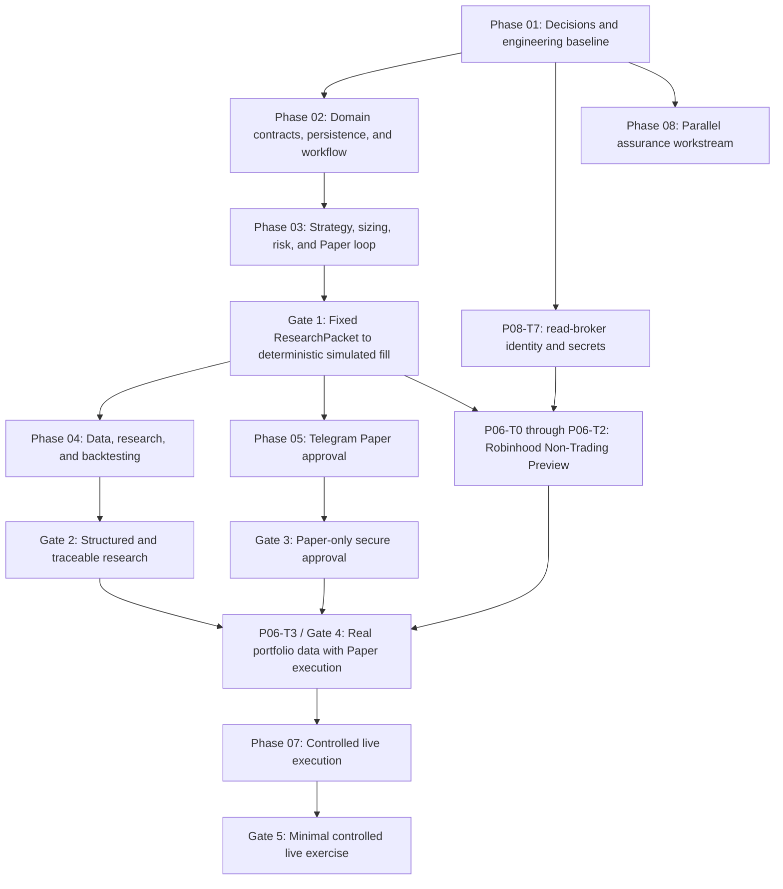

# ainvest Executable Implementation Plan

> Based on `design.md` in `likefudan/ainvest`, including the architecture merged in PR #1 on 2026-07-24 and the safety, model, approval, and data-source decisions accepted afterward.
>
> Purpose: move ainvest from an architecture-only repository to Paper Trading, research, human approval, non-trading Robinhood integration, and eventually tightly controlled live execution. Every task card is written so that it can be assigned to an independent Codex sub-agent, Cursor Agent, or another AI coding tool.
>
> Safety baseline: unless a task explicitly belongs to Phase 07 and all live-trading gates have passed, every implementation must keep `TRADING_MODE=paper`, `LIVE_TRADING_ENABLED=false`, and `REQUIRE_HUMAN_APPROVAL=true`. The first release also fixes `REGULAR_TRADING_HOURS_ONLY=true` and `REQUIRE_COMPLETE_RISK_LIMITS=true`.

## 0. Repository Baseline

- Repository: `likefudan/ainvest`; default branch: `main`; visibility: private.
- Existing source files at the time this plan was written: `README.md`, `.gitignore`, and `design.md`.
- `README.md` states that implementation has not started.
- There is no `pyproject.toml`, application code, test suite, database migration, CI workflow, or deployment configuration yet.
- `design.md` defines the target architecture, security boundaries, phased delivery path, sample data contracts, and primary dependencies.
- This plan does not expand the product boundary: the first release supports US-listed stocks and ETFs only, prefers limit orders, defaults to Paper Trading, and requires per-order human approval for live trading.

## 1. Context Every Execution Agent Must Inherit

### 1.1 System Goal

ainvest is a trading framework that combines AI-assisted research, deterministic Python strategy decisions, independent risk controls, human approval, and broker execution. The primary flow is:

```text
External data
  -> Research Agent
  -> ResearchPacket
  -> Strategy Engine
  -> TradeSignal
  -> Position Sizer
  -> Risk Engine
  -> OrderProposal
  -> Telegram approval for Paper / HTTPS + Passkey approval for Live
  -> Pre-trade risk re-evaluation
  -> Robinhood MCP or Paper Broker
  -> Fill reconciliation
  -> Append-only audit trail
```

### 1.2 Non-Negotiable Architecture and Safety Constraints

1. AI may research and explain; it must never produce an order that can be submitted directly to a broker.
2. A strategy may only produce a `TradeSignal`. It must not decide final share quantity, hold broker credentials, or call a broker.
3. The Position Sizer creates candidate orders only. The Risk Engine has unconditional veto authority.
4. All money-related calculations use `Decimal`; money and quantity values in JSON use decimal strings.
5. All timestamps use timezone-aware UTC ISO 8601. Naive datetimes are prohibited.
6. Module boundaries exchange only versioned Pydantic models containing `schema_version`.
7. Missing or stale data, exceptions, timeouts, state conflicts, and uncertain submission outcomes must fail closed.
8. Approval is bound to a canonical order hash. Any change to symbol, side, quantity, order type, limit, time in force, expiry, account scope, or strategy version invalidates the approval.
9. Telegram may approve a first-release Paper proposal only. A successful event must use `approval_method=telegram` and `approval_scope=paper`; Telegram is never the final authorization boundary for live trading.
10. The Execution Service is the only component allowed to receive trading/order write-tool access. The dedicated Robinhood Non-Trading Gateway may expose only the exact 11 owner-approved watchlist/saved-scan mutations, never a trading capability.
11. A `SUBMIT_UNKNOWN` result must never cause an immediate resubmission. Reconcile the idempotency key, client order ID, and broker history first.
12. Inputs, outputs, versions, and state transitions for Research, Strategy, Risk, Approval, and Execution must be replayable and auditable.
13. Strategy plugins are arbitrary Python code and must run in separate processes with no credentials, no network by default, a read-only file system, and bounded CPU, memory, and wall time.
14. Do not use broker libraries that require a Robinhood username/password or depend on unofficial Robinhood APIs.
15. No agent may write real tokens, account numbers, Passkey private keys, or `.env` contents into source code, fixtures, snapshots, logs, or audit records.
16. The first release may create or execute orders only during the US regular trading session. Pre-market, after-hours, overnight, holidays, and times after an early close are non-trading periods.
17. If any required risk limit is missing, empty, malformed, out of range, or otherwise invalid, trading must be rejected. There are no implicit tradable limit defaults.
18. When Robinhood MCP officially provides a read capability and it passes contract tests, that capability must be accessed through the read projection of the Robinhood Non-Trading Gateway instead of introducing a duplicate default provider.
19. Live quotes must come only from Robinhood MCP `get_equity_quotes`; spread and book data must come from `get_equity_price_book`. If MCP fails, is stale, omits required fields, or conflicts internally, reject the trade. Do not fall back to Alpaca, yfinance, or another quote source.
20. The Research Agent and Strategy Engine may consume only versioned schemas returned by read-only projections. They must not receive a raw MCP session, OAuth token, generic capability invocation, non-trading mutation, or trading tool.
21. SEC EDGAR with EdgarTools supplies primary filing evidence. News and event discovery uses GDELT, SEC 8-K/Form 4 filings, and company Investor Relations sources. yfinance is an optional development/offline adapter only; Alpaca is not a default first-release dependency.
22. The first-release AI model is OpenAI `gpt-5.6-sol`, called through Pydantic AI and the Responses API with `reasoning_effort=medium`, `store=false`, and strict structured output. Built-in web search and automatic cross-model fallback are disabled.
23. An AI failure, timeout, refusal, invalid schema, or unsupported evidence must not produce a complete `ResearchPacket` usable by a strategy. Retry at most once and only for an explicitly transient error.
24. Staging and production use separate Telegram Bots. Identity is authorized only by numeric `user_id`, numeric private `chat_id`, and `chat.type=private`; usernames are not authorization identifiers.
25. The first Paper release uses one active Telegram long-polling instance and one-time callback buttons bound to a proposal and order hash. Plain `approve` text is not accepted. A public domain and Passkey are not required for Paper.
26. The Paper Broker may consume only `approval_scope=paper`. The Robinhood write path accepts only `approval_method=webauthn` with `approval_scope=live`. Enforce this in the schema, approval handoff, live guard, and Execution Service.
27. A fixed HTTPS origin, closed Passkey bootstrap, and at least two recovery-capable credentials are prerequisites for any live broker write. They are not part of the first Paper release.
28. A ticker symbol alone is never a broker instrument identity. Every tradeable object must bind a canonical instrument ID, symbol, exchange, currency, asset type, and broker tradability metadata.
29. Kill-switch changes, manual-review resolution, cancellation requests, audit access, and live-start confirmation are privileged operations. They require an authenticated operator identity, explicit authorization, a reason, idempotency, and an audit event.
30. The first release does not modify a live order in place. Any replacement is a cancellation followed by a new proposal, new risk decision, new order hash, and new human approval.
31. An uncertain cancellation outcome must be reconciled before another cancel attempt. Automatic cancellation by the kill switch is disabled until an explicit owner decision defines its scope and recovery behavior; the default kill switch blocks new submissions and alerts.
32. The first `rh-mcp` manifest permits exactly 34 reads and 11 explicitly reviewed non-trading mutations, each with a pinned `mutates` flag, and denies exactly 8 trading capabilities. Its boundary is no trading, not no writes. Unknown capabilities and any manifest, schema, disposition, or mutation-classification drift fail closed.

### 1.3 First-Release Non-Goals

- High-frequency or low-latency trading.
- Unattended, fully autonomous live trading.
- Options, futures, cryptocurrency, margin, or naked short selling.
- Multi-tenancy, managed accounts, or investment advice for third parties.
- Natural language as an order protocol.
- Representing backtest performance as a promise of future returns.
- Irreversible live authorization inside Telegram.

### 1.4 Fixed Technical Direction

- Package layout: Python with `src/ainvest`.
- Data contracts and configuration: Pydantic.
- Strategy plugins: pluggy, Python `entry_points`, and `StrategyRegistry`.
- HTTP API: FastAPI.
- Persistence: SQLAlchemy and Alembic; SQLite for local/MVP use, with PostgreSQL compatibility for deployment.
- State machine: transitions.
- AI: OpenAI `gpt-5.6-sol` through Pydantic AI and Responses API; `medium`, `store=false`, strict structured output.
- Telegram: python-telegram-bot; single-instance long polling and Paper-only bound approval in the first release.
- Passkey: py_webauthn; deferred for Paper and mandatory before live trading.
- Scheduling: APScheduler 3.11.x.
- Robinhood: the official Trading MCP through the external default-deny
  [`likefudan/rh-mcp`](https://github.com/likefudan/rh-mcp) Non-Trading Gateway.
  `rh-mcp` privately owns MCP Python SDK v2 transport and OAuth lifecycle;
  ainvest consumes only its pinned, SDK-neutral capability/result contract.
  The approved v0 surface is 34 reads plus 11 non-trading mutations; all 8
  trading capabilities and every unknown capability are denied.
- Data: Robinhood MCP capabilities first; SEC EDGAR/EdgarTools for primary filings; GDELT, SEC, and company announcements for news/events; yfinance for optional development/offline use only.
- Testing: pytest, Hypothesis, and HTTPX mocks.
- Logging and monitoring: structlog, OpenTelemetry, and Prometheus.

### 1.5 Agent Working Agreement

An agent should claim exactly one task card, or one explicitly listed serial group. Before implementation:

1. Read `design.md`, this file, the current `README.md`, and all existing code in the target area.
2. Inspect the current branch and uncommitted changes. Preserve other agents' work.
3. Restate the task inputs, outputs, allowed paths, and dependencies.
4. If a dependency has not merged, do not copy its implementation. Use the smallest interface stub permitted by the task or stop and report the dependency.
5. Add or update tests before implementation. Security-sensitive cards require explicit failure-path tests.
6. Avoid broad refactors outside the card. Never enable live trading as a side effect.
7. Run the card's formatting, static analysis, and test requirements before handoff.
8. Report changed files, behavior, verification evidence, unresolved risks, and interface notes for downstream tasks.
9. If an owner decision is still proposed/deferred, implement only the fail-closed abstraction and tests. Do not create accounts, purchase services, select production identity providers, authorize Robinhood, or submit a real order.
10. Stop and escalate if the task would require weakening a safety rule, editing an unowned high-conflict interface, or using a dependency artifact that does not match the recorded commit.

Recommended branch name: `task/<task-id>-<short-name>`. Prefer one task card per PR. Serialize tasks that edit the same high-conflict file.

### 1.6 Global Definition of Done

Unless a card states stricter requirements, it is complete only when:

- Code has type annotations and public interfaces have concise docstrings.
- New behavior has positive, boundary, and fail-closed tests.
- Ruff, the configured type checker, and targeted tests pass.
- There is no float-based money, naive datetime, plaintext credential, or real account data.
- Errors use stable machine-readable codes; control flow does not parse error messages.
- External calls have timeouts. Retries are limited to read-only operations that are demonstrably safe to retry.
- Logs include correlation IDs and redact sensitive values.
- New configuration has safe defaults, validation, and an `.env.example` or example YAML entry.
- New public schemas or APIs include serialized examples and compatibility notes.
- State changes and audit events share one atomic boundary, or use an explicit transactional outbox.

### 1.7 Source Precedence and Task Dispatch Contract

Use the following authority order:

1. Accepted ADRs and accepted entries in the decision register.
2. Non-negotiable safety and product constraints in `design.md`.
3. The current task card in this implementation plan.
4. Existing public interfaces, tests, and implementation.

If two levels conflict, an agent must stop and report the conflict instead of silently choosing one. Existing code is evidence of repository state, not authority to weaken a higher-level safety rule.

Before dispatching a task, record this execution envelope in `docs/tasks/status.md` or the issue/PR:

- task ID, title, status, owner/agent, and branch;
- base commit and dependency PR/commit IDs;
- exact design sections and ADRs that apply;
- dependency artifacts and public interfaces expected to exist;
- allowed production-code paths and corresponding test/documentation paths;
- files that must not be modified;
- canonical verification commands established by P01-T2;
- owner-provided values or credentials required, without copying secret values;
- blockers, assumptions, handoff notes, and resulting PR.

The `Primary files` field on a card is the default production-code write scope. Matching tests, fixtures, generated schemas, example configuration, and task-specific documentation are also allowed. Any other production path requires an explicit handoff note and prior coordination with its owner.

## 2. Phase and Gate Sequence



Primary parallelization opportunities:

- After Phase 01 foundations exist, domain schemas, CI, and the threat model can proceed in parallel.
- After schemas stabilize, persistence, the strategy protocol, the Paper Broker interface, and the workflow state machine can be assigned independently.
- After Gate 1, the Research and Paper Approval tracks can run in parallel.
- The Robinhood Non-Trading Preview may start as soon as its task dependencies
  are merged. Its serial cross-repository order is: independently reviewed
  tagged SemVer `rh-mcp` release with an immutable artifact → ainvest tracker
  records the tag, artifact provenance/digest, and expected full-manifest
  digest → `P06-T0` → `P06-T1` → `P06-T2` Part 1 display CLI. `P06-T2` Part 2
  is the later Paper-promotion step under the same task ID. The first two steps
  are done:
  `rh-mcp` `v0.2.0` was approved on 2026-08-04 and its pins are recorded under
  "Recorded external dependency pin" in `docs/tasks/status.md`. Gate 2, Gate 3,
  and complete observability remain prerequisites for `P06-T3` / Gate 4, not
  for the preview.
- No broker-write code starts before Gates 1–4, security tests, fixed live approval infrastructure, and all live decisions are complete.
- Phase 08 is a parallel assurance phase, not a final sequential phase. Its cards start and finish according to their own dependencies and the batch plan; no agent may treat all P08 cards as prerequisites for Phase 02 or postpone all of them until after Phase 07.

## 3. Task Index

| Phase | Outcome | Task cards |
|---|---|---|
| Phase 01 | Decisions, threat model, and engineering baseline | P01-T0 through P01-T5 |
| Phase 02 | Schemas, database, audit, and workflow state | P02-T0 through P02-T10 |
| Phase 03 | Strategies, sizing, risk, deterministic Paper loop, Gate 1 | P03-T0 through P03-T17 |
| Phase 04 | Data, Research Agent, backtesting, Gate 2 | P04-T0 through P04-T12 |
| Phase 05 | Telegram Paper approval, deferred live approval preparation, Gate 3 | P05-T0 through P05-T8 |
| Phase 06 | Official Robinhood MCP read path and Gate 4 | P06-T0 through P06-T3 |
| Phase 07 | Controlled live execution, cancellation, reconciliation, and Gate 5 | P07-T0 through P07-T6 |
| Phase 08 | Parallel runtime, observability, security, documentation, and test assurance | P08-T0 through P08-T15 |

### 3.1 Minimum Design Traceability

The dispatcher should narrow these ranges to the exact subsections relevant to a card and add any accepted ADRs from P01-T0.

| Task cards | Minimum `design.md` references |
|---|---|
| P01-T0 | §16–§17 |
| P01-T1 | §3–§5, §7–§9, §11 |
| P01-T2 through P01-T5 | §10–§14 |
| P02-T0 through P02-T5 | §3.2, §3.4, §6 |
| P02-T6 through P02-T8 | §3.6, §9 |
| P02-T9 through P02-T10 | §5.6–§5.7, §8–§9 |
| P03-T0 through P03-T5 | §5.3, §10 |
| P03-T6 through P03-T7 | §5.3.4 |
| P03-T8 through P03-T12 | §3.3–§3.5, §5.4 |
| P03-T13 through P03-T16 | §5.6, §8–§9 |
| P03-T17 | §14, §15 Phase 1 |
| P04-T0 through P04-T8 | §5.1–§5.2, §10.1, §14 |
| P04-T9 through P04-T11 | §14.2 |
| P04-T12 | §15 Phase 2 |
| P05-T0 through P05-T8 | §3.4–§3.5, §5.5, §7, §15 Phase 3 |
| P06-T0 through P06-T3 | §5.1, §5.6, §10.1, §15 Phase 4 |
| P07-T0 through P07-T6 | §3.3–§3.5, §5.6–§5.7, §8, §14.4, §15 Phase 5 |
| P08-T0 through P08-T15 | §3.5–§3.6, §5.7, §9, §11–§14 |

---

## 4. Phase 01 — Decisions and Engineering Baseline

### P01-T0 — Create the Decision Register and ADR Process

- **Objective:** Turn every unresolved implementation choice into a tracked decision that an agent cannot silently guess.
- **Dependencies:** None.
- **Primary files:** `docs/decisions/README.md`, ADR template under `docs/adr/`, `docs/tasks/status.md`.
- **Implementation checklist:**
  - Define decision states: `proposed`, `accepted`, and `superseded`.
  - Create entries for the OpenAI API monthly budget, actual Telegram Bot and allowed identity values, first strategy and parameters, numeric risk limits, data-retention periods, and backup RPO/RTO.
  - Mark domain/deployment, Passkey bootstrap/recovery, Robinhood live budget, production operator-authentication method, and automatic kill-switch cancellation policy as `deferred_until_live`.
  - Record the accepted regular-session-only policy, complete-risk-limits policy, Robinhood-MCP-first data policy, OpenAI model/API settings, Telegram Paper-only approval, mandatory Passkey live approval, no in-place order replacement, and no automatic cancellation before an explicit owner decision.
  - Record owner, deadline, safe default, and affected phase for each item.
  - Give every unresolved item a fail-closed default. For example, missing live quote authorization disables live trading.
  - Maintain `docs/tasks/status.md` with task status, owner, branch, base commit, dependency commits/PRs, blockers, and handoff PR.
- **Acceptance criteria:**
  - Every unresolved choice has one stable decision ID.
  - Configuration and code can cite those IDs; agents implement accepted decisions and never invent external credentials or numeric limits.
  - `README.md` links to the decision register.

### P01-T1 — Document Trust Boundaries and Threat Model

- **Objective:** Fix assets, attack surfaces, trust domains, and required controls before approval or broker code is written.
- **Dependencies:** P01-T0.
- **Primary files:** `docs/security/threat-model.md`, `docs/security/data-flow.md`.
- **Implementation checklist:**
  - Inventory funds, broker/OpenAI/Telegram tokens, WebAuthn credentials, account data, approval tokens, strategy packages, and audit records.
  - Identify the Data, Research, Strategy Worker, Risk, Approval API, Execution, Database, user-device, and external-provider trust domains.
  - Cover strategy escape, dependency poisoning, approval replay, order tampering, Telegram account/Bot compromise, long-poll offset loss, SSRF, webhook forgery, Paper-to-Live scope escalation, duplicate orders, operator/control-plane takeover, unauthorized audit access, unsafe cancel/replace, log leakage, clock skew, and MCP timeout/schema drift.
  - Map every control to task IDs and tests in this plan.
  - Record residual risk; every high/critical live risk must be resolved or explicitly accepted before Phase 07.
- **Acceptance criteria:** The document includes data-flow and trust-boundary diagrams, threat and control tables, residual risk, and traceability from each security test to a threat ID.

### P01-T2 — Initialize the Python Project and Dependency Groups

- **Objective:** Establish an installable, testable, secure-by-default `src` layout.
- **Dependencies:** None; may run in parallel with P01-T0.
- **Primary files:** `pyproject.toml`, `src/ainvest/__init__.py`, `tests/conftest.py`, `.python-version`, lock file, canonical developer command wrapper.
- **Implementation checklist:**
  - Select and document a supported minimum Python version; do not use an EOL release.
  - Define core, research, approval, broker, observability, and dev/test dependency groups so research workers do not install trading dependencies by default.
  - Configure pytest, Ruff, type checking, and coverage.
  - Pin APScheduler to the design-required 3.11.x line; use compatible bounds elsewhere and generate a hash-locked dependency file.
  - Expose stable repository-level commands for setup, formatting check, lint, type-check, unit, contract, integration, and full verification. Document them once so later task prompts do not invent tool-specific commands.
  - Add minimal import and smoke tests.
- **Acceptance criteria:** A clean environment installs successfully; import, lint, type-check, and pytest commands pass; default dependencies contain no unofficial Robinhood client.

### P01-T3 — Create Package Boundaries and Architecture Tests

- **Objective:** Create the designed package boundaries and prevent Research or Strategy from depending on Execution.
- **Dependencies:** P01-T2.
- **Primary paths:** `src/ainvest/{agents,data,schemas,strategies,risk,approval,execution,portfolio,audit,api}`.
- **Implementation checklist:**
  - Add only minimal package exports and interfaces.
  - Document allowed dependency direction; schemas are shared, while `execution` cannot be imported by `strategies` or `agents`.
  - Add architecture tests that reject `strategies -> execution`, `agents -> execution`, `risk -> approval`, and other reverse dependencies.
  - Separate domain models from ORM models; never pass ORM instances across layers.
- **Acceptance criteria:** The package structure exists, an intentionally invalid fixture proves architecture tests fail correctly, and no import cycle exists.

### P01-T4 — Implement Configuration Loading and Safe Defaults

- **Objective:** Centralize YAML, environment variables, and runtime modes; individual modules must not read arbitrary environment variables.
- **Dependencies:** P01-T2.
- **Primary files:** `src/ainvest/config.py`, `config/risk.example.yaml`, `config/strategies.example.yaml`, `.env.example`.
- **Implementation checklist:**
  - Use Pydantic Settings for `TRADING_MODE`, `LIVE_TRADING_ENABLED`, `REQUIRE_HUMAN_APPROVAL`, `REGULAR_TRADING_HOURS_ONLY`, and `REQUIRE_COMPLETE_RISK_LIMITS`.
  - Fix defaults to paper/false/true/true/true. The first release rejects attempts to set either of the last two flags to false.
  - Fix AI defaults to OpenAI, `gpt-5.6-sol`, Responses API, `medium`, `store=false`, built-in web search off, model fallback off, and at most two total attempts.
  - Separate staging and production Telegram Bot settings. Allowlists accept only 64-bit numeric `user_id` and private `chat_id`; first-release transport is long polling and approval scope is Paper.
  - Live configuration requires a fixed WebAuthn origin and RP ID, at least two credentials, `approval_method=webauthn`, and `approval_scope=live`; otherwise startup fails.
  - Specify configuration precedence. Production rejects unknown fields and unsafe combinations.
  - Use a safe YAML loader; prohibit arbitrary objects, `eval`, lambda expressions, and executable configuration.
  - Mark secrets with `repr=False` and never echo values in validation errors.
- **Acceptance criteria:** Missing optional configuration starts safely in Paper mode; every incomplete live combination fails during startup; tests cover unknown fields, invalid types, dangerous combinations, and secret redaction.

### P01-T5 — Add CI, Commit Quality Gates, and Dependency Security

- **Objective:** Give every agent PR one consistent validation standard.
- **Dependencies:** P01-T2.
- **Primary files:** `.github/workflows/ci.yml`, `.pre-commit-config.yaml`, `CODEOWNERS`, dependency-update configuration.
- **Implementation checklist:**
  - Run lint, formatting checks, type checking, unit tests, coverage, and schema snapshots.
  - Add secret scanning, dependency auditing, and lock-file consistency checks.
  - Require owner review for security and execution paths; live-safety tests cannot be skipped with an ordinary marker.
  - Never inject real OpenAI, broker, or Telegram credentials into CI.
- **Acceptance criteria:** A deliberately failing test or policy violation blocks the PR; CI artifacts contain no `.env`, token, or account data.

---

## 5. Phase 02 — Domain Contracts, Persistence, and Workflow

### P02-T0 — Define Common Domain Types

- **Objective:** Establish strict shared types and serialization rules for every schema.
- **Dependencies:** P01-T2 through P01-T4.
- **Primary files:** `src/ainvest/schemas/common.py`, `tests/unit/schemas/test_common.py`.
- **Implementation checklist:**
  - Define `SchemaVersion`, timezone-aware UTC validation, symbols, currency, source, quality flags, and stable ID types.
  - Define a canonical `InstrumentIdentity` containing stable provider/broker instrument ID, display symbol, exchange/MIC, currency, asset type, and identity-as-of metadata. A display symbol alone cannot identify a tradeable instrument.
  - Define `Decimal` constraints for money, price, quantity, weight, and ratio.
  - Reject NaN, Infinity, negative money where invalid, and extra fields; define separate P&L types where negative values are valid.
  - Standardize JSON serialization: Decimal to string and datetime to UTC ISO 8601.
- **Acceptance criteria:** Floats, naive datetimes, unknown fields, invalid symbols, and out-of-range ratios are rejected; a round trip preserves values and types.

### P02-T1 — Define Market, Research, and Evidence Schemas

- **Objective:** Implement `ResearchPacket` and its provenance, freshness, and quality model.
- **Dependencies:** P02-T0.
- **Primary files:** `src/ainvest/schemas/market.py`, `src/ainvest/schemas/research.py`.
- **Implementation checklist:**
  - Model quotes, OHLCV, technical indicators, fundamentals, events, evidence citations, and thesis structures.
  - Every external datum includes `source`, `observed_at`, `received_at`, `timezone`, `is_delayed`, and `quality_flags`.
  - `ResearchPacket` includes `research_id`, `symbol`, `as_of`, market, technical, portfolio, thesis, and evidence sections.
  - Unsupported natural-language assertions cannot become evidence; important numeric values cite their deterministic calculation source.
- **Acceptance criteria:** The design example validates; stale data and invalid time ordering are rejected or explicitly flagged; JSON Schema and golden fixtures are generated.

### P02-T2 — Define Portfolio, Strategy Context, and TradeSignal Schemas

- **Objective:** Define the only protocol that a strategy may read and return.
- **Dependencies:** P02-T0 and P02-T1.
- **Primary files:** `src/ainvest/schemas/portfolio.py`, `src/ainvest/schemas/strategy.py`.
- **Implementation checklist:**
  - Define account scope, buying power, cash, positions, exposure, and open-order snapshots.
  - Define immutable `StrategyContext` with `as_of`, `ResearchPacket`, portfolio snapshot, and explicit strategy state.
  - Define `TradeSignal` intent, strength, target weight, creation/expiry, reason codes, strategy version, and `research_id`.
  - Bound strength to -1 through 1 and document that it is not a success probability. HOLD cannot become an order.
- **Acceptance criteria:** Context objects cannot be modified in place; future timestamps, expired signals, invalid strength, and missing strategy versions fail validation.

### P02-T3 — Define Candidate Order, Risk, Approval, and Broker Schemas

- **Objective:** Standardize every money-moving object after strategy intent.
- **Dependencies:** P02-T0 and P02-T2.
- **Primary files:** `src/ainvest/schemas/{orders,risk,approval,broker}.py`.
- **Implementation checklist:**
  - Define `CandidateOrder`, `OrderProposal`, `RiskDecision`, and `RiskViolation`.
  - Define approval challenge/event, broker order/fill, and reconciliation result types.
  - Define `CancelCommand`, `CancelResult`, and cancellation idempotency fields separately from order submission; do not model an in-place replace operation.
  - Approval events include method, scope, proposal ID, order hash, approval timestamp, and stable approver identity.
  - Schema validation permits only telegram+paper and webauthn+live method/scope combinations.
  - Initial enums allow equity/ETF, BUY/SELL, LIMIT, and DAY only; explicitly reject short, margin, options, and unsupported assets.
  - `OrderProposal` includes canonical instrument identity, maximum notional, risk decision ID, creation/expiry, price/quantity increment metadata, and order hash.
- **Acceptance criteria:** Design examples round-trip; invalid asset/order types and telegram+live approvals cannot be constructed; every outcome has a stable reason or rule code.

### P02-T4 — Implement Canonical Order Serialization and Hashing

- **Objective:** Create a stable approval-binding digest across APIs, databases, and processes.
- **Dependencies:** P02-T3.
- **Primary files:** `src/ainvest/approval/order_hash.py`, `tests/unit/approval/test_order_hash.py`.
- **Implementation checklist:**
  - Specify hash fields, order, Decimal normalization, timestamp form, Unicode normalization, and null handling.
  - Use canonical JSON plus SHA-256 and return an algorithm-prefixed digest.
  - Cover canonical instrument ID, symbol, exchange, currency, asset type, side, quantity, order type, limit, time in force, maximum notional, expiry, strategy name/version, and account scope.
  - Define a separate canonical cancel-command digest. A replacement order always receives a new proposal and order hash; an earlier order approval cannot authorize it.
  - Exclude display text, database auto-increment IDs, and mutable UI copy.
- **Acceptance criteria:** Semantically identical inputs yield identical hashes; every protected-field change changes the hash; fixed test vectors are available to UI and other-language consumers.

### P02-T5 — Establish Schema Versioning and Compatibility Rules

- **Objective:** Prevent implicit schema changes from breaking independently developed strategy plugins.
- **Dependencies:** P02-T0 through P02-T4.
- **Primary files:** `docs/schema-versioning.md`, `schemas/json/*.json`, `tests/contract/`.
- **Implementation checklist:**
  - Define major/minor compatibility, deprecation windows, unknown-field policy, and migration boundaries.
  - Export core JSON Schemas into version control.
  - Add snapshots and contract tests; breaking changes require explicit approval.
  - Store at least one valid and multiple invalid fixtures per schema.
- **Acceptance criteria:** CI detects unintended breaking changes, and plugins can declare a supported Strategy API version range.

### P02-T6 — Create SQLAlchemy Models and the Initial Alembic Migration

- **Objective:** Persist the designed records on SQLite while retaining PostgreSQL compatibility.
- **Dependencies:** P02-T0 through P02-T3 and P01-T4.
- **Primary paths:** `src/ainvest/db/`, `migrations/`.
- **Implementation checklist:**
  - Add research runs/packets, strategy runs, signals, risk decisions, proposals, approval challenges/events, broker orders/fills, portfolio snapshots, and audit events.
  - Separate JSON payloads from indexed query columns and retain schema, code, and configuration versions.
  - Store UTC timestamps and fixed-point/normalized decimal values, never binary floats.
  - Add uniqueness for signal/proposal/idempotency/client order ID/token hash as appropriate.
- **Acceptance criteria:** Empty-database upgrade/downgrade/upgrade succeeds; SQLite integration tests pass; PostgreSQL-compatible type tests run in CI.

### P02-T7 — Implement Repositories, Unit of Work, and Concurrency Control

- **Objective:** Keep business code away from direct ORM operations and provide transactional boundaries for one-time approval and state transitions.
- **Dependencies:** P02-T6.
- **Primary files:** `src/ainvest/db/repositories.py`, `src/ainvest/db/uow.py`.
- **Implementation checklist:**
  - Provide minimal repositories for proposals, approvals, broker orders, and audit records.
  - Define a Unit of Work with one commit per business operation and rollback on failure.
  - Use conditional updates, row locks, or version columns so concurrent approval clicks can succeed only once.
  - Enforce idempotency with unique keys and read the existing result after a conflict; never parse database error text.
- **Acceptance criteria:** Concurrency tests create one approval/execution request only, and rollback leaves no partial state.

### P02-T8 — Implement Append-Only Audit Events and Redaction

- **Objective:** Make every critical decision replayable without leaking secrets.
- **Dependencies:** P02-T6 and P02-T7.
- **Primary paths:** `src/ainvest/audit/`.
- **Implementation checklist:**
  - Define an event envelope containing event/time/correlation/causation/actor/type, input/output digests, versions, before/after state, and errors.
  - Expose append operations only; business code receives no update/delete API for audit events.
  - Implement recursive redaction for tokens, cookies, authorization headers, account numbers, and raw approval tokens.
  - Define payload-size limits and store digests for large external objects.
- **Acceptance criteria:** Every critical state change creates an audit event; secret-corpus tests find no plaintext value; a proposal timeline can be reconstructed.

### P02-T9 — Implement the Order State Machine and Illegal-Transition Guards

- **Objective:** Implement the complete state graph in design §8.
- **Dependencies:** P02-T3, P02-T7, and P02-T8.
- **Primary file:** `src/ainvest/execution/state_machine.py`.
- **Implementation checklist:**
  - Implement every order-lifecycle state and the exact allowed edges.
  - Implement cancellation as a separate, correlated command state machine so fills can continue while cancellation is pending. Include REQUESTED, CONFIRMED, REJECTED/NOT_APPLIED, UNKNOWN, RECONCILING, and MANUAL_REVIEW outcomes.
  - Require expected-current-state on transitions so a stale worker cannot overwrite newer state.
  - Atomically persist business state and its audit event.
  - Terminal states cannot transition; `SUBMIT_UNKNOWN -> RECONCILING` and `CANCEL_UNKNOWN -> CANCEL_RECONCILING` are the only recovery entries for ambiguous broker writes.
- **Acceptance criteria:** Tests cover every legal edge and representative illegal edges; duplicate/out-of-order events are idempotent; neither uncertain submit nor uncertain cancel can transition directly to another broker write.

### P02-T10 — Define Domain Commands, Events, and Correlation IDs

- **Objective:** Provide stable internal command interfaces for orchestrators, workers, and APIs.
- **Dependencies:** P02-T9 and P02-T8.
- **Primary paths:** `src/ainvest/workflow/`.
- **Implementation checklist:**
  - Define commands for strategy evaluation, sizing, risk evaluation, proposal creation, approval, execution, cancellation, manual-review resolution, and reconciliation.
  - Define corresponding results/events with correlation, causation, and idempotency IDs.
  - Distinguish retryable pure operations, read-only external calls, and broker writes that must never be blindly retried.
  - Begin with an in-process dispatcher while preserving an interface that can later support a durable queue or Temporal.
- **Acceptance criteria:** Repeated commands return the same business result, no command depends on hidden in-memory state, and one trace connects the full workflow.

---

## 6. Phase 03 — Strategies, Position Sizing, Risk, and Paper Broker

### P03-T0 — Define the Strategy API, Definitions, and Hook Contract

- **Objective:** Create the smallest stable interface shared by independent strategy teams.
- **Dependencies:** P02-T2, P02-T5, and P01-T3.
- **Primary files:** `src/ainvest/strategies/{api,hooks,definitions}.py`.
- **Implementation checklist:**
  - Define the Strategy Protocol, Pydantic parameter model, `StrategyDefinition`, and plugin metadata.
  - Metadata includes plugin ID/version, Strategy API range, strategy name/version, source commit, owner, and repository.
  - `strategy_definitions()` returns declarations only and never executes strategy logic during import.
  - Define `evaluate(context) -> StrategyResult`, with signals, next state, and diagnostics.
- **Acceptance criteria:** A minimal third-party package implements the contract; missing metadata, invalid parameter models, and incompatible API versions are rejected.

### P03-T1 — Load pluggy Plugins into StrategyRegistry

- **Objective:** Discover, validate, and list strategies from the `ainvest.strategies` entry-point group.
- **Dependencies:** P03-T0.
- **Primary file:** `src/ainvest/strategies/registry.py`.
- **Implementation checklist:**
  - Configure PluginManager, hook specifications, and entry-point loading.
  - Fail startup on duplicate plugin IDs, entry points, or strategy names.
  - Support configuration allowlists, pinned versions, and disabled plugins; live mode requires an allowlist.
  - Expose immutable, validated definitions only.
- **Acceptance criteria:** Test packages cover multiple plugins, conflicts, incompatible APIs, unknown/disabled strategies, and prove there is no silent override.

### P03-T2 — Implement Strategy Instance YAML Configuration

- **Objective:** Separate strategy code definitions from runtime instances.
- **Dependencies:** P03-T0, P03-T1, and P01-T4.
- **Primary files:** `src/ainvest/strategies/config.py`, `config/strategies.example.yaml`.
- **Implementation checklist:**
  - Support instance ID, plugin, enabled flag, universe, parameters, schedule, and constraints.
  - Validate parameters through `definition.params_model`.
  - Validate symbols, timeframe, `research_max_age`, and `signal_ttl`.
  - Reject duplicate IDs, unknown parameters, executable YAML, and unpinned plugin versions in live mode.
- **Acceptance criteria:** The design example loads; invalid configuration fails at startup without exposing secrets; normalized configuration is auditable.

### P03-T3 — Build a Reference Moving-Average Strategy Plugin

- **Objective:** Prove the Strategy API with a complete example that has no network or broker dependency.
- **Dependencies:** P03-T0 through P03-T2 and P02-T1 through P02-T2.
- **Primary path:** `examples/strategies/moving_average/` or a separate workspace package.
- **Implementation checklist:**
  - Implement fast/slow windows and target-weight parameters.
  - Use only `context.as_of` and supplied historical data; never read the system clock.
  - Return BUY/SELL/HOLD with stable reason codes.
  - Include entry point, metadata, tests, and README.
- **Acceptance criteria:** Identical input produces byte-identical output, no future data is used, and the registry discovers the installed package.

### P03-T4 — Isolate Strategy Workers and Enforce Resource Boundaries

- **Objective:** Prevent faulty or malicious strategy code from reaching main-process secrets or trading capabilities.
- **Dependencies:** P03-T0 through P03-T2 and P02-T8.
- **Primary path:** `src/ainvest/strategies/worker/`.
- **Implementation checklist:**
  - Exchange versioned JSON only; never pass ORM objects, sockets, or credentials.
  - Enforce wall timeout and CPU/memory limits; classify crashes, timeouts, and invalid output.
  - Remove sensitive environment variables, use a read-only working tree, and document network isolation for target OS/container environments.
  - Record package version, source commit, parameter/input digests, and duration.
  - A worker failure affects one strategy run only.
- **Acceptance criteria:** Test plugins attempting timeout, OOM, secret access, network access, or invalid output all fail closed while other strategies continue.

### P03-T5 — Publish the Strategy Conformance Test Suite

- **Objective:** Let independent teams validate plugins in their own CI.
- **Dependencies:** P03-T0 through P03-T4 and P03-T13.
- **Primary paths:** `src/ainvest/strategy_conformance/`, CLI entry point.
- **Implementation checklist:**
  - Check hooks, metadata, API range, parameters, and signal schemas.
  - Repeat runs with fixed clocks and inputs to verify determinism.
  - Check no future data, timeout behavior, exceptions, and a Paper example.
  - Include network, broker, and secret-access probes.
  - Emit machine-readable JSON and a human-readable report.
- **Acceptance criteria:** The reference strategy passes; deliberately invalid plugins fail with stable codes; documentation contains a third-party CI example.

### P03-T6 — Implement the Single-Strategy Position Sizer

- **Objective:** Convert target-weight intent into a whole-share candidate order.
- **Dependencies:** P02-T2, P02-T3, and P01-T4.
- **Primary file:** `src/ainvest/portfolio/sizer.py`.
- **Implementation checklist:**
  - Accept a signal, latest quote, portfolio snapshot, and sizing configuration.
  - Calculate target value, current difference, cash reserve, safe-direction whole-share rounding, broker quantity increment, price tick normalization, and min/max notional.
  - Return no order with a stable reason for HOLD, expired signal, missing price, missing/invalid tick or quantity metadata, or zero/negative buying power.
  - Do not perform final risk approval here.
- **Acceptance criteria:** All arithmetic uses Decimal; property tests cover boundaries and price/quantity increments; output never exceeds configured limits or buying power, never rounds a price in a less-safe direction, and is deterministic.

### P03-T7 — Define Multi-Strategy Signal Aggregation

- **Objective:** Convert conflicting signals for one symbol into at most one candidate order without duplicate or self-crossing trades.
- **Dependencies:** P03-T6.
- **Primary files:** `src/ainvest/portfolio/signal_aggregation.py`, ADR.
- **Implementation checklist:**
  - Accept a first-release rule through an ADR; the safe default is conflict -> no trade or `NEEDS_REVIEW`.
  - Group by symbol, `as_of`, expiry, and strategy version.
  - Do not weight strength or treat it as probability without an explicit approved rule.
  - Preserve every input signal and the final reason code.
- **Acceptance criteria:** BUY/SELL conflicts, duplicates, differing `as_of`, and mixed expiry produce deterministic results and never create opposing orders for one symbol.

### P03-T8 — Build the Risk Rule Framework and Decision Aggregator

- **Objective:** Create a composable, explainable, pure-Python Risk Engine.
- **Dependencies:** P02-T3 and P02-T8.
- **Primary files:** `src/ainvest/risk/{engine,rules,models}.py`.
- **Implementation checklist:**
  - A rule receives immutable `RiskContext` and returns code, severity, decision, reason, and evidence.
  - Aggregate as: any hard reject -> REJECTED; review-only -> NEEDS_REVIEW; otherwise APPROVED.
  - Missing input, a missing required limit, rule exceptions, and unknown rules all fail closed.
  - Persist rule-set, configuration, code versions, and input digest.
- **Acceptance criteria:** Rule order cannot change the final result, exceptions cannot be swallowed into approval, and every decision is explainable and auditable.

### P03-T9 — Implement Notional, Position, Sector, and Cash Rules

- **Objective:** Enforce hard exposure limits.
- **Dependencies:** P03-T8 and P03-T6.
- **Primary file:** `src/ainvest/risk/rules/exposure.py`.
- **Implementation checklist:**
  - Enforce maximum order notional, symbol weight, sector exposure, daily turnover, minimum cash reserve, and daily realized/unrealized loss.
  - Require explicit, range-validated configuration for every mandatory limit. Missing or invalid limits return REJECTED; no tradable defaults exist.
  - Evaluate projected post-trade state, not current state alone.
  - Missing sector metadata, incomplete P&L, or invalid account equity rejects or requires review according to an explicit safe policy.
- **Acceptance criteria:** Tests cover equality and just-over-threshold boundaries, buy/sell directions, negative P&L, and Decimal properties.

### P03-T10 — Enforce Asset Eligibility, Allowlist, Side, and Trading Session

- **Objective:** Make the first-release product boundary impossible to bypass.
- **Dependencies:** P03-T8.
- **Primary files:** `src/ainvest/risk/rules/eligibility.py`, `src/ainvest/data/calendar_port.py`.
- **Implementation checklist:**
  - Allow only configured ordinary US stocks and ETFs.
  - Reject options, crypto, margin, short sales, and leveraged/inverse ETFs.
  - Require an unambiguous canonical instrument identity and matching symbol, exchange, currency, asset type, broker tradability, tick-size, and quantity-increment metadata.
  - Define the minimal `MarketCalendar` port and deterministic fake. P04-T3 later implements that port and is not a prerequisite for this card.
  - Permit regular session only; validate holidays, early close, and trading halts with no extended-hours switch.
  - Reject missing instrument metadata.
- **Acceptance criteria:** Every prohibited asset class has a test; off-hours, holidays, and post-early-close attempts fail closed.

### P03-T11 — Enforce Quote Freshness, Spread, Volatility, and Slippage

- **Objective:** Prevent approval based on stale or anomalous prices.
- **Dependencies:** P03-T8 and P02-T1.
- **Primary file:** `src/ainvest/risk/rules/market_quality.py`.
- **Implementation checklist:**
  - Enforce maximum quote age, delayed flags, and bid/ask completeness.
  - Enforce maximum spread bps, abnormal short-term volatility, and maximum limit/reference-price deviation.
  - Separate proposal-time and pre-trade-time thresholds.
  - Fail closed on clock skew, zero/negative price, or crossed markets.
- **Acceptance criteria:** Boundary and stale-clock tests pass; a newer quote that violates limits cannot reuse an old approval.

### P03-T12 — Prevent Duplicate Orders and Re-run Risk Before Execution

- **Objective:** Prevent duplicate submissions and execution of stale approvals after account state changes.
- **Dependencies:** P03-T8 through P03-T11, P02-T7, and P02-T9.
- **Primary files:** `src/ainvest/risk/rules/orders.py`, `src/ainvest/risk/kill_switch.py`, `src/ainvest/risk/pretrade.py`.
- **Implementation checklist:**
  - Detect duplicates by proposal hash, symbol/side/time window, and client order ID.
  - Detect opposing or overlapping open orders.
  - Support configured and operational kill switches; any active source rejects new orders.
  - Re-fetch quotes, account, positions, and open orders and re-run the full rule set before execution.
  - Never reuse a prior APPROVED result for the pre-trade decision.
- **Acceptance criteria:** Duplicate delivery, stale snapshots, active kill switch, and existing open orders block execution; tests prove every hard rule runs again.

### P03-T13 — Define the Broker Port and Error Taxonomy

- **Objective:** Support Paper and Robinhood through one domain interface without leaking MCP details into business logic.
- **Dependencies:** P02-T3.
- **Primary file:** `src/ainvest/execution/broker.py`.
- **Implementation checklist:**
  - Define read methods for account, positions, quotes, orders, and fills.
  - Place submit/cancel in a separate write protocol/capability so read-only processes cannot receive it.
  - Define stable auth, timeout, rate-limit, invalid-order, rejected, and unknown-outcome errors.
  - Require an idempotency/client order ID for submit and a distinct idempotency/cancel request ID for cancel.
  - Do not expose a replace method. Replacement is cancel plus a separately approved new proposal.
- **Acceptance criteria:** Paper adapter contract tests exist, the read-only type cannot call submit/cancel, submit and cancel unknown outcomes are distinguishable from confirmed rejection, and no in-place replace operation exists.

### P03-T14 — Build the Deterministic Paper Broker and Fill Simulator

- **Objective:** Implement a no-real-money order lifecycle.
- **Dependencies:** P03-T13, P02-T9, and P02-T6 through P02-T8.
- **Primary file:** `src/ainvest/execution/paper.py`.
- **Implementation checklist:**
  - Model cash/positions, submit, cancel, partial fill, full fill, and rejection.
  - Fill limit orders only from injected market events; inject/fix clocks and randomness.
  - Simulate fees, spread, and slippage; never assume zero costs implicitly.
  - Return the same order for the same idempotency key.
- **Acceptance criteria:** Identical market events yield identical outcomes; no overselling or overdraft occurs; repeated submit does not double-charge; partial-fill accounting is correct.

### P03-T15 — Reconcile Paper Orders and Maintain the Portfolio Ledger

- **Objective:** Reconstruct internal state from broker orders/fills and expose discrepancies.
- **Dependencies:** P03-T14 and P02-T6 through P02-T8.
- **Primary files:** `src/ainvest/execution/reconciliation.py`, `src/ainvest/portfolio/ledger.py`.
- **Implementation checklist:**
  - Compare orders/fills against local client order IDs, quantities, prices, and states.
  - Handle duplicate, out-of-order, and late fills.
  - Route discrepancies to `MANUAL_REVIEW` with alerts; never silently rewrite money facts.
  - Generate portfolio snapshots and foundational P&L data.
- **Acceptance criteria:** Duplicate/out-of-order events are idempotent; missing orders, quantity differences, and unknown fills are detected; ledger conservation properties hold.

### P03-T16 — Orchestrate a Full Paper Flow from a Fixed ResearchPacket

- **Objective:** Create the first end-to-end loop without AI, Telegram, or Robinhood.
- **Dependencies:** P03-T0 through P03-T15 and P02-T10.
- **Primary files:** `src/ainvest/orchestrator.py`, CLI, `tests/integration/test_paper_flow.py`.
- **Implementation checklist:**
  - Accept a fixed ResearchPacket, portfolio, and strategy configuration.
  - Run strategy -> sizing -> risk -> proposal -> explicit test approval stub -> Paper submit -> fill -> reconciliation.
  - Provide dry-run output for every step. Never auto-approve; tests inject approval explicitly.
  - Persist every step with correlated audit events.
- **Acceptance criteria:** Success, risk rejection, expired approval, unknown broker outcome, and partial-fill flows are replayable; the same fixture yields the same decisions and digests.

### P03-T17 — Gate 1: Accept the Deterministic Simulated Trading Loop

- **Objective:** Freeze the first usable domain kernel.
- **Dependencies:** P01-T0 through P01-T5, P02-T0 through P02-T10, and P03-T0 through P03-T16.
- **Primary file:** `docs/releases/phase-1-acceptance.md`.
- **Implementation checklist:**
  - Run all unit, contract, integration, and safety tests available at this phase.
  - Start from an empty SQLite database, migrate it, process a fixed input to a simulated fill, and export the audit timeline.
  - Verify the strategy process has no credentials/network, Risk fails closed, Paper is idempotent, and the state machine rejects illegal transitions.
  - Record performance baseline and unresolved defects; high/critical defects must be zero.
- **Acceptance criteria:** The design Phase 1 criterion—fixed ResearchPacket to repeatable and testable simulated fill—is met, and `docs/releases/phase-1-acceptance.md` is produced.

---

## 7. Phase 04 — Data, Research Agent, and Backtesting

### P04-T0 — Define Data Adapter Ports and Deterministic Fakes

- **Objective:** Unify quote, price-book, OHLCV, fundamental, news/event, and instrument-metadata access behind provider-independent interfaces.
- **Dependencies:** P02-T1 and P03-T13.
- **Primary files:** `src/ainvest/data/{ports,models,fakes}.py`.
- **Implementation checklist:**
  - Define consistent async or sync interfaces per data class, including request/response shape, timeout, pagination, and stable errors.
  - Every result includes provenance, observed/received time, timezone, delayed status, and quality flags.
  - Add a deterministic fake provider and fixture data set.
  - Prohibit upper layers from importing third-party provider SDKs directly.
- **Acceptance criteria:** Providers share contract tests; data without source/time cannot enter a `ResearchPacket`; the live quote port exposes no cross-provider automatic fallback.

### P04-T1 — Add the Optional Development/Offline Market Adapter

- **Objective:** Use yfinance for local development, backtesting, and offline research when Robinhood is unavailable, while excluding it from all live risk decisions.
- **Dependencies:** P04-T0.
- **Primary file:** `src/ainvest/data/providers/yahoo.py`.
- **Implementation checklist:**
  - Implement thin quote, historical OHLCV, and corporate-action adapters.
  - Make adjusted/unadjusted prices, exchange timezone, delay status, and provider restrictions explicit.
  - Convert network timeouts, empty responses, and rate limits into stable errors; cached results retain original `observed_at`.
  - Mark code, types, and documentation `development_only`; live mode cannot construct or call this adapter.
- **Acceptance criteria:** Recorded/fake tests require no public network; cover splits/dividends, missing bars, timezone, and duplicate indexes; live configuration referencing the adapter fails at startup.

### P04-T2 — Implement SEC Filing and Fundamental Event Adapters

- **Objective:** Retrieve citable primary filings and regulatory events through SEC EDGAR/EdgarTools, complementing Robinhood's normalized fundamentals.
- **Dependencies:** P04-T0.
- **Primary file:** `src/ainvest/data/providers/sec.py`.
- **Implementation checklist:**
  - Support company mapping, 10-K/10-Q/8-K/Form 4 metadata, and selected XBRL facts.
  - Respect SEC user-agent and rate-limit guidance; cache accession numbers and original citation locations.
  - Keep units, periods, and currency explicit; never silently mix annual and quarterly facts.
  - Represent earnings-date certainty and source quality explicitly.
- **Acceptance criteria:** Fixed filing fixtures produce evidence and fundamental fields; facts without units or periods are never assumed comparable.

### P04-T3 — Implement News, Macro Events, and the US Trading Calendar

- **Objective:** Integrate GDELT, SEC 8-K/Form 4, company Investor Relations announcements, and a reliable US market calendar.
- **Dependencies:** P04-T0, P04-T2, and P03-T10.
- **Primary files:** `src/ainvest/data/providers/news.py`, `src/ainvest/data/calendar.py`.
- **Implementation checklist:**
  - Normalize news title, URL, publisher, publication/receipt times, symbols, license, and quality.
  - Deduplicate the same event while preserving multiple source citations.
  - Use GDELT for discovery; mark SEC and company announcements as higher-trust primary evidence. Preserve licensing and quotation restrictions.
  - Implement the `MarketCalendar` port defined by P03-T10 with pandas-market-calendars for holidays and early closes; do not create a second calendar abstraction.
- **Acceptance criteria:** Timezone, DST, early-close, duplicate-news, and future-`published_at` tests pass; the Risk Engine consumes the shared calendar port.

### P04-T4 — Compute Indicators and Persist Quality-Controlled Data Snapshots

- **Objective:** Compute important numbers deterministically and retain replayable inputs.
- **Dependencies:** P04-T0 through P04-T3 and P02-T1.
- **Primary files:** `src/ainvest/data/{indicators,quality,cache,snapshots}.py`.
- **Implementation checklist:**
  - Wrap TA-Lib indicators such as SMA, RSI, and ATR with fixed warm-up and missing-value behavior.
  - Detect stale, gapped, duplicate, out-of-order, currency-mismatched, and adjustment-mismatched data.
  - Include provider, symbol, timeframe, adjustment, and `as_of` in cache keys.
  - Retain raw-response digest, normalization version, and calculation parameters.
- **Acceptance criteria:** Indicators match fixed references; insufficient windows do not emit fabricated values; one snapshot can rebuild a `ResearchPacket` offline.

### P04-T5 — Build the Research Agent's Deterministic Tool Layer

- **Objective:** Move money, indicator, and portfolio calculations out of model reasoning.
- **Dependencies:** P04-T0 through P04-T4 and P02-T1 through P02-T2.
- **Primary path:** `src/ainvest/agents/tools/`.
- **Implementation checklist:**
  - Provide quote, price book, history, indicators, filings, news, portfolio concentration, and buying-power tools. Robinhood capabilities are accessible only through the read projection of the Non-Trading Gateway.
  - Use Pydantic inputs/outputs, timeouts, and bounded result sizes.
  - Return evidence IDs; the model may cite only evidence that the tools returned.
  - Do not grant the tool layer broker-write capability.
- **Acceptance criteria:** Tool errors, timeouts, and stale data set quality flags and prevent an invalid “complete” research result; all calculations are unit-testable without a model.

### P04-T6 — Implement the Pydantic AI Research Agent

- **Objective:** Produce structured bull case, bear case, risks, and open questions—not trade instructions.
- **Dependencies:** P04-T5 and the accepted model decision in P01-T0.
- **Primary files:** `src/ainvest/agents/research_agent.py`, `prompts/`.
- **Implementation checklist:**
  - Call OpenAI Responses through Pydantic AI with model `gpt-5.6-sol`, `reasoning_effort=medium`, `store=false`, and strict JSON Schema for the intermediate narrative.
  - Build independent context for each run; do not depend on `previous_response_id` or long-lived server conversation state.
  - The system prompt prohibits BUY/SELL directions, quantities, performance promises, and unsupported numeric claims.
  - Disable built-in OpenAI web search. Expose only ainvest read-only deterministic tools and named read-projection wrappers, never a raw MCP session, a generic capability invocation, or a non-trading mutation.
  - Bound tool set, turns, tokens, duration, and concurrency. Retry once only for explicitly transient network/rate-limit failures; never switch models automatically.
  - Version the model, prompt, and tool schemas. Record model ID, OpenAI request ID, token usage, and input/output digests.
- **Acceptance criteria:** Tests assert the fixed model/API/effort/store settings; invalid schema, trade instructions, unsupported claims, timeout, or exhausted retry fails closed without a complete `ResearchPacket`; fake-model tests run offline.

### P04-T7 — Assemble ResearchPackets and Verify Evidence Consistency

- **Objective:** Combine deterministic numbers and model explanations into the final `ResearchPacket`.
- **Dependencies:** P04-T5, P04-T6, and P02-T6 through P02-T8.
- **Primary file:** `src/ainvest/agents/research_builder.py`.
- **Implementation checklist:**
  - Market, technical, and portfolio fields accept tool outputs only; the model fills thesis text structures only.
  - Every thesis claim cites an evidence ID from the same run.
  - Persist research run, raw/tool digests, prompt/model version, and final packet.
  - Express incomplete data with quality flags; never guess missing facts.
- **Acceptance criteria:** Fixed tools plus a fake model yield a stable packet; forged evidence IDs, cross-run citations, and stale required quotes are rejected.

### P04-T8 — Add Research Safety, Quality, and Cost Evaluations

- **Objective:** Provide repeatable evaluations for model or prompt changes.
- **Dependencies:** P04-T6 and P04-T7.
- **Primary paths:** `tests/evals/research/`, `scripts/run_research_evals.py`.
- **Implementation checklist:**
  - Cover ordinary inputs, conflicting sources, old news, missing filings, extreme markets, and prompt injection.
  - Measure schema success, evidence coverage, unsupported claims, numeric consistency, latency, tokens, and cost.
  - Treat instructions found in news or pages as untrusted data that cannot change agent permissions.
  - Run and approve the full evaluation before model/prompt upgrades or moving routine work to `gpt-5.6-terra`; runtime model downgrade remains prohibited.
  - Define release thresholds. Falling below them prevents scheduled Paper research.
- **Acceptance criteria:** Evaluation reports are machine-readable and version-comparable; injection cannot expose Execution or mutate configuration; exceeding the budget pauses new research and alerts instead of switching models.

### P04-T9 — Build the Strategy Replay and Backtest Adapter

- **Objective:** Use the same Strategy implementation for historical replay, Paper, and future live execution.
- **Dependencies:** P03-T0 through P03-T5, P04-T4, and P03-T14.
- **Primary file:** `src/ainvest/backtest/runner.py`.
- **Implementation checklist:**
  - Construct each historical `StrategyContext` with data available at that time only.
  - Inject `as_of` clock, historical portfolio state, and strategy state.
  - Reuse Position Sizer and Risk Engine; do not create backtest shortcuts around them.
  - bt may schedule portfolio evaluation, but ainvest domain contracts remain authoritative.
- **Acceptance criteria:** The same context yields the same signal in replay and Paper; tests prove future bars are inaccessible.

### P04-T10 — Model Costs, Adjustments, and Walk-Forward Validation

- **Objective:** Prevent optimistic performance and data leakage.
- **Dependencies:** P04-T9.
- **Primary files:** `src/ainvest/backtest/{costs,validation}.py`.
- **Implementation checklist:**
  - Model commissions, spread, slippage, partial fills, and volume limits.
  - Make total-return/adjusted-data use explicit and avoid double-adjusting prices and share counts.
  - Separate in-sample and out-of-sample periods; support rolling/walk-forward validation.
  - Detect lookahead, survivorship, and filing-publication-date leakage.
- **Acceptance criteria:** A deliberately leaking strategy is caught; zero cost exists only in an explicit test mode; parameters and data snapshots are replayable.

### P04-T11 — Generate Performance Reports and Disclosures

- **Objective:** Produce comparable, non-misleading reports through QuantStats or an equivalent library.
- **Dependencies:** P04-T9 and P04-T10.
- **Primary file:** `src/ainvest/backtest/reporting.py`.
- **Implementation checklist:**
  - Report return, volatility, maximum drawdown, turnover, cost, benchmark comparison, and sample interval.
  - Show gross/net and in/out-of-sample results together.
  - Include configuration, strategy, data, and code digests.
  - Display a clear statement that historical results do not predict future performance.
- **Acceptance criteria:** Repeated generation from one result yields identical metrics; missing benchmarks or intervals do not produce fabricated comparisons.

### P04-T12 — Gate 2: Accept Structured and Traceable Research

- **Objective:** Prove that research output conforms to schemas and every important number comes from a deterministic tool.
- **Dependencies:** P04-T0 through P04-T11. Research and backtesting cards may run in parallel, but every card must complete before this gate.
- **Primary file:** `docs/releases/phase-2-acceptance.md`.
- **Implementation checklist:**
  - Generate `ResearchPacket` objects from fixed and recorded provider data.
  - Trace market, technical, and portfolio fields back to tool output.
  - Run prompt-injection, stale-data, provider-timeout, and unsupported-evidence tests.
  - Feed the packet into the Gate 1 Paper flow.
- **Acceptance criteria:** The design Phase 2 criteria pass and `docs/releases/phase-2-acceptance.md` is produced.

---

## 8. Phase 05 — Telegram Paper Approval and Deferred Live Approval

### P05-T0 — Implement OrderProposal and One-Time Approval Challenges

- **Objective:** Safely create proposals and short-lived, single-use opaque nonces while distinguishing Paper and Live approval at the domain layer.
- **Dependencies:** P02-T3, P02-T4, P02-T6 through P02-T9.
- **Primary files:** `src/ainvest/approval/service.py`, `src/ainvest/approval/tokens.py`.
- **Implementation checklist:**
  - Generate at least 256 bits of nonce entropy with a CSPRNG. Persist only a domain-separated hash.
  - Constrain configurable TTL to the designed 60–120 second range and inject the server clock.
  - Freeze the canonical order, order hash, and risk decision when creating the proposal.
  - Model PENDING, APPROVED, REJECTED, EXPIRED, and CONSUMED challenge states; every approval event records method and scope.
  - Accept only telegram+paper or webauthn+live; reject every other combination in schema and service logic.
- **Acceptance criteria:** Raw nonces never appear in database/logs; expiry, repeat, and concurrent consumption allow one success only; changing an order invalidates its nonce; telegram+live cannot be created.

### P05-T1 — Handle Telegram Paper Approval Callbacks

- **Objective:** Let an authorized private-chat user approve one specific Paper proposal without creating any live privilege.
- **Dependencies:** P05-T0, P01-T4, P02-T3, and P02-T4.
- **Primary file:** `src/ainvest/approval/telegram_approval.py`.
- **Implementation checklist:**
  - Callback data contains an opaque nonce only. Read symbol, quantity, and price from the server-side proposal.
  - Validate numeric `from.id`, private `chat.id`, `chat.type=private`, original `message_id`, update/callback ID, nonce, expiry, PENDING state, and order hash.
  - Reject username allowlists, plain `approve` text, groups/channels, forwarded messages, wrong message ID, and identities outside the allowlist.
  - Atomically persist `approval_method=telegram`, `approval_scope=paper`, stable approver ID, timestamp, audit event, and outbox record.
- **Acceptance criteria:** One valid callback creates one Paper approval; tampered, expired, repeated, concurrent, wrong-user/chat/message, and plain-text requests fail closed; no path creates a live approval.

### P05-T2 — Register Passkeys Before Live Trading

- **Objective:** Before live enablement, register iPhone Face ID/Passkey credentials for the account owner. This card does not block the first Paper release.
- **Dependencies:** P05-T0, P08-T14, and the deployment decisions in P01-T0 marked `deferred_until_live`.
- **Primary files:** `src/ainvest/approval/webauthn.py`, registration API routes, database migration.
- **Implementation checklist:**
  - Generate and verify registration options with py_webauthn.
  - Fix RP ID, origin, and user handle; production accepts only the approved HTTPS origin.
  - Store credential public key, credential ID, sign count, and backup flags; never store a private key.
  - Require a separate administrator/bootstrap authentication. Telegram identity cannot bootstrap Passkeys.
  - Close bootstrap automatically after the first credential and require at least two recovery-capable credentials before live startup.
- **Acceptance criteria:** Origin/RP/challenge mismatch, duplicate credential, and expired challenge are rejected; no private key is stored; the live guard rejects fewer than two recovery credentials.

### P05-T3 — Build the HTTPS Approval Page and Passkey Assertion Binding

- **Objective:** Display server-owned order data at a fixed HTTPS origin and sign a challenge bound one-to-one with a live `OrderProposal`. This card does not block Paper.
- **Dependencies:** P05-T0, P05-T2, P02-T4, and P05-T7.
- **Primary files:** `src/ainvest/api/app.py`, `src/ainvest/api/routes/approval.py`, templates/static assets, `src/ainvest/approval/assertion.py`.
- **Implementation checklist:**
  - The URL contains an opaque token only. The page loads symbol, quantity, LIMIT price, worst-case amount, expiry, strategy/version, reasons, and Risk result from the server.
  - Use HTTPS-only cookies where needed, CSP, HSTS, `frame-ancestors`, `no-store`, and Referrer-Policy.
  - Bind the server-generated challenge to token hash, proposal ID, order hash, expiry, credential, and user.
  - Verify origin, RP ID, challenge, credential, UV flag, counter, and backup semantics.
  - In one transaction, write an APPROVED event with `approval_method=webauthn` and `approval_scope=live`; replay of the assertion fails.
  - Execution receives proposal/approval IDs only, never client-supplied order fields.
- **Acceptance criteria:** URL changes cannot alter an order; quantity/limit/strategy tampering, origin mismatch, cross-proposal challenge, cross-user credential, and repeated assertion all fail.

### P05-T4 — Configure Telegram Bots and Send Private Notifications

- **Objective:** Use separate staging/production Bots to show order/risk summaries and provide either a Paper callback or a Live HTTPS link.
- **Dependencies:** P05-T0, the accepted identity policy in P01-T0, and account-owner supplied Bot/user/chat values.
- **Primary file:** `src/ainvest/approval/telegram.py`.
- **Implementation checklist:**
  - Use separate Bot tokens and numeric user/chat allowlists. Call `getMe` at startup to validate environment and Bot identity.
  - Disable groups; send only to configured numeric private user/chat IDs. A username is display-only.
  - Show minimal account detail, full order summary, expiry, and a prominent PAPER or LIVE label; never include broker credentials.
  - Paper notifications carry a callback button bound to the opaque nonce. Live notifications contain only a fixed-origin HTTPS approval link.
  - Record message ID/status but not the full link or raw token.
- **Acceptance criteria:** Incorrect Bot/chat/user/environment configuration fails closed; delivery failure cannot trade; message snapshots make scope unmistakable and contain no sensitive values.

### P05-T5 — Operate Idempotent Telegram Long Polling and Preserve a Webhook Boundary

- **Objective:** Receive first-release updates without a public endpoint and retain a safe future webhook adapter.
- **Dependencies:** P05-T4 and P01-T4.
- **Primary files:** `src/ainvest/approval/telegram_updates.py`, future `src/ainvest/api/routes/telegram.py`.
- **Implementation checklist:**
  - Run one active poller, persist offset, deduplicate by update and callback-query IDs, and resume from the last confirmed offset.
  - Enable only required `allowed_updates`; validate Bot identity, private chat, and user/chat allowlists before dispatch.
  - Route Paper callbacks to P05-T1. Plain text may query/reject status only and never approve.
  - A future webhook validates HTTPS secret token, body/rate limits, and the same identity rules; configuration forbids simultaneous polling and webhook modes.
  - Fill/rejection/expiry message updates grant no new approval capability.
- **Acceptance criteria:** Restart, duplicate/out-of-order updates, two pollers, groups, unapproved users, and forged callbacks cannot duplicate or elevate approval; tests prove the first release needs no public domain.

### P05-T6 — Hand Off an Approval to Execution Exactly Once

- **Objective:** Convert approval into one consumable execution request, preserve pre-trade risk, and enforce method/scope authorization at the handoff layer.
- **Dependencies:** P05-T0, P05-T1, P02-T7, P02-T10, and P03-T12. The live branch additionally requires P05-T2 and P05-T3.
- **Primary file:** `src/ainvest/approval/handoff.py`.
- **Implementation checklist:**
  - Write the outbox/command in the approval transaction so an approved event cannot be lost before delivery.
  - Deduplicate consumption by approval/proposal idempotency key.
  - Carry no raw token; Execution reloads proposal, approval method/scope, and order hash from trusted storage.
  - Route Paper handoff only to Paper Broker. Live handoff accepts webauthn+live only; telegram+live or missing scope is rejected and audited.
  - Expired, rejected, or already-consumed records create no execution command.
- **Acceptance criteria:** Crash recovery, repeated outbox delivery, and concurrent approval create one execution attempt; a forged telegram+live event cannot reach a write client.

### P05-T7 — Deploy the HTTPS Baseline Required for Live Approval

- **Objective:** Before live enablement, provide a stable, secure production origin for WebAuthn. This card does not block Paper.
- **Dependencies:** Deployment choices in P01-T0 and P08-T6.
- **Primary files:** deployment manifest/IaC, `docs/runbooks/approval-deploy.md`.
- **Implementation checklist:**
  - Use an independent service identity, minimal network access, TLS, fixed domain, and health checks.
  - Isolate database and secret-manager permissions from Research and Strategy.
  - Enforce CSRF/origin checks, rate limits, and WAF or reverse-proxy limits.
  - Separate staging and production RP IDs and credentials.
- **Acceptance criteria:** Staging iPhone Passkey validation succeeds; HTTP is redirected or rejected; deployment scanning reports no high/critical finding.

### P05-T8 — Gate 3: Accept Paper-Only Secure Approval

- **Objective:** Prove Telegram can approve only the bound Paper proposal and cannot create or reach a live execution request.
- **Dependencies:** P05-T0, P05-T1, P05-T4 through P05-T6, P08-T6, P08-T7, and P08-T13. P05-T2, P05-T3, and P05-T7 are not required.
- **Primary file:** `docs/releases/phase-3-acceptance.md`.
- **Implementation checklist:**
  - Test nonce expiry, double-click/concurrency, order tampering, plain approval text, wrong message, groups, wrong user/chat, spoofing, poller restart, and repeated updates.
  - Assert every successful event is telegram+paper; bind Execution to Paper Broker and rehearse iPhone-to-Paper-fill.
  - Verify database/logs contain no raw nonce or Bot token and the Paper deployment contains no public approval route or Robinhood write client.
- **Acceptance criteria:** The design Phase 3 criteria pass; no Telegram input can create live scope or call a write broker; `docs/releases/phase-3-acceptance.md` is produced.

---

## 9. Phase 06 — Official Robinhood MCP Non-Trading Integration

`P06-T0` through `P06-T2` are an early **Robinhood Non-Trading Preview**. They
may run after their own dependencies without waiting for all of Batch E, Gate
2, or Gate 3. This preview does not accept Gate 4 and never enables a trading
capability. `P06-T3` remains the Gate 4 acceptance card and retains all
of its research, Paper-approval, and observability dependencies.

The preview is delivered product-first without confusing displayable data with
trade-grade evidence. `P06-T1` may complete normalization of the pinned
`rh-mcp` surface using explicit partial/unverified instrument references and
display-only, account-unbound, or session-unverified outputs. Missing canonical
instrument identity, verified Agentic-account binding, or regular-session proof
blocks promotion into identity-bearing schemas and Paper/Strategy/Sizer/Risk;
it does not block honest normalized display models. `P06-T2` therefore has two
parts under the same task ID: Part 1 exposes those normalized values in a
display-only CLI, while Part 2 adds real-portfolio Paper integration only after
the three promotion prerequisites are supplied by a separately reviewed
contract and deliberately pinned dependency update.

The external [`likefudan/rh-mcp`](https://github.com/likefudan/rh-mcp) project
owns the default-deny Non-Trading Gateway: OAuth/DCR/PKCE/refresh, its
credential-store protocol, private MCP SDK v2 transport, the reviewed
capability manifest and schema digests, and a stable SDK-neutral result/error
envelope.

Its OAuth credential is itself trading-capable, so the real boundary is the
reviewed, digest-pinned manifest — not a token scope, and not the word
"read-only". That manifest allows exactly 34 `mutates=false` read capabilities
and 11 reviewed `mutates=true` watchlist/saved-scan mutations, and permanently
denies the 8 order-placement, cancellation, option-exercise, and order-review
capabilities. Unknown capabilities and any manifest, schema, disposition, or
`mutates` drift fail closed.

The gateway ships **no read-only projection**: its `invoke()` accepts any
allowed capability, including the 11 mutations. Narrowing what Research and
Strategy can reach (rule 20) is therefore ainvest's own adapter
responsibility, not something the gateway enforces on our behalf. Phase 06
consumes the read capabilities only; using any of the 11 non-trading mutations
requires its own explicitly named task card and tracker entry.

The gateway likewise does not strip **provider-controlled instructional
prose**. Provider `guide`, tool descriptions, and schema descriptions ride
inside result envelopes and inside the reviewed manifest itself. `rh-mcp`
never executes them, but it hands them to us verbatim, and the `v0.2.0` review records
discarding them as an ainvest consumer requirement. Treat that text as
untrusted data across all of Phase 06: it must not reach a model prompt,
Telegram, CLI output, or a log.

P06-T0 was blocked until that implementation had an independently reviewed
tagged SemVer release, an immutable artifact with source provenance and an
artifact digest/checksum, and a committed full-manifest digest. `rh-mcp`
`v0.2.0` satisfies all of it, and the exact tag, tagged commit, artifact
filenames and SHA-256 digests, provenance verification, manifest version,
expected full-manifest digest, envelope version, and review verdict are
recorded under "Recorded external dependency pin" in `docs/tasks/status.md`.
That subsection is the sole authority for those values, and it maps all eight
of the review's ainvest consumer requirements to where this repository carries
them. A source commit may still be recorded as provenance evidence but cannot
substitute for the consumable release artifact.

### P06-T0 — Integrate the External Robinhood Non-Trading Gateway

- **Objective:** Compose a thin ainvest adapter over a pinned `rh-mcp` release
  without taking ownership of MCP transport, OAuth, tokens, or provider SDK
  types.
- **Dependencies:** P03-T13, P01-T4, P08-T7, the authorization decision in
  P01-T0, and an independently reviewed immutable `rh-mcp` implementation
  artifact from a tagged SemVer release, with its source provenance, artifact
  digest/checksum, committed reviewed capability manifest, and full-manifest
  digest recorded in `docs/tasks/status.md`. That dependency is satisfied:
  `rh-mcp` `v0.2.0` (tagged commit `46128a62`) returned
  `APPROVED_FOR_AINVEST_INTEGRATION` on 2026-08-04, and every pinned value is
  recorded under "Recorded external dependency pin" in `docs/tasks/status.md`.
  Take the pins from that subsection. Do not take the expected manifest digest
  from `rh-mcp`'s `CHANGELOG.md`: its `[0.1.0]` and `[0.2.0]` entries print a
  digest belonging to a later manifest version, and pinning it would make the
  gateway fail readiness at every startup.
- **Primary file:** `src/ainvest/execution/robinhood/read_client.py`.
- **Implementation checklist:**
  - Pin an independently reviewed tagged SemVer `rh-mcp` release, immutable
    artifact identity, artifact digest/checksum and provenance, plus the
    expected digest of its complete reviewed manifest; never follow a branch,
    mutable tag, or use a bare source commit as the consumable dependency.
  - At deployment composition and startup, verify the installed release and
    artifact identity against those pins. At readiness, verify
    `manifest_version` and the full-manifest `manifest_digest`; for every result
    envelope, additionally verify its `envelope_version`. Missing, unsupported,
    or mismatched values fail closed; do not require a package-version field in
    the gateway readiness or result envelope.
  - Consume only the stable SDK-neutral result/error envelope. Never
    import or expose `mcp.*` types, OAuth tokens, credentials, raw sessions,
    arbitrary tool invocation, or `CallToolResult`.
  - Build the read projection here. The adapter exposes named read operations
    over an allowlist that is the intersection of the manifest's 34
    `mutates=false` capabilities and what ainvest actually needs; it must not
    forward a caller-supplied capability name to the gateway. Assert at
    startup that every capability in that allowlist is `allowed` **and**
    `mutates=false` in the pinned manifest, and fail closed otherwise — this
    is what keeps a manifest that later reclassifies a capability from
    silently widening our surface.
  - Keep OAuth/DCR/PKCE/refresh, credential persistence, MCP SDK v2 transport,
    tool discovery, the default-deny capability allowlist, and schema-drift
    enforcement inside `rh-mcp`. Compose its credential-store protocol only in
    the independently identified Read Broker deployment.
  - Add cross-repository contract fixtures for version/digest verification,
    sanitized errors, bounded results, timeouts, and no provider fallback. Log
    only approved metadata such as capability name, duration, manifest/result
    digest, and status. `rh-mcp` now publishes a compatibility policy
    (`DESIGN.md` §12.5) that pins the wire shape of the result envelope, the
    nine `ErrorCode` wire strings, and `GatewayError`'s public field set
    (`code`, `message`, `retryable`, `correlation_id`). Those are two different
    kinds of promise. `GatewayError` has no wire shape: §12.5 states there is
    deliberately **no** `to_json_dict()` on it and none is planned, so what is
    pinned is a Python field set. The nine codes are the wire contract, and are
    observable as strings on the CLI's stderr line and in `rh-mcp status` JSON.
    Do not write a fixture that expects a serialized `GatewayError`; none
    exists. §12.5 was merged on `rh-mcp` `main` after `v0.2.0` was tagged, so
    the `v0.2.0` tag does not carry the document — but no Python file under
    `rh-mcp/src/` changed between the tag and that commit, so the surface it
    describes is the surface `v0.2.0` ships. Still assert on `code` and
    `retryable`, never on message text: §12.5 pins the error codes and the
    field set, and explicitly leaves `message` free to change in any release,
    including a patch, with no changelog entry. It also records that
    `correlation_id` is public but is never populated by the package, so a
    fixture must not require it.
  - Discard provider-controlled instructional prose before anything derived
    from an envelope reaches a model, Telegram, CLI output, or a log. Provider
    `guide`, tool descriptions, and schema descriptions travel inside result
    envelopes and inside the reviewed manifest's own `description` and schema-`description`
    fields. `rh-mcp` does not execute them and does not strip them; the
    `v0.2.0` review records discarding them as an ainvest consumer requirement
    (requirement 5) and as a standing residual risk. Treat that prose as
    untrusted data, never as instructions, and never place it in prompt,
    approval, or log context. `docs/security/threat-model.md` `T-007` already
    models prompt and tool-argument injection as an attacker and names
    `P06-T0` among its implementing tasks; this record adds the discard to
    `T-007` and `T-016` as planned evidence `P-GATEWAY-PROSE` (`SEC-PROSE-*`),
    with `P06-T2` added beside `P06-T0` as an implementing task. Its state is
    `planned` and no ainvest code implements it — writing the evidence the ID
    stands for is this card's work, not this record's. It binds `P06-T1`'s
    normalization and `P06-T2`'s read surface as well.
  - The pinned release requires `mcp>=2,<3` and `httpx2>=2.5,<3`. Resolve that
    compatibility when the `broker` extra is populated, and do not install a
    second conflicting public MCP SDK surface in ainvest; `rh-mcp` keeps its
    SDK private and ainvest imports no `mcp.*` type.
- **Acceptance criteria:** Offline cross-repository contract tests prove that
  only the pinned SDK-neutral envelope is accepted; version or manifest
  drift, unknown capabilities, malformed/oversized results, authentication
  failure, and timeout fail closed without exposing MCP/provider objects or
  calling a fallback provider. A test asserts that no adapter code path can
  reach a `mutates=true` or denied capability. Real authentication and schema
  evidence remain unverified until owner-assisted external-browser
  authorization is completed.

### P06-T1 — Normalize Robinhood Market, Fundamental, and Portfolio Data

- **Objective:** Map validated payloads from SDK-neutral `rh-mcp` result
  envelopes into versioned ainvest schemas or narrowly scoped,
  provider-independent read models that state every unresolved binding.
- **Dependencies:** P06-T0, P02-T1 through P02-T3, and P02-T6.
- **Primary file:** `src/ainvest/execution/robinhood/mappers.py`.
- **Implementation checklist:**
  - Map quotes, price book, historicals, fundamentals, financials, account scope, cash/buying power, positions, open orders, and order history.
  - Construct canonical `InstrumentIdentity` only when the provider contract
    verifies instrument ID, symbol, exchange MIC, currency, asset type,
    identity timestamp, tradability, price tick, and quantity increment.
    Otherwise preserve only the available instrument ID/symbol facts as an
    explicitly partial, unverified reference. Reject ambiguity or
    inconsistency; never invent a missing identity field. Partial identity is
    valid for display normalization and invalid for promotion into an
    identity-bearing or trading model.
  - A live-eligible quote includes symbol, last/bid/ask, server or observation time, source, and session; otherwise mark it unusable for live.
  - Bind the expected Agentic Account only when a trustworthy contract proves
    it. An unknown, non-Agentic, or result-unbound scope remains display-only
    and non-tradable; do not recover or default a raw account number.
  - Preserve manifest-backed units exactly. Fundamentals map
    volume/float/share counts as `SHARES`, `market_cap` as `USD`, valuation
    ratios as `RATIO`, yields as `PERCENT`, employee count as `PEOPLE`, and
    founding year as `YEAR`. Price-like fundamentals without a supplied
    currency (`open`, `high`, `low`, 52-week high/low, and
    `dividend_per_share`) use explicit `UNSPECIFIED` unit/non-comparable
    semantics. Financial `net_margin` is `PERCENT`; financial revenue,
    gross-profit, and net-income values are `UNSPECIFIED` and non-comparable
    because the pinned schema supplies no reporting currency. Never infer USD,
    coerce an unspecified amount to `Money`, or silently drop a non-null value.
  - Treat result free text as untrusted display data. Needed values may cross
    normalization only through a wrapper limited to 512 Unicode characters,
    with no CR, LF, C0, or C1 control characters, that is marked untrusted and
    forbidden to prompt/log consumers. Oversized, control-bearing, or
    intentionally excluded values become the stable
    `UNAVAILABLE_UNTRUSTED_TEXT` marker plus an entry in
    `omitted_untrusted_fields`; no raw text is silently dropped.
    Provider `guide`, tool descriptions, and schema descriptions are always
    discarded and never become display data.
  - Never silently fall back on Decimal, symbol, timezone, or status mapping errors.
  - Store raw-response digests and normalized snapshots.
- **Acceptance criteria:** Recorded/synthetic contracts cover unknown enum,
  missing account scope, amount mismatch, missing bid/ask/time, stale quotes,
  partial/ambiguous identity, unspecified unit/currency, and bounded-untrusted
  text handling; all fail closed or retain an explicit non-comparable/omitted
  marker as defined above. Completion means the pinned surface is honestly
  normalized for display and unblocks only `P06-T2` Part 1. Canonical identity,
  Agentic-account binding, and regular-session proof remain promotion
  prerequisites for `P06-T2` Part 2 and Gate 4, not hidden completion claims.

### P06-T2 — Expose Display-Only CLI, then Real-Portfolio Paper Mode

- **Objective:** Make it technically impossible for a Phase 06 process to submit a live order.
- **Dependencies:** Part 1 depends on P06-T0, completed P06-T1 normalization,
  P03-T16, and P08-T0. Part 2 additionally requires trustworthy canonical
  instrument identity, verified Agentic-account binding, and regular-session
  evidence. The pinned `rh-mcp` `v0.2.0` contract does not supply those three
  prerequisites; satisfying them likely requires a separately reviewed
  `rh-mcp` patch/contract and a deliberate ainvest pin update.
- **Primary files:** read-only service/CLI entry point, deployment permissions, integration tests.
- **Implementation checklist:**
  - **Part 1 — display-only CLI:** expose only normalized, explicitly
    partial/unverified, account-unbound, or session-unverified results. It may
    show portfolio, positions, buying power, orders, quotes, price books,
    historicals, fundamentals, and financials, but cannot feed a proposal,
    sizing, risk, or execution decision. CLI output must preserve
    non-comparable/omitted markers and escape any bounded
    `UntrustedDisplayText`; that result text must not reach prompts or logs.
  - Use the normalized ainvest read protocol and an independent Read Broker
    deployment identity; only that deployment composes the pinned `rh-mcp`
    gateway and its credential-store adapter.
  - Keep the Part 1 normalized display surface available to a later Telegram
    read-query adapter, and never expose a raw MCP session, provider envelope,
    or tool invocation. Telegram read queries may be scheduled after the CLI
    display path; they do not wait for Part 2 and cannot promote display data.
  - Never render provider-controlled instructional prose. Provider `guide`,
    tool descriptions, and schema descriptions are prompt-injection material
    that `rh-mcp` returns but does not strip, and this card is the one that routes
    gateway-derived data to a CLI, to Paper workflows, and to a later Telegram
    adapter. `P06-T0` discards that instructional prose at the adapter boundary;
    assert here that none of it survives into CLI output, a Telegram message,
    a model prompt, or a log. Bounded result-field text may reach only escaped
    CLI or Telegram display through `UntrustedDisplayText`, with the stable
    marker and `omitted_untrusted_fields` metadata defined in `P06-T1`; it must
    never reach a model prompt or log. This is requirement 5 of the `rh-mcp`
    `v0.2.0` review, recorded in `docs/tasks/status.md` under "Recorded external
    dependency pin".
  - **Part 2 — real-portfolio Paper:** only after canonical identity,
    Agentic-account binding, and regular-session proof are verified, promote
    eligible Robinhood quotes, fundamentals, and real portfolio snapshots into
    Strategy/Sizer/Risk while fixing the broker to PaperBroker. No Part 1
    partial/unbound/session-unverified value may enter this path.
  - Part 1 startup logs and health state show `read_only=true`,
    `mode=display_only`, and `execution=disabled`. Part 2 shows
    `read_only=true` and `execution=paper`. Here `read_only` means either
    deployment reaches no Robinhood mutation of any kind—neither a trading
    capability nor one of the 11 approved non-trading mutations.
  - Reject a trade when an MCP quote fails; never construct an Alpaca/yfinance fallback.
  - Make submit attempts fail at two or more of client, configuration, and deployment-permission layers.
- **Acceptance criteria:** Part 1 is accepted when the CLI returns only
  normalized display-read account/market results with every partial identity,
  unknown unit, omitted text, account binding, and session limitation visible,
  and no code path reaches a Robinhood trading capability or non-trading
  mutation. Part 2—and therefore full `P06-T2` completion—is accepted only when
  the three promotion prerequisites are contract-tested, real data safely
  drives a Paper proposal, failures call no fallback provider, and submit
  remains unreachable at two or more layers.

### P06-T3 — Gate 4: Accept Robinhood Non-Trading Paper Trading

- **Objective:** Prove real account state can drive Paper while no trading path exists.
- **Dependencies:** P06-T0 through P06-T2, P03-T17, P04-T12 (Gate 2), P05-T8 (Gate 3), P08-T3, and P08-T4.
- **Primary file:** `docs/releases/phase-4-acceptance.md`.
- **Implementation checklist:**
  - Read quotes, price book, historicals, fundamentals, account, positions, buying power, and orders into snapshots.
  - Run the full Paper workflow and approval from those snapshots.
  - Audit permission/capability allowlists and execute negative tests against
    all 8 denied trading capabilities and all 11 approved non-trading
    mutations; both classes must be unreachable from this deployment.
  - Compare MCP values to internal snapshots and validate freshness, bid/ask, and schema-drift behavior.
  - Inject quote timeout, missing fields, and conflicting results; assert no alternative provider is called and the order is rejected.
- **Acceptance criteria:** The design Phase 4 criteria pass; `docs/releases/phase-4-acceptance.md` explicitly records no live-order capability and no live quote fallback.

---

## 10. Phase 07 — Controlled Live Execution, Reconciliation, and Recovery

### P07-T0 — Build an Isolated Robinhood Write Client

- **Objective:** Implement the thinnest official MCP submit/cancel adapter for the Execution Service only.
- **Dependencies:** P06-T3, P03-T13, P06-T0, P06-T1, P05-T2, P05-T3, P05-T7, P08-T14, and the risk/account decisions in P01-T0.
- **Primary file:** `src/ainvest/execution/robinhood/write_client.py`; separate dependency/deployment target.
- **Implementation checklist:**
  - Research, Strategy, and general API processes cannot install or import the write client.
  - Submit accepts only a validated internal broker command with client order/idempotency ID.
  - Reload and require `approval_method=webauthn`, `approval_scope=live`, and matching order hash before any MCP call. Reject Telegram/Paper/missing scope locally.
  - Revalidate canonical instrument ID, symbol/exchange/currency/asset type, tradability, tick size, quantity increment, and minimum notional against the latest read-projection metadata.
  - Preserve broker order ID, status, and time exactly. Distinguish confirmed failure from unknown outcome.
  - Initially support DAY LIMIT orders for allowlisted stocks/ETFs only.
- **Acceptance criteria:** Architecture tests block unauthorized imports; non-Agentic accounts, ambiguous/mismatched instruments, invalid increments, non-LIMIT orders, and non-allowlisted symbols are rejected before MCP; mock-MCP contracts pass.

### P07-T1 — Execute Live Orders with Fresh Pre-Trade Risk

- **Objective:** Consume a one-time live approval and submit exactly one order against current account state.
- **Dependencies:** P07-T0, P05-T6, P03-T12, P02-T9, P02-T10, and P02-T6 through P02-T8.
- **Primary file:** `src/ainvest/execution/service.py`.
- **Implementation checklist:**
  - Atomically claim the approval; validate unexpired/unconsumed state, matching hash, `approval_method=webauthn`, and `approval_scope=live`.
  - Reload quote, price book, buying power, positions, and open orders through the read projection of the Robinhood Non-Trading Gateway. Any market-data failure becomes `PRE_TRADE_REJECTED` with no provider switch.
  - Run the full pre-trade Risk Engine; reject price drift beyond limits.
  - Enter SUBMITTING and use a stable client order ID.
  - Save broker ID and SUBMITTED on success, REJECTED on confirmed rejection, and SUBMIT_UNKNOWN on timeout/disconnect.
- **Acceptance criteria:** State, transaction, and audit records are complete; repeated delivery cannot repeat submit; telegram+paper, missing scope, missing Passkey, or absent second risk check cannot call the client.

### P07-T2 — Reconcile SUBMIT_UNKNOWN and Route Ambiguity to Human Review

- **Objective:** Safely resolve the highest-risk case where the broker may have received the request but the client did not receive a result.
- **Dependencies:** P07-T1, P03-T15, P08-T5, and P08-T14.
- **Primary files:** `src/ainvest/execution/reconciler.py`, manual-review API/runbook.
- **Implementation checklist:**
  - Transition `SUBMIT_UNKNOWN -> RECONCILING` and query client order ID, idempotency key, time window, and order history.
  - Link a unique match and move to SUBMITTED. Move zero, multiple, or conflicting matches to MANUAL_REVIEW.
  - Never automatically resubmit in any branch.
  - Alert with proposal ID and redacted summary plus a manual inspection/closure runbook.
- **Acceptance criteria:** Cover timeout-created, timeout-not-created, multiple candidates, and unavailable history; static and behavioral tests prove no submit retry follows an unknown outcome.

### P07-T3 — Monitor Fills, Cancellations, and Real Portfolio Reconciliation

- **Objective:** Track broker state to a terminal result while keeping the internal ledger aligned with the real account.
- **Dependencies:** P07-T1, P07-T2, P03-T15, and P02-T6.
- **Primary file:** `src/ainvest/execution/order_monitor.py`.
- **Implementation checklist:**
  - Idempotently map updates to SUBMITTED, PARTIALLY_FILLED, FILLED, CANCELLED, and REJECTED.
  - Deduplicate by broker fill ID and verify cumulative quantity/notional.
  - Route discrepancies to MANUAL_REVIEW; do not rewrite the approved order.
  - Update portfolio snapshots and Telegram status notifications.
- **Acceptance criteria:** Out-of-order/duplicate fills, partial-then-cancel, broker corrections, and internal differences are covered; the final audit trail reconstructs the lifecycle.

### P07-T4 — Enforce Independent Live Gates and Operational Kill Switch

- **Objective:** Ensure no single environment variable or agent can accidentally enable live trading.
- **Dependencies:** P07-T0 through P07-T3, P08-T0, P08-T6, P08-T7, and P08-T14.
- **Primary files:** `src/ainvest/execution/live_guard.py`, deployment policy, runbook.
- **Implementation checklist:**
  - Require live mode, explicit enablement, fixed HTTPS origin/RP ID, two recovery-capable Passkeys, webauthn+live approval, matching Agentic Account, Gates 1–4 attestations, signed/versioned risk configuration, healthy kill switch, and an authenticated/audited startup confirmation through P08-T14.
  - Enforce very small budget, symbol allowlist, LIMIT only, and regular session.
  - Startup confirmation cannot become a permanent bypass and must repeat after restart.
  - Define and test the safety-attestation verification interface with fixed fixtures. P08-T15 later produces the release attestation and is not a prerequisite for implementing this guard.
  - The default kill switch blocks new submissions and alerts but does not automatically cancel existing orders. Any future automatic-cancel mode remains disabled until its owner decision is accepted and its tests pass.
- **Acceptance criteria:** Removing any one gate prevents write-service startup; missing/invalid test attestation fails closed; a kill switch activated immediately before submission blocks it; gate state is fully audited.

### P07-T5 — Implement Authenticated Cancellation and Cancel Reconciliation

- **Objective:** Cancel an existing live order through an authenticated, idempotent workflow without turning an uncertain result into repeated broker writes.
- **Dependencies:** P07-T0 through P07-T4, P02-T3, P02-T9, P02-T10, P08-T5, P08-T14, and the cancellation decision entry in P01-T0.
- **Primary files:** `src/ainvest/execution/cancellation.py`, cancellation reconciliation tests and runbook.
- **Implementation checklist:**
  - Accept cancellation commands only from the authenticated operator control plane and bind actor, reason, broker order ID, cancel-command digest, and cancel idempotency ID.
  - Reject in-place replace. A replacement must complete a new proposal, risk decision, order hash, and approval workflow independently of the cancellation.
  - Persist the cancellation command and audit event before calling the broker; return the same result for a repeated idempotency ID.
  - Distinguish confirmed cancel, already terminal, rejected cancel, and uncertain cancel outcomes.
  - Reconcile uncertain cancellation against broker order/fill history before any further cancel attempt; route zero, multiple, or conflicting matches to `CANCEL_MANUAL_REVIEW` while the order lifecycle continues to follow broker fill facts.
  - Keep kill-switch automatic cancellation disabled unless its P01-T0 owner decision has been accepted and a separately versioned policy defines eligible orders, partial fills, ordering, and recovery.
- **Acceptance criteria:** Unauthorized cancellation cannot reach the write client; repeated requests create one broker call; uncertain cancel never retries blindly; replacement requires a new approval; partial-fill and cancel-race tests preserve ledger truth.

### P07-T6 — Gate 5: Conduct a Minimal Controlled Live Exercise

- **Objective:** Only after every safety condition passes, execute one auditable minimal-value end-to-end exercise.
- **Dependencies:** P03-T17, P04-T12, P05-T8, P06-T3, P07-T0 through P07-T5, P08-T2, P08-T5 through P08-T7, P08-T10, and P08-T12 through P08-T15; zero unaccepted high/critical security risk; explicit user authorization for the real order.
- **Primary file:** `docs/releases/phase-5-acceptance.md` and a redacted audit bundle.
- **Implementation checklist:**
  - First pass the same configuration in Paper and complete backup/restore and kill-switch drills.
  - Use the dedicated Agentic Account, minimal budget, one allowlisted symbol, regular session, and DAY LIMIT order.
  - Require iPhone Passkey approval and assert the audit event is webauthn+live; capture fresh snapshot and second risk decision before submit.
  - Inject one valid Telegram Paper approval and prove rejection at live handoff, live guard, and Execution Service.
  - Follow the order to terminal state and reconcile broker, internal ledger, Telegram, and audit data.
  - Return to Paper mode after the exercise and complete a retrospective.
- **Acceptance criteria:** The design Phase 5 criteria pass; `docs/releases/phase-5-acceptance.md` and a redacted audit bundle are produced. Without explicit user authorization, complete dry-run only and submit no real order.

---

## 11. Phase 08 — Parallel Safety, Operations, Observability, Documentation, and QA

Phase 08 is a parallel assurance phase. Its cards support multiple delivery phases, and their numeric placement does not mean they should wait until Phase 07. Dispatch each card only when its own dependencies are satisfied and complete it before the gate that cites it.

### P08-T0 — Define Runtime Modes and Startup Capability Gates

- **Objective:** Provide one capability matrix for Research-only, Paper, and Live modes.
- **Dependencies:** P01-T4 and P03-T13.
- **Primary files:** `src/ainvest/runtime.py`, `docs/runtime-modes.md`.
- **Implementation checklist:**
  - Specify packages, secrets, broker capabilities, and scheduler jobs allowed in each mode.
  - Research-only does not load Strategy execution, Approval, or broker write components.
  - Paper may read a real account but always writes to PaperBroker; it allows telegram+paper and does not load WebAuthn or the Robinhood write client.
  - Define a `LiveGuard` interface and a default implementation that always rejects. P07-T4 later supplies the production guard; P08-T0 does not depend on it.
  - Live alone may construct the write-client capability, and only through the rejecting-by-default `LiveGuard` interface.
- **Acceptance criteria:** Automated tests cover the capability matrix; invalid mode combinations and missing production LiveGuard fail startup; health output shows redacted mode/capabilities.

### P08-T1 — Schedule Work with the Exchange Calendar

- **Objective:** Run research, strategy, expiry, monitoring, and reconciliation jobs on the market calendar without duplicate scheduling.
- **Dependencies:** P04-T3, P03-T16, and P08-T0.
- **Primary file:** `src/ainvest/scheduler.py`.
- **Implementation checklist:**
  - Use APScheduler 3.11.x for research, strategy, expiry, order-monitor, and reconciliation jobs.
  - Define schedules in exchange timezone and execute with UTC timestamps; account for DST, holidays, and early closes.
  - Prevent duplicates across instances through durable job storage, leadership, or a unique execution lock.
  - Use safe `misfire`, coalescing, and maximum-instance policies. Missing a trading window never causes a stale trade to run later.
- **Acceptance criteria:** Simulations cover DST, restart, duplicate instances, and a 30-minute delay; expired signals do not execute after a misfire.

### P08-T2 — Define Backup, Retention, Restore, and Deletion Boundaries

- **Objective:** Preserve auditability with minimal retention and reliable SQLite/PostgreSQL recovery.
- **Dependencies:** P02-T6 through P02-T8 and the retention decision in P01-T0.
- **Primary files:** `docs/runbooks/backup-restore.md`, maintenance scripts.
- **Implementation checklist:**
  - Set separate retention policies for audit, order, and raw research data.
  - Record owner-approved RPO and RTO per data class and environment; missing production recovery objectives block deployment rather than selecting implicit values.
  - Encrypt and restrict backups and rehearse restores; plaintext secrets must not spread through backups.
  - Separate append-only audit requirements from lawful deletion/anonymization.
  - A restored environment always starts in Paper and never automatically restores a live writer.
- **Acceptance criteria:** A staging restore reconstructs a proposal timeline within the approved RPO/RTO; expiry cleanup preserves required referential integrity.

### P08-T3 — Add Structured Logging, Correlation, and Redaction

- **Objective:** Produce unified log events without exposing trading or authentication secrets.
- **Dependencies:** P01-T2 and P02-T8.
- **Primary file:** `src/ainvest/observability/logging.py`.
- **Implementation checklist:**
  - Use structlog JSON with service, environment, version, correlation, causation, proposal, and strategy-run IDs.
  - Apply allow/deny policies to fields, exception objects, and HTTP headers.
  - Do not log secrets in model prompts, approval links, or MCP authorization.
  - Logging level and sampling must preserve safety and funds-related events.
- **Acceptance criteria:** Secret-corpus and exception-stack tests pass; correlation IDs connect the full workflow.

### P08-T4 — Add Metrics, Tracing, and Health Checks

- **Objective:** Cover the monitoring requirements in design §13.
- **Dependencies:** P08-T3; integrate each component as it is implemented.
- **Primary files:** `src/ainvest/observability/{metrics,tracing,health}.py`.
- **Implementation checklist:**
  - Measure data freshness/errors, agent success/duration/tokens, strategy failures, risk rejection, approval latency/expiry, MCP errors, order state, and P&L thresholds.
  - OpenTelemetry spans contain no secret or full payload; retain only digests and stable IDs.
  - Readiness reflects dependencies and runtime mode. Temporary external failure must not turn liveness into a restart storm.
  - Avoid high-cardinality Prometheus labels such as symbol and proposal ID.
- **Acceptance criteria:** Tests/local runtime expose metrics; critical workflows have traces; health distinguishes degraded, read-only, and not-ready.

### P08-T5 — Implement Funds-Safety Alerts and Incident Runbooks

- **Objective:** Reliably notify humans about states that need immediate attention.
- **Dependencies:** P08-T4 and P02-T9.
- **Primary files:** `src/ainvest/observability/alerts.py`, `docs/runbooks/incidents/`.
- **Implementation checklist:**
  - Define the alert port and generic state-event handlers. P07-T2 later emits and integration-tests real reconciliation events and is not a prerequisite for this card.
  - Alert on SUBMIT_UNKNOWN, uncertain cancellation, order-hash mismatch, duplicates, account/position differences, kill switch, and unexpected live startup.
  - Deduplicate without suppressing state escalation; include redacted IDs, current state, and next action.
  - Give every critical alert an owner and acknowledge/resolve procedure.
  - Do not make the Telegram trading Bot the only critical-alert channel.
- **Acceptance criteria:** Fault injection triggers and recovery resolves alerts; no raw token/account number appears; alert storms are controlled.

### P08-T6 — Implement and Audit Security Controls

- **Objective:** Turn the P01-T1 threat model into verifiable controls.
- **Dependencies:** P01-T1; continues throughout all later phases.
- **Primary files:** `docs/security/control-matrix.md`, security tests, CI jobs.
- **Implementation checklist:**
  - Map each threat to preventive/detective controls, code/task, test, and owner.
  - Track dependency vulnerabilities, SAST, secret scans, and container/IaC scans.
  - Specifically audit strategy sandboxing, WebAuthn, outbox/idempotency, and MCP tool allowlists.
  - Require an independent live review; the implementation agent cannot self-approve its own live control.
- **Acceptance criteria:** No critical threat lacks a mapped control, and release gates automatically verify required evidence.

### P08-T7 — Isolate Secrets, Identities, and Least-Privilege Access

- **Objective:** Separate OpenAI, Telegram, WebAuthn, database, provider, and MCP credentials.
- **Dependencies:** P01-T4 and P01-T1.
- **Primary files:** `src/ainvest/secrets.py`, deployment identity/IAM configuration, `docs/security/secrets.md`.
- **Implementation checklist:**
  - Development may use an uncommitted `.env`; production uses a secret manager or workload identity only.
  - Research, Approval, Read Broker, and Write Broker use distinct identities and secret scopes. Only Research can read the OpenAI key.
  - Support credential rotation without placing secrets in audit or traces.
  - Startup checks presence/permission only and never prints values.
- **Acceptance criteria:** Strategy workers contain no secrets; services cannot read credentials outside their role; rotation needs no code change.

### P08-T8 — Rewrite README as a Safe Quickstart

- **Objective:** Let a new developer start Research/Paper without accidentally enabling Live.
- **Dependencies:** P01-T2 through P01-T4; expand after P03-T17.
- **Primary file:** `README.md`.
- **Implementation checklist:**
  - Cover architecture, non-goals, installation, configuration, migration, tests, and a Paper demo.
  - Clearly state investment risk, Paper defaults, and live unavailability/requirements.
  - Link design, decisions, plugin development, security, and runbooks.
- **Acceptance criteria:** A clean environment follows README to run the fixed-fixture Paper demo without any real token.

### P08-T9 — Publish the Strategy Plugin Developer Guide

- **Objective:** Enable teams to build compliant strategies in separate repositories.
- **Dependencies:** P03-T0 through P03-T5.
- **Primary files:** `docs/strategy-plugin-guide.md`, starter template.
- **Implementation checklist:**
  - Explain API, metadata, entry point, parameters, YAML, and state protocol.
  - Document prohibited behavior, determinism, `as_of`, no-future-data rules, and no broker/secret/network access.
  - Document local conformance, CI, versions, upgrades, and allowlists.
  - Include a full reference plugin and common invalid examples.
- **Acceptance criteria:** A temporary external package built from the guide is discovered and passes conformance.

### P08-T10 — Write Operations and Incident Runbooks

- **Objective:** Give operators deterministic responses to safety-critical events.
- **Dependencies:** P08-T5, P08-T2, P08-T14, and P07-T2 through P07-T5.
- **Primary path:** `docs/runbooks/`.
- **Implementation checklist:**
  - Cover kill switch, SUBMIT_UNKNOWN, uncertain cancellation, position mismatch, Telegram outage, WebAuthn outage, MCP auth/rate limit, and database restore.
  - Each runbook includes trigger, immediate action, prohibited action, evidence collection, recovery criteria, and escalation owner.
  - Explicitly mark every situation where submit or cancel must not be retried.
- **Acceptance criteria:** Tabletop drills cover unknown submit, unknown cancel, and kill switch; participants do not need to read source code.

### P08-T11 — Publish API, Schema, State, and Audit Query Documentation

- **Objective:** Give agents and teams stable integration contracts.
- **Dependencies:** P02-T5, P02-T10, and P05-T1.
- **Primary paths:** `docs/api/`, generated OpenAPI and JSON Schema artifacts.
- **Implementation checklist:**
  - Publish core schemas, state machine, error codes, commands, and events.
  - Explain version compatibility, idempotency keys, UTC time, and Decimal serialization.
  - Document only required approval endpoints; do not expose internal execution APIs.
  - Provide a redacted audit-timeline query by proposal or correlation ID.
- **Acceptance criteria:** CI verifies generated artifacts match code; third parties can validate payloads with published artifacts.

### P08-T12 — Build Unit, Property, and Contract Test Matrices

- **Objective:** Systematically cover domain correctness beyond happy paths.
- **Dependencies:** Incremental alongside each module.
- **Primary paths:** `tests/{unit,property,contract}/`, `docs/testing.md`.
- **Implementation checklist:**
  - Cover schema/Decimal, every Risk rule, order hash, nonce, transitions, and idempotency.
  - Use Hypothesis for money, ratio, and time boundaries.
  - Publish contract suites for Data, Broker, and Strategy plugins.
  - Inject clocks, IDs, randomness, and market data.
- **Acceptance criteria:** The matrix maps to design requirements; funds-related modules have a higher branch-coverage target without excluding failure paths.

### P08-T13 — Add Integration, Concurrency, and Fault-Injection Tests

- **Objective:** Prove network, database, Telegram, and worker failures remain fail closed.
- **Dependencies:** P02-T6 through P02-T10, P03-T13 through P03-T15, P05-T0, P05-T1, and P05-T4 through P05-T6.
- **Primary paths:** `tests/integration/`, `tests/faults/`.
- **Implementation checklist:**
  - Provide fake market, news, Telegram, and MCP services.
  - Inject timeout, reset, rate limit, rollback, repeated update/webhook, out-of-order event, and process crash.
  - Test concurrent approval, duplicate scheduler, outbox redelivery, partial fill, and uncertain cancel.
  - For each fault, assert final state, audit output, and whether any funds action occurred.
- **Acceptance criteria:** No fault defaults to trading; unknown outcomes enter reconciliation and never automatic retry.

### P08-T14 — Secure the Operator Control Plane and Privileged Actions

- **Objective:** Ensure administrative and funds-safety actions cannot be reached through an unauthenticated or weakly authorized endpoint.
- **Dependencies:** P01-T1, P01-T4, P02-T8, P02-T10, and P08-T7.
- **Primary files:** `src/ainvest/admin/{auth,service}.py`, privileged FastAPI routes or CLI adapter, `docs/security/operator-access.md`.
- **Implementation checklist:**
  - Inventory privileged actions: kill-switch activate/release, live-start confirmation, cancellation request, manual-review resolution, reconciliation trigger, approval bootstrap, and audit access.
  - Define an operator identity and authorization interface with least-privilege roles. Telegram identity, a username, possession of a callback nonce, or network location alone is never operator authentication.
  - Keep non-sensitive liveness narrowly public; require authenticated authorization for readiness detail, audit queries, and every state-changing administrative action.
  - For browser sessions, enforce HTTPS, secure/HttpOnly/SameSite cookies, CSRF protection, origin checks, bounded session/reauthentication lifetime, and rate limits. For CLI/service calls, use short-lived credentials from the secret/identity provider.
  - Require actor, role, reason, correlation ID, idempotency key, previous state, and resulting state in an atomic audit event.
  - Separate staging and production identities. A production operator endpoint and Live startup both fail until the P01-T0 operator-authentication decision is accepted and configured; this does not block a local Paper process with no remote privileged endpoint.
  - Add deny-by-default tests for missing/expired credentials, wrong role, replay, CSRF, cross-environment identity, and attempts by Research/Strategy/Telegram credentials.
- **Acceptance criteria:** No privileged route or command is anonymous; every unauthorized case fails before state change or broker access; every successful privileged action is attributable and replay-safe; operator credentials are absent from logs and strategy workers.

### P08-T15 — Build the Mandatory Pre-Live Safety Gate

- **Objective:** Convert design §14.4 into an unskippable automated gate.
- **Dependencies:** P03-T17, P04-T12, P05-T8, P06-T3, P05-T7, P05-T2, P05-T3, P07-T0 through P07-T5, and P08-T14.
- **Primary paths:** `tests/safety/`, independent CI workflow.
- **Implementation checklist:**
  - Test approval expiry, changed quantity/limit/strategy version, double-click, MCP timeout, kill switch, unapproved Telegram identity, and non-Agentic account.
  - Test wrong Telegram user/chat/message, plain approval text, duplicate/out-of-order updates, poller restart, and attempted telegram+live scope elevation.
  - Test Passkey origin/RP/challenge/hash/UV mismatch, fewer than two recovery credentials, and a valid telegram+paper event attempting to enter live.
  - Test stale/missing/conflicting MCP quotes, account mismatch, open-order conflict, read/write schema drift, and every single missing live gate.
  - Test ambiguous instrument identity, symbol/instrument mismatch, invalid price/quantity increments, unauthorized privileged actions, in-place replacement attempts, cancel replay, and uncertain-cancel no-retry behavior.
  - Assert live code contains no Alpaca/yfinance fallback and no alternate quote provider is called after MCP failure.
  - Use mocks/sandboxes only; never submit a real order.
  - Generate a commit/config/test digest attestation for the live guard.
- **Acceptance criteria:** Any failed safety test blocks write-service build/deployment; an attestation that differs from current commit/config prevents live startup.

---

## 12. Recommended Agent Assignment and Parallel Batches

### Batch A — Start Immediately

| Agent | Task cards | Primary write scope | Coordination note |
|---|---|---|---|
| A1 | P01-T0 + P01-T1 | `docs/decisions`, `docs/adr`, `docs/security` | Documentation only |
| A2 | P01-T2 + P01-T5 | `pyproject.toml`, lock file, CI/tool configuration | Coordinate `pyproject.toml` with A3 |
| A3 | P01-T3 + P01-T4 | `src/ainvest` skeleton, configuration, example YAML | Do not predefine domain schemas |

### Batch B — After the Foundation Merges

| Agent | Task cards | Primary write scope | Merge order |
|---|---|---|---|
| B1 | P02-T0 + P02-T1 | `schemas/common.py`, `market.py`, `research.py` | First |
| B2 | P02-T2 | `schemas/portfolio.py`, `strategy.py` | After B1 |
| B3 | P02-T3 + P02-T4 | order/risk/approval/broker schemas and order hash | After P02-T0/P02-T2 |
| B4 | P02-T5 | JSON Schema artifacts, contract tests, docs | After P02-T0 through P02-T4 |

### Batch C — After Schemas Stabilize

Launch **C1**, **C2**, and **C3a** in parallel after Batch B. **C1 is the
critical path.** Do not claim C3b / C4b until their card dependencies unlock.

| Agent | Task cards | Primary write scope | Parallelization / unlock |
|---|---|---|---|
| C1 | P02-T6 through P02-T8 | `db`, `audit`, `migrations` | Critical path; parallel with C2 and C3a |
| C2 | P03-T0 through P03-T3 | `strategies`, reference plugin | Parallel with C1/C3a; before P03-T4 |
| C3a | P03-T13 | `execution/broker.py` | Parallel with C1/C2 (port + error taxonomy only) |
| C3b | P03-T14 | `execution/paper.py` | After C1 **and** P02-T9 (Batch D state machine) |
| C4a | P03-T8, P03-T10, P03-T11 | `risk` framework + eligibility/market-quality rules | After C1 (`P02-T8`); does **not** need the sizer |
| C4b | P03-T9 | `risk/rules/exposure.py` | After C4a **and** P03-T6 (Batch D sizer) |

Note: the older Batch C row that bundled `P03-T13`+`P03-T14` and put all of
`P03-T8`–`P03-T11` behind the sizer was inconsistent with the task-card
dependencies. Agents must follow the table above and each card's Dependencies
line.

### Batch D — Close Gate 1

| Agent | Task cards | Coordination note |
|---|---|---|
| D1 | P03-T4 + P03-T5 | Worker isolation and conformance; assign strong sandboxing experience |
| D2 | P03-T6 + P03-T7 + P03-T12 | Shared order/risk schemas; complete serially |
| D3 | P02-T9 + P02-T10 + P03-T15 | State and reconciliation overlap; serialize |
| D4 | P03-T16 + P03-T17 | Integration only; do not rewrite preceding modules |

### Batch E — Parallel Tracks After Gate 1

- Research topology: P04-T0 through P04-T8 -> P04-T9 through P04-T11 ->
  P04-T12; dispatch is currently paused at P04-T2.
- Paper approval topology: P05-T0 -> P05-T4 + P05-T5 -> P05-T1 -> P05-T6 ->
  P05-T8; dispatch is currently paused at P05-T4.
- Deferred live approval: P05-T7 -> P08-T14 -> P05-T2 -> P05-T3. This track does not block Phase 06, but must finish before P07-T0.
- Cross-cutting foundation: P08-T0, P08-T3 through P08-T7, P08-T12 through P08-T14, P08-T8, and P08-T9. Dispatch each card when its listed dependencies are satisfied.
- Priority lane: after the already merged P04-T0, P05-T0, P08-T0, P08-T3,
  and P08-T7, implement and independently review a tagged SemVer `rh-mcp`
  release with an immutable artifact, record its tag, artifact
  provenance/digest, and expected full-manifest digest in the ainvest tracker,
  then integrate `P06-T0` -> `P06-T1` -> `P06-T2` Part 1 serially for the
  earliest safe Robinhood Non-Trading Preview. `P06-T2` Part 2 remains a
  separate promotion step under the same task ID. The release and tracker are
  done (`rh-mcp` `v0.2.0`); the lane resumes at `P06-T0`. By owner instruction,
  `P04-T2`, `P05-T4`, and their dependent chains are paused and unclaimed;
  they may not start until the owner/coordinator explicitly resumes them.

### Batch F — Robinhood Preview First, Gate 4 Later

1. Complete the priority lane: independently reviewed tagged SemVer `rh-mcp`
   release with an immutable artifact -> ainvest tracker records its tag,
   artifact provenance/digest, and expected full-manifest digest -> `P06-T0`
   -> `P06-T1` -> `P06-T2` Part 1, without waiting for every Batch E track. This
   is a display-only Non-Trading Preview, not a gate acceptance. The first two
   steps are complete
   (`rh-mcp` `v0.2.0`, pinned in `docs/tasks/status.md`).
2. After the `P06-T2` Part 1 CLI display path, schedule Telegram read-only
   queries as a separate narrow task-card/tracker change built on that display
   projection and P05-T4/P05-T5. Do not combine queries with Telegram approval,
   Paper promotion, non-trading mutations, or trading capabilities.
3. Supply and independently review canonical identity, Agentic-account
   binding, and regular-session evidence; deliberately update the pinned
   contract if required; then complete `P06-T2` Part 2 real-portfolio Paper.
4. Complete Gate 2, Gate 3, P08-T4, and the remaining P06-T3 dependencies,
   then perform the P06-T3 capability permission audit and Gate 4 acceptance.
5. P05-T7 -> P08-T14 -> P05-T2 -> P05-T3 for the fixed origin, authenticated operator plane, Passkey bootstrap, and recovery credentials.
6. P07-T0 through P07-T5.
7. P08-T15 plus an independent security review.
8. P07-T6. Perform the real-order step only after the user explicitly authorizes it.

### Parallel-Edit Warnings

- `pyproject.toml`, `config.py`, core schemas, the Alembic head, and `README.md` are high-conflict files and should have one owner at a time.
- If migration agents work in parallel, create separate branch migrations and let the database owner reconcile Alembic heads before merge.
- Risk rule files may be parallelized, but the P03-T8 owner controls `engine.py` and the rule registry.
- Approval agents must not edit broker submission logic directly; integrate through P02-T10 commands/events.
- Robinhood agents must not put write methods into the read client for test convenience.

---

## 13. Reusable Prompt for a Sub-Agent or Cursor

```text
You are implementing this task in the likefudan/ainvest repository:
<TASK_ID> — <TASK_TITLE>

Execution envelope:
- Task status/owner: <STATUS_AND_OWNER>
- Base commit: <BASE_COMMIT>
- Dependency PRs/commits and required artifacts: <DEPENDENCY_ARTIFACTS>
- Design sections and accepted ADRs: <DESIGN_AND_ADR_REFERENCES>
- Allowed production paths: <ALLOWED_PATHS>
- Paths that must not be modified: <FORBIDDEN_PATHS>
- Canonical verification commands: <VERIFY_COMMANDS>

Read completely before changing code:
1. design.md
2. Section 1, "Context Every Execution Agent Must Inherit," in IMPLEMENTATION_TODO.md
3. The complete <TASK_ID> task card
4. The current target directory, existing tests, and git status

Hard system constraints:
- Defaults remain TRADING_MODE=paper, LIVE_TRADING_ENABLED=false, and REQUIRE_HUMAN_APPROVAL=true.
- AI and strategies cannot submit orders. The Risk Engine has final veto authority. Execution is the only broker-write component.
- AI uses OpenAI gpt-5.6-sol through Pydantic AI and Responses API with medium reasoning, store=false, strict structured output, no built-in web search, and no automatic model fallback.
- Telegram can approve Paper proposals only; successful events are telegram+paper. Every Live path accepts webauthn+live only.
- Money and quantity use Decimal and serialize as decimal strings. Time uses timezone-aware UTC datetimes.
- A ticker symbol alone is not an instrument identity; broker writes require canonical instrument metadata and valid price/quantity increments.
- Privileged operations require an authenticated, authorized, audited operator. There is no in-place order replacement and no blind retry after an uncertain submit or cancel.
- Missing data, errors, timeouts, and state conflicts fail closed.
- Never write or print a real token, account number, raw approval token, or Passkey private key.

Scope:
- Implement <TASK_ID> only.
- Primary paths you may edit: <ALLOWED_PATHS>.
- Dependencies: <DEPENDENCIES>.
- Do not implement later cards, enable Live, or bypass an unfinished interface.

Execution requirements:
1. Confirm HEAD matches <BASE_COMMIT> or stop and report the mismatch. Confirm all dependency artifacts exist.
2. Add tests for success, boundaries, and fail-closed behavior.
3. Complete every checklist item in the task card.
4. Run <VERIFY_COMMANDS> plus every task-specific test.
5. Inspect the final diff for unrelated refactors and secrets.

Your handoff report must include:
- Changed files
- Base commit, final commit, branch, and PR
- Core behavior and public interfaces
- Verification commands and results
- Unresolved risks or assumptions
- Compatibility notes for downstream tasks

Completion is governed by the card's acceptance criteria and the global Definition of Done.
```

## 14. PR Handoff Checklist

```markdown
## Task
- ID:
- Status/owner:
- Base commit:
- Final commit/branch/PR:
- Design sections:
- Accepted ADRs:
- Dependencies confirmed:
- Dependency artifacts/commits:

## Scope
- Allowed production paths:
- Forbidden paths:
- Files changed:
- Public interfaces added or changed:
- Out-of-scope items intentionally untouched:

## Safety
- [ ] Paper defaults unchanged
- [ ] No broker capability outside Execution
- [ ] No float money or naive datetime
- [ ] No secrets or real account data
- [ ] Failure paths fail closed
- [ ] Idempotency and state transitions tested
- [ ] Canonical instrument identity and price/quantity increments validated where applicable
- [ ] Privileged actions require authenticated authorization and audit
- [ ] No in-place replacement or blind submit/cancel retry

## Verification
- Lint:
- Type check:
- Unit:
- Integration/contract/safety:
- Manual evidence:

## Handoff
- Schema/API compatibility notes:
- Migration/configuration notes:
- Known limitations:
- Recommended next task:
```

## 15. Whole-Project Completion Criteria

The implementation is complete only when all of the following are true:

1. Gates 1–4 have passed with acceptance records matching the current commit and configuration.
2. Every important research number traces to a deterministic tool and source.
3. Third-party strategies pass conformance and run in isolated workers with no secret, network, or broker access.
4. All risk rules run at proposal and pre-execution time, and missing inputs reject by default.
5. Telegram approval can create only telegram+paper events for Paper Broker. Live accepts only a single-use webauthn+live assertion bound to the canonical order hash.
6. Paper and Robinhood implementations pass Broker contracts; real account access uses official MCP only.
7. `SUBMIT_UNKNOWN` reconciles without retry and can enter human review.
8. Uncertain cancellation reconciles without retry; in-place replacement is unavailable and every replacement order receives a new proposal, risk decision, hash, and approval.
9. Broker writes use an unambiguous canonical instrument identity and validated tradability, price tick, and quantity increment; symbol-only routing is impossible.
10. Every privileged administrative action is authenticated, authorized, idempotent, attributable, and audited.
11. State, orders, fills, portfolio, and audit can be reconstructed by correlation/proposal ID.
12. Observability, alerts, backup/restore, kill switch, and incident runbooks have passed drills.
13. The Safety Gate passes, and threat-model high/critical residual risks are zero or explicitly accepted by the user.
14. Repository and deployment defaults remain Paper even after live code exists; each real order still requires explicit user approval.
15. After Gate 5, the system returns to Paper and stores a redacted retrospective.
16. Live market data comes only from the read projection of the Robinhood Non-Trading Gateway. MCP failure rejects the trade, and no Alpaca/yfinance automatic fallback exists.
17. The Research Agent uses the accepted OpenAI Responses configuration. Invalid schema, model failure, or cost-limit breach never switches models or creates a complete `ResearchPacket`.

## 16. Decision Authority Boundary

The following safety decisions are accepted. Every agent must implement them directly and must not turn them back into optional behavior:

- Create and execute new orders only during the US regular trading session.
- Reject trading whenever a required risk limit is missing or invalid.
- Prefer officially supported, contract-tested Robinhood MCP capabilities and isolate them behind the Non-Trading Gateway, whose reviewed manifest permanently denies every trading capability.
- Use Robinhood MCP as the only live quote source; reject on failure with no Alpaca/yfinance fallback.
- Use SEC EDGAR/EdgarTools for primary filing evidence; use GDELT, SEC, and company announcements for news/events; keep yfinance development/offline only.
- Use OpenAI `gpt-5.6-sol` through Pydantic AI and Responses API with medium reasoning, `store=false`, strict structured output, built-in web search off, and no automatic model switch.
- Use separate staging/production Telegram Bots; authorize numeric user/private-chat IDs only; use long polling and a bound telegram+paper callback in the first release.
- Do not require a public domain or Passkey for Paper. Require a fixed HTTPS origin, independent bootstrap, at least two recovery credentials, and webauthn+live approval before any live broker write.
- Never route a broker write by ticker symbol alone; require canonical instrument identity and current tradability/precision metadata.
- Do not support in-place live order replacement. A replacement is a new order and requires the complete proposal, risk, hash, and approval workflow.
- Until an explicit automatic-cancellation policy is accepted, the kill switch blocks new submissions and alerts but does not blindly cancel open orders.

The following choices require the product/account owner. Agents may research them, draft ADR options, and implement abstractions, but must not purchase, create, authorize, or enable them:

- OpenAI API project credentials and monthly budget.
- Actual staging/production Telegram Bot creation, token secrets, and numeric allowed `user_id`/`chat_id` values.
- Public domain, cloud environment, TLS, database, and secret manager before Live.
- Production operator-authentication provider/method and privileged-role assignment before exposing a remote control plane or enabling Live.
- WebAuthn bootstrap authentication and recovery process before Live.
- Robinhood Agentic Account authorization and budget.
- Initial strategy and parameter values.
- Per-order, per-symbol, sector, daily turnover/loss, and drawdown limits.
- Retention periods for audit and raw market/research data.
- Backup RPO/RTO by data class and environment.
- Whether a future kill-switch mode may automatically cancel open orders and, if so, its eligible-order, partial-fill, ordering, and recovery policy.
- Final submission of any real order.
