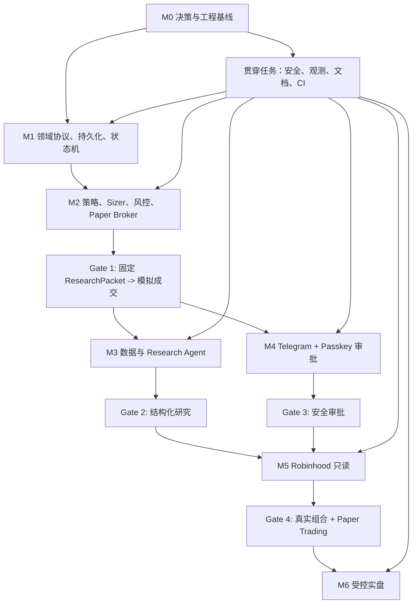

# ainvest 可执行实施 TODO

> 基于：`likefudan/ainvest` 的 `design.md`（PR #1，2026-07-24 已合并）以及随后确认的安全和数据源决策
>
> 文档用途：将 ainvest 从“只有架构设计”推进到 Paper Trading、研究、审批、Robinhood 只读接入和受控实盘。每张任务卡都可以交给独立 Codex sub-agent、Cursor Agent 或其他 AI 工具执行。
>
> 安全原则：除非任务卡明确属于 Phase 5，并且所有实盘门禁已经通过，否则所有实现必须保持 `TRADING_MODE=paper`、`LIVE_TRADING_ENABLED=false`、`REQUIRE_HUMAN_APPROVAL=true`。首版固定 `REGULAR_TRADING_HOURS_ONLY=true`、`REQUIRE_COMPLETE_RISK_LIMITS=true`。

## 0. 当前基线

- 仓库：`likefudan/ainvest`，默认分支 `main`，私有仓库。
- 已有文件：`README.md`、`.gitignore`、`design.md`。
- `README.md` 明确写明 implementation has not started。
- 尚无 `pyproject.toml`、应用代码、测试、数据库迁移、CI 或部署配置。
- `design.md` 已确定总体架构、安全边界、五阶段路线、数据协议样例和核心依赖。
- 本 TODO 不改变设计中的产品边界：首版只支持美股/ETF、限价单优先、默认 Paper Trading、实盘逐笔人工审批。

## 1. 所有执行 Agent 必须继承的上下文

### 1.1 系统目标

ainvest 是一个 AI 辅助研究、确定性 Python 策略决策、独立风控、人工审批、Broker 执行的交易框架。主流程是：

```text
外部数据
  -> Research Agent
  -> ResearchPacket
  -> Strategy Engine
  -> TradeSignal
  -> Position Sizer
  -> Risk Engine
  -> OrderProposal
  -> Telegram 通知
  -> HTTPS + Passkey 审批
  -> 下单前二次风控
  -> Robinhood MCP / Paper Broker
  -> 成交核对
  -> 追加式审计
```

### 1.2 不可破坏的架构约束

1. AI 只能研究和解释，不能产生可直接提交给 Broker 的订单。
2. 策略只能产生 `TradeSignal`，不能决定最终股数、持有 Broker 凭据或调用 Broker。
3. Position Sizer 只产生候选订单，Risk Engine 拥有无条件否决权。
4. 所有资金相关计算使用 `Decimal`；JSON 中金额和数量使用十进制字符串。
5. 时间统一为带时区的 UTC ISO 8601；禁止使用 naive datetime。
6. 模块间只传递带 `schema_version` 的 Pydantic 模型。
7. 缺数据、旧数据、异常、超时、状态冲突和无法确认下单结果时必须 fail closed。
8. 审批绑定规范化订单哈希。标的、方向、数量、订单类型、限价、有效期或策略版本变化后，原审批立即失效。
9. Telegram 只是通知通道，不是身份验证或最终授权边界。
10. Execution Service 是唯一可以获得交易工具访问权的组件。
11. `SUBMIT_UNKNOWN` 时禁止直接重试下单，必须先核对幂等键、客户端订单 ID 和 Broker 历史。
12. Research、Strategy、Risk、Approval 和 Execution 的输入、输出、版本和状态迁移都要可重放、可审计。
13. 策略插件是任意 Python 代码，必须在独立进程中运行；无凭据、默认无网络、只读文件系统、有限 CPU/内存/时间。
14. 不得使用要求 Robinhood 用户名/密码或非官方接口的 Broker 库。
15. 任何 agent 都不得把真实 token、账户号、Passkey 私钥或 `.env` 内容写入代码、测试快照或日志。
16. 首版只允许在美股常规交易时段创建或执行订单；盘前、盘后、隔夜、节假日和提前收市后的时段一律不交易。
17. 任一必需风控额度缺失、为空、格式错误或无效时必须拒绝交易，不得使用隐式额度默认值。
18. Robinhood MCP 正式提供且通过契约测试的读取能力必须优先通过 Robinhood Read Gateway 使用，不重复引入同类默认供应商。
19. 实盘报价只使用 Robinhood MCP `get_equity_quotes`；点差和深度使用 `get_equity_price_book`。MCP 失败、过期、缺字段或冲突时拒绝交易，不得回退到 Alpaca、yfinance 或其他行情源。
20. Research Agent 和 Strategy Engine 只能访问只读网关返回的版本化 schema，不能持有原始 MCP session、OAuth token 或写单工具。
21. SEC EDGAR + EdgarTools 提供原始申报证据；新闻和事件使用 GDELT、SEC 8-K/Form 4 和公司 Investor Relations；yfinance 仅为可选开发/离线适配器，Alpaca 不是首版默认依赖。

### 1.3 首版非目标

- 高频/低延迟交易。
- 无人值守全自动实盘。
- 期权、期货、加密货币、保证金、裸卖空。
- 多租户、代客理财或对第三方提供投资建议。
- 用自然语言作为下单协议。
- 用回测结果承诺未来收益。
- 在 Telegram 内完成不可撤销授权。

### 1.4 固定技术方向

- Python package：`src/ainvest` 布局。
- 数据协议与配置：Pydantic。
- 策略插件：pluggy + Python `entry_points` + `StrategyRegistry`。
- HTTP API：FastAPI。
- 数据库：SQLAlchemy + Alembic；开发/MVP 为 SQLite，部署后可切 PostgreSQL。
- 状态机：transitions。
- Telegram：python-telegram-bot。
- Passkey：py_webauthn。
- 调度：APScheduler 3.11.x。
- Robinhood：官方 Trading MCP + MCP Python SDK。
- 数据源：Robinhood MCP 能力优先；SEC EDGAR/EdgarTools 提供原始申报，GDELT/SEC/公司公告提供新闻事件，yfinance 仅作可选开发和离线用途。
- 测试：pytest、Hypothesis、HTTPX mock。
- 日志/监控：structlog、OpenTelemetry、Prometheus。

### 1.5 Agent 工作协议

每次只领取一张任务卡，或一组明确标注可连续完成的任务卡。开始前：

1. 阅读 `design.md`、本文件、当前 `README.md` 和目标目录已有代码。
2. 检查当前分支和未提交改动，不覆盖其他 agent 的工作。
3. 复述本任务的输入、输出、允许修改的目录和依赖。
4. 若依赖尚未合并，不自行复制另一任务的实现；使用最小接口桩或停止并报告。
5. 先写/更新测试，再实现到测试通过；安全任务需要失败路径测试。
6. 不做任务卡之外的大规模重构，不顺手启用实盘。
7. 提交前运行本任务要求的格式化、静态检查和测试。
8. 最终报告：修改文件、行为变化、测试证据、未解决风险、需要下游注意的接口。

建议分支命名：`task/<task-id>-<short-name>`。建议一个任务卡一个 PR；同一文件的任务按依赖顺序串行，避免并行冲突。

### 1.6 通用 Definition of Done

除任务卡另有说明外，每项任务必须同时满足：

- 代码有类型注解，公共接口有简短 docstring。
- 新增行为有正向、边界和失败关闭测试。
- `ruff`、类型检查和目标测试通过。
- 不出现 float 金额、naive datetime、明文凭据、真实账户数据。
- 错误使用稳定的机器可读 code，不依赖错误文本做控制流。
- 外部调用均有超时；重试只用于确定可安全重试的只读操作。
- 日志带 correlation ID，且敏感数据已脱敏。
- 新配置有安全默认值、校验、`.env.example` 或 example YAML。
- 若新增公共 schema/API，提供序列化样例和向后兼容说明。
- 若改变状态，事务与审计事件在同一原子边界内完成，或明确使用 outbox。

## 2. 推荐的总体执行顺序



可以并行的主要工作流：

- 完成 M0 后，领域 schema、CI、威胁模型可以并行。
- schema 稳定后，持久化、策略协议、Paper Broker 接口、状态机可以分给不同 agent。
- Gate 1 后，Research track 与 Approval track 可以并行。
- Robinhood 只读必须等领域模型、持久化和基本观测完成。
- 任何写单代码必须等 Gate 1–4、安全测试和实盘决策全部完成。

## 3. 任务索引

| Milestone | 目标 | 任务 |
|---|---|---|
| M0 | 决策、威胁模型、项目基线 | GOV-001～002, FND-001～004 |
| M1 | Schema、数据库、审计、状态机 | DOM-001～006, DB-001～003, WF-001～002 |
| M2 | 策略、Sizer、风控、Paper 闭环 | STR-001～006, SIZ-001～002, RSK-001～005, PAP-001～003, ORC-001 |
| Gate 1 | 固定输入到可重复模拟成交 | REL-001 |
| M3 | 数据、Research Agent、回测 | DAT-001～005, RES-001～004, BKT-001～003 |
| Gate 2 | 研究输出可验证、可追溯 | REL-002 |
| M4 | Telegram、HTTPS、Passkey | APR-001～007, DEP-001 |
| Gate 3 | 重放/篡改全部失败关闭 | REL-003 |
| M5 | Robinhood 官方 MCP 只读 | RHB-001～003 |
| Gate 4 | 真实组合驱动 Paper Trading | REL-004 |
| M6 | 受控写单与核对 | EXE-001～005 |
| Gate 5 | 极小额实盘演练 | REL-005 |
| 贯穿 | 运行模式、观测、安全、文档 | OPS-001～003, OBS-001～003, SEC-001～002, DOC-001～004, QAT-001～003 |

---

## 4. M0：决策与工程基线

### GOV-001 — 建立决策登记册与 ADR

- **目标**：把设计中“实现前仍需确定”的选项变成可追踪、不会被 agent 随意猜测的决策。
- **依赖**：无。
- **建议文件**：`docs/decisions/README.md`、`docs/adr/0001-*.md` 模板。
- **执行清单**：
  - 建立状态：`proposed / accepted / superseded`。
  - 为以下未决问题各建条目：AI 模型、审批域名/部署、Telegram 身份、首版策略、风险额度具体数值、数据保留期。
  - 为已确定的“仅美股常规交易时段”“缺失必需风控额度即拒绝交易”和“Robinhood MCP 优先的数据源策略”建立 `accepted` 决策记录，agent 不得重新选择。
  - 记录 owner、deadline、默认安全行为和受影响 milestone。
  - 未决项必须有 fail-closed 默认值；例如无实盘报价供应商则禁止实盘。
- **验收**：
  - 所有未决项都有唯一 ID。
  - 代码配置可以引用这些 ID，但不得把未决选择硬编码成“已确定”。
  - README 链接到决策登记册。

### GOV-002 — 编写信任边界与威胁模型

- **目标**：在写审批和 Broker 代码前固定资产、攻击面和控制措施。
- **依赖**：GOV-001。
- **建议文件**：`docs/security/threat-model.md`、`docs/security/data-flow.md`。
- **执行清单**：
  - 列出资产：资金、Broker token、Telegram token、WebAuthn credential、公私账户数据、审批令牌、策略包、审计记录。
  - 列出主体和信任域：数据、研究、策略 worker、风控、审批 API、Execution、数据库、用户 iPhone、外部供应商。
  - 覆盖 STRIDE 类威胁：策略逃逸、依赖投毒、审批重放、订单篡改、SSRF、Webhook 伪造、重复下单、日志泄密、时钟偏差、MCP 超时。
  - 把每个控制措施映射到本 TODO 的任务 ID 和测试。
  - 明确剩余风险与实盘前必须关闭的 high/critical 项。
- **验收**：至少包含数据流图、信任边界、威胁表、控制表、残余风险表；安全测试可以反向追踪到威胁 ID。

### FND-001 — 初始化 Python 项目与依赖分组

- **目标**：建立可安装、可测试、默认安全的 `src` layout。
- **依赖**：无，可与 GOV-001 并行。
- **建议文件**：`pyproject.toml`、`src/ainvest/__init__.py`、`tests/conftest.py`、`.python-version`、lock file。
- **执行清单**：
  - 选择并记录 Python 最低版本；优先当前受支持版本，不使用 EOL Python。
  - 建立 core、research、approval、broker、observability、dev/test 等 dependency groups，避免研究进程默认安装交易依赖。
  - 配置 pytest、ruff、类型检查、coverage。
  - 固定 APScheduler 为设计指定的 3.11.x；其他依赖使用兼容范围并生成带哈希锁文件。
  - 增加最小 import/smoke test。
- **验收**：全新环境能安装；`python -c "import ainvest"`、lint、type-check、pytest 均通过；默认依赖不包含任何非官方 Robinhood 库。

### FND-002 — 建立包目录、依赖方向与架构测试

- **目标**：创建设计中的包边界，并防止研究/策略越权依赖执行模块。
- **依赖**：FND-001。
- **建议目录**：`src/ainvest/{agents,data,schemas,strategies,risk,approval,execution,portfolio,audit,api}`。
- **执行清单**：
  - 每个 package 只建立最小 `__init__` 和公共接口出口。
  - 记录允许依赖方向，例如 schemas 可被所有层使用，execution 不得被 strategies/agents 导入。
  - 添加架构测试扫描 imports；禁止 `strategies -> execution`、`agents -> execution`、`risk -> approval` 等逆向耦合。
  - 区分 domain models 与 ORM models，禁止把 ORM 实例跨层传递。
- **验收**：目录存在；架构测试能用故意违规 fixture 证明会失败；无循环依赖。

### FND-003 — 配置加载与安全默认值

- **目标**：统一 YAML、环境变量和运行模式，不允许 agent 各自读取 `os.getenv`。
- **依赖**：FND-001。
- **建议文件**：`src/ainvest/config.py`、`config/risk.example.yaml`、`config/strategies.example.yaml`、`.env.example`。
- **执行清单**：
  - 建立 Pydantic Settings；集中定义 `TRADING_MODE`、`LIVE_TRADING_ENABLED`、`REQUIRE_HUMAN_APPROVAL`、`REGULAR_TRADING_HOURS_ONLY`、`REQUIRE_COMPLETE_RISK_LIMITS`。
  - 默认值固定为 paper/false/true/true/true；首版拒绝把后两项设为 false。
  - 配置来源优先级明确；生产拒绝未知字段和不安全组合。
  - YAML 使用安全 loader，禁止任意对象、`eval`、lambda 和表达式。
  - secret 字段 `repr=False`，错误消息不得回显值。
- **验收**：缺配置可安全启动 Paper；任何试图在无完整门禁时启用 live 的配置都在启动阶段失败；测试覆盖未知字段、坏类型、危险组合和 secret 脱敏。

### FND-004 — CI、提交质量门禁与依赖安全

- **目标**：让每个 agent 的 PR 有一致验证标准。
- **依赖**：FND-001。
- **建议文件**：`.github/workflows/ci.yml`、`.pre-commit-config.yaml`、`CODEOWNERS`、依赖更新配置。
- **执行清单**：
  - CI 运行 lint、format check、type-check、unit tests、coverage、schema snapshot check。
  - 加入 secret scan、dependency audit、lock file consistency。
  - 安全/执行目录要求 owner review；实盘相关测试不能被普通标记跳过。
  - CI 不注入真实 Broker/Telegram 凭据。
- **验收**：空白 PR 与故意失败测试能正确阻断；CI 产物不包含 `.env`、token 或账户数据。

---

## 5. M1：领域协议、持久化与状态机

### DOM-001 — 通用领域基础类型

- **目标**：建立所有 schema 共用的严格类型和序列化规则。
- **依赖**：FND-001～003。
- **建议文件**：`src/ainvest/schemas/common.py`、`tests/unit/schemas/test_common.py`。
- **执行清单**：
  - 定义 `SchemaVersion`、UTC datetime 校验、symbol、currency、source、quality flag、稳定 ID 类型。
  - 定义金额、价格、数量、权重、比例的 `Decimal` 约束。
  - 禁止 NaN、Infinity、负数金额和多余字段；明确允许负数的 P&L 类型。
  - 统一 JSON encoder：Decimal -> string，datetime -> UTC ISO 8601。
- **验收**：float、naive datetime、未知字段、非法 symbol、越界比例均拒绝；round-trip 后值与类型不变。

### DOM-002 — 市场、研究与证据 Schema

- **目标**：实现 `ResearchPacket` 及其来源、时效、质量结构。
- **依赖**：DOM-001。
- **建议文件**：`src/ainvest/schemas/market.py`、`research.py`。
- **执行清单**：
  - 建模 quote、OHLCV、technical indicators、fundamentals、event、evidence citation、thesis。
  - 每条外部数据含 `source/observed_at/received_at/timezone/is_delayed/quality_flags`。
  - `ResearchPacket` 包含 `research_id/symbol/as_of/market/technical/portfolio/thesis/evidence`。
  - 不允许把无来源自然语言当证据；关键数值标记计算来源。
- **验收**：实现 design 示例；旧行情和 received-before-observed 等异常能标记或拒绝；生成 JSON Schema 和 golden fixture。

### DOM-003 — 组合、策略上下文与交易信号 Schema

- **目标**：定义策略唯一允许读取和返回的协议。
- **依赖**：DOM-001～002。
- **建议文件**：`src/ainvest/schemas/portfolio.py`、`strategy.py`。
- **执行清单**：
  - 定义账户 scope、buying power、cash、positions、exposure、open orders 的只读快照。
  - 定义 `StrategyContext`：`as_of`、ResearchPacket、组合快照、显式策略状态；对象不可变。
  - 定义 `TradeSignal`：intent、strength、target_weight、生成/过期时间、reason_codes、策略版本、research_id。
  - `strength` 限制在 -1～1，明确不是成功概率；HOLD 不能转为订单。
- **验收**：策略上下文无法原地修改；未来时间、过期信号、越界 strength、缺 strategy version 都失败。

### DOM-004 — 候选订单、风控、审批与 Broker Schema

- **目标**：把策略意图之后的所有资金动作标准化。
- **依赖**：DOM-001、DOM-003。
- **建议文件**：`src/ainvest/schemas/{orders,risk,approval,broker}.py`。
- **执行清单**：
  - 定义 `CandidateOrder`、`OrderProposal`、`RiskDecision`、`RiskViolation`。
  - 定义 Approval challenge/event、Broker order/fill、reconciliation result。
  - 首版 enum 只允许 equity/ETF、BUY/SELL、LIMIT、DAY；明确拒绝 short、margin、options。
  - OrderProposal 包含 maximum_notional、risk_decision_id、created/expires、order_hash。
- **验收**：设计样例可 round-trip；非法资产/订单类型无法构造；所有结果都有机器可读 reason/rule code。

### DOM-005 — 规范化订单序列化与哈希

- **目标**：生成跨 API、数据库和进程稳定一致的审批绑定摘要。
- **依赖**：DOM-004。
- **建议文件**：`src/ainvest/approval/order_hash.py`、`tests/unit/approval/test_order_hash.py`。
- **执行清单**：
  - 明确哈希字段、字段顺序、Decimal 规范、时间格式、Unicode 和空值处理。
  - 使用 canonical JSON + SHA-256；输出带算法前缀。
  - 哈希必须覆盖 symbol、side、quantity、type、limit、TIF、maximum_notional、expires、strategy name/version、account scope。
  - 不把 display text、数据库自增 ID、可变化的 UI 文案混入摘要。
- **验收**：相同语义不同输入格式得到相同哈希；任一关键字段变化哈希变化；提供固定测试向量供其他语言/UI 使用。

### DOM-006 — Schema 版本与兼容性策略

- **目标**：避免多个团队的策略插件因隐式 schema 变化失效。
- **依赖**：DOM-001～005。
- **建议文件**：`docs/schema-versioning.md`、`schemas/json/*.json`、`tests/contract/`。
- **执行清单**：
  - 定义 major/minor 兼容规则、弃用窗口、未知字段策略和 migration 边界。
  - 导出核心 JSON Schema 并纳入版本控制。
  - 添加 snapshot/contract test，破坏性变化必须显式批准。
  - 为每个 schema 保存至少一个有效和多个无效 fixture。
- **验收**：CI 能识别无意的破坏性 schema 变化；插件可声明支持的 Strategy API 范围。

### DB-001 — SQLAlchemy 模型、连接与首版 Alembic 迁移

- **目标**：实现设计列出的持久化记录，支持 SQLite 和 PostgreSQL。
- **依赖**：DOM-001～004、FND-003。
- **建议文件**：`src/ainvest/db/`、`migrations/`。
- **执行清单**：
  - 建表：research_runs/packets、strategy_runs、signals、risk_decisions、proposals、approval_challenges/events、broker_orders/fills、portfolio_snapshots、audit_events。
  - JSON payload 与可查询索引字段分离；保留 schema/version/code hash。
  - 时间全为 UTC；金额保存为定点数或规范十进制字符串，不使用 binary float。
  - 增加唯一约束：signal/proposal/idempotency/client_order_id/token_hash 等。
- **验收**：空库 upgrade/downgrade/upgrade；SQLite 集成测试通过；PostgreSQL 类型兼容测试可在 CI 服务中运行。

### DB-002 — Repository、Unit of Work 与并发控制

- **目标**：让业务层不直接操作 ORM，并为审批一次消费和状态迁移提供事务边界。
- **依赖**：DB-001。
- **建议文件**：`src/ainvest/db/repositories.py`、`uow.py`。
- **执行清单**：
  - 为 proposal、approval、broker order、audit 提供最小 repository。
  - 定义 Unit of Work；业务操作一次 commit，异常 rollback。
  - 对一次性审批使用条件更新/行锁/版本列，保证并发点击只成功一次。
  - 对幂等请求使用唯一键后读取已有结果，不以捕获文本错误判断。
- **验收**：并发测试证明只创建一个审批/执行请求；rollback 不留下半完成状态。

### DB-003 — 追加式审计事件与脱敏

- **目标**：所有关键决策可重放，同时不泄露 secret。
- **依赖**：DB-001～002。
- **建议文件**：`src/ainvest/audit/`。
- **执行清单**：
  - 定义事件 envelope：event_id/time/correlation/causation/actor/type/input-output digest/versions/state before-after/error。
  - 审计只追加，不提供业务删除/更新接口。
  - 建立递归脱敏器，覆盖 token、cookie、authorization、account number、approval raw token。
  - 定义 payload 大小限制和外部大对象 digest。
- **验收**：关键流程每次状态变更都有审计；secret corpus 测试确保日志/审计不出现明文；审计可按 proposal_id 还原时间线。

### WF-001 — 订单状态机与非法迁移保护

- **目标**：实现 design 第 8 节的完整状态图。
- **依赖**：DOM-004、DB-002～003。
- **建议文件**：`src/ainvest/execution/state_machine.py`。
- **执行清单**：
  - 实现所有状态和唯一允许的边。
  - 迁移包含 expected-current-state，防止陈旧 worker 覆盖新状态。
  - 每次迁移原子写业务状态与 audit event。
  - 终态不可继续迁移；`SUBMIT_UNKNOWN -> RECONCILING` 是唯一恢复入口。
- **验收**：测试覆盖所有合法边和代表性非法边；乱序/重复事件幂等；禁止 `SUBMIT_UNKNOWN -> SUBMITTING`。

### WF-002 — 领域命令、事件与关联 ID

- **目标**：为 orchestrator、worker 和 API 建立稳定的内部命令接口。
- **依赖**：WF-001、DB-003。
- **建议文件**：`src/ainvest/workflow/`。
- **执行清单**：
  - 定义命令：evaluate_strategy、size_order、evaluate_risk、create_proposal、approve、execute、reconcile。
  - 定义对应结果/事件；每个对象携带 correlation/causation/idempotency ID。
  - 区分可安全重试的纯函数、只读外部调用和不可盲重试的写单。
  - 先采用进程内 dispatcher；接口允许未来替换为持久队列/Temporal。
- **验收**：重复命令返回同一业务结果；不依赖 in-memory hidden state；trace 可串起完整工作流。

---

## 6. M2：策略、Position Sizer、风控与 Paper Broker

### STR-001 — Strategy API、Definition 与 Hook 规范

- **目标**：实现多团队策略共享的最小稳定接口。
- **依赖**：DOM-003、DOM-006、FND-002。
- **建议文件**：`src/ainvest/strategies/{api,hooks,definitions}.py`。
- **执行清单**：
  - 定义 Strategy Protocol、Pydantic params model、StrategyDefinition、plugin metadata。
  - metadata 包含 plugin_id/version、Strategy API range、strategy name/version、source commit、owner/repo。
  - Hook `strategy_definitions()` 只返回声明，不在 import 时执行策略。
  - 明确 `evaluate(context) -> StrategyResult`；结果含 signals、next_state、diagnostics。
- **验收**：最小第三方包可实现接口；缺元数据、错误参数模型、不兼容 API 被拒绝。

### STR-002 — pluggy 加载与 StrategyRegistry

- **目标**：从 `ainvest.strategies` entry point 安全发现、验证和列举插件。
- **依赖**：STR-001。
- **建议文件**：`src/ainvest/strategies/registry.py`。
- **执行清单**：
  - 配置 PluginManager、hookspec、entry point 加载。
  - 冲突的 plugin_id、entry point、strategy name 必须使启动失败。
  - 支持配置 allowlist、固定版本和禁用列表；live 模式强制 allowlist。
  - registry 对外只暴露验证后的不可变 definition。
- **验收**：测试包覆盖多插件、冲突、API 不兼容、未知策略、被禁用策略；不得静默覆盖。

### STR-003 — 策略 YAML 实例配置

- **目标**：把策略代码定义与运行实例配置分离。
- **依赖**：STR-001～002、FND-003。
- **建议文件**：`src/ainvest/strategies/config.py`、`config/strategies.example.yaml`。
- **执行清单**：
  - 支持 id/plugin/enabled/universe/parameters/schedule/constraints。
  - 用 definition.params_model 验证 parameters。
  - 校验 symbols、timeframe、research_max_age、signal_ttl。
  - 禁止重复实例 ID、未知参数、可执行 YAML 和 live 下的浮动插件版本。
- **验收**：design 示例可加载；坏配置在启动时失败且不泄露 secret；配置归一化结果可审计。

### STR-004 — 参考移动平均策略插件

- **目标**：提供一个不含 Broker/网络访问的完整示例，验证 API 能用。
- **依赖**：STR-001～003、DOM-002～003。
- **建议文件**：`examples/strategies/moving_average/` 或独立 workspace package。
- **执行清单**：
  - 实现 fast/slow window、target_weight 参数。
  - 只使用 context.as_of 和提供的历史数据；不得读取系统当前时间。
  - 输出 BUY/SELL/HOLD 与稳定 reason_codes。
  - 提供 entry point、metadata、tests、README。
- **验收**：相同输入重复运行字节级相同；无未来数据；能被 Registry 从已安装 package 发现。

### STR-005 — 独立策略 Worker 与资源边界

- **目标**：让策略异常或恶意行为不能接触主进程 secret 和交易能力。
- **依赖**：STR-001～003、DB-003。
- **建议文件**：`src/ainvest/strategies/worker/`。
- **执行清单**：
  - 主进程以版本化 JSON 传入/出，不传 ORM、socket、credential。
  - 独立进程设置 wall timeout、CPU/内存限制；捕获 crash/timeout/invalid-output。
  - 运行环境清理敏感 env，工作目录只读；默认网络隔离方案需按目标 OS/容器记录。
  - 记录 package version、source commit、params digest、input digest、duration。
  - worker 失败只影响本策略本次运行。
- **验收**：测试策略尝试超时、OOM、读 secret、联网、返回坏 schema 时均失败关闭；主调度仍可继续其他策略。

### STR-006 — strategy-conformance 测试套件

- **目标**：让独立团队在自己的 CI 验证插件。
- **依赖**：STR-001～005、PAP-001。
- **建议文件**：`src/ainvest/strategy_conformance/`、CLI entry point。
- **执行清单**：
  - 检查 Hook/metadata/API range/参数/信号 schema。
  - 用固定 clock/input 重复运行检查确定性。
  - 检查无未来数据、timeout、异常、Paper 示例。
  - 提供网络/Broker/secret 访问探针。
  - 输出机器可读 JSON 和人类可读报告。
- **验收**：参考策略通过；多个故意违规插件分别失败并给稳定 code；文档包含第三方 CI 示例。

### SIZ-001 — 单策略 Position Sizer

- **目标**：把 target_weight 意图转换为整股候选订单。
- **依赖**：DOM-003～004、FND-003。
- **建议文件**：`src/ainvest/portfolio/sizer.py`。
- **执行清单**：
  - 输入 signal、最新 quote、portfolio snapshot、sizing config。
  - 计算目标市值、当前差额、现金保留、整股向安全方向取整、min/max notional。
  - HOLD、过期 signal、缺价格、零/负购买力返回 no-order + reason。
  - 不在这里做最终风险批准。
- **验收**：全部使用 Decimal；Hypothesis 覆盖边界；候选金额不超过配置/购买力；输出可重复。

### SIZ-002 — 多策略同标的信号合并策略

- **目标**：明确冲突信号如何变成至多一个候选订单，避免重复/对敲。
- **依赖**：SIZ-001。
- **建议文件**：`src/ainvest/portfolio/signal_aggregation.py`、ADR。
- **执行清单**：
  - 先通过 ADR 固定首版规则；安全默认建议冲突即不交易/NEEDS_REVIEW。
  - 按 symbol、as_of、有效期和策略版本分组。
  - 禁止未经明确规则的 strength 加权或把 strength 当概率。
  - 记录每个输入 signal 及最终 reason code。
- **验收**：BUY/SELL 冲突、重复 signal、不同 as_of、过期混合均有确定结果；不会产生同标的双向订单。

### RSK-001 — 风控规则框架与决策聚合

- **目标**：建立纯 Python、可组合、可解释的 Risk Engine。
- **依赖**：DOM-004、DB-003。
- **建议文件**：`src/ainvest/risk/{engine,rules,models}.py`。
- **执行清单**：
  - 规则接口只接收不可变 RiskContext，返回 rule code/severity/decision/reason/evidence。
  - 聚合优先级：任何 hard reject -> REJECTED；review-only -> NEEDS_REVIEW；否则 APPROVED。
  - 缺输入、缺任一必需风控额度、规则异常、未知规则均 fail closed。
  - 决策记录 rule set/config/code versions 和 input digest。
- **验收**：规则顺序不改变最终结果；异常规则无法被吞掉后批准；每个结果可解释、可审计。

### RSK-002 — 金额、仓位、行业与现金规则

- **目标**：实现资金暴露类硬限制。
- **依赖**：RSK-001、SIZ-001。
- **建议文件**：`src/ainvest/risk/rules/exposure.py`。
- **执行清单**：
  - 单笔最大名义金额、单标的最大权重、单行业最大暴露。
  - 单日最大成交额、最低现金保留、单日已实现/未实现亏损。
  - 所有必需额度必须显式配置并通过范围校验；缺失或无效时返回 REJECTED，不提供可交易的默认额度。
  - 计算 post-trade 状态，不只检查当前状态。
  - 无行业映射、P&L 不完整、账户净值异常时拒绝或 NEEDS_REVIEW，不默认通过。
- **验收**：阈值等于/略超边界测试；买卖两侧和负 P&L；Decimal property tests。

### RSK-003 — 资产、白名单、方向与交易时段规则

- **目标**：把首版产品范围变成不可绕过的硬规则。
- **依赖**：RSK-001、DAT-004 可后补真实日历，先用接口/fake。
- **建议文件**：`src/ainvest/risk/rules/eligibility.py`。
- **执行清单**：
  - 只允许配置白名单内普通美股/ETF。
  - 拒绝 options、crypto、margin、short、leveraged/inverse ETF。
  - 固定只允许 regular session；校验节假日、提前收市和交易 halt，首版不提供盘前/盘后开关。
  - 元数据缺失时拒绝。
- **验收**：每一类禁用资产有测试；非交易时段/节假日/提前收市失败关闭。

### RSK-004 — 行情时效、点差、波动与滑点规则

- **目标**：禁止使用过期或异常价格批准订单。
- **依赖**：RSK-001、DOM-002。
- **建议文件**：`src/ainvest/risk/rules/market_quality.py`。
- **执行清单**：
  - quote 最大年龄、delayed flag、bid/ask 完整性。
  - 最大 spread bps、异常短期波动、最大允许 limit/market reference 偏移。
  - 区分 proposal-time 和 pre-trade-time 阈值。
  - 时钟偏差、零/负价格、crossed market 都失败关闭。
- **验收**：边界和 stale-clock tests；报价更新后旧批准不能自动沿用超限价格。

### RSK-005 — 重复订单、未完成冲突、Kill Switch 与二次风控

- **目标**：防止重复下单和在账户状态变化后执行旧批准。
- **依赖**：RSK-001～004、DB-002、WF-001。
- **建议文件**：`src/ainvest/risk/rules/orders.py`、`kill_switch.py`、`pretrade.py`。
- **执行清单**：
  - 以 proposal hash、symbol/side/window、client order ID 检测重复。
  - 检测同标的相反/重叠未完成订单。
  - Kill switch 支持配置、数据库/运营开关，任何来源 active 即拒绝新订单。
  - pre-trade 重新获取 quote/account/positions/open orders 并运行完整规则集。
  - 二次风控不得复用旧 APPROVED 结论。
- **验收**：重复 webhook/worker、旧快照、kill switch、已有 open order 均阻止执行；测试证明所有 hard rules 在执行前再次运行。

### PAP-001 — Broker Port 与错误分类

- **目标**：用同一领域接口支持 Paper 和 Robinhood，业务层不依赖 MCP 细节。
- **依赖**：DOM-004。
- **建议文件**：`src/ainvest/execution/broker.py`。
- **执行清单**：
  - 定义只读方法：account、positions、quotes、orders、fills。
  - 定义写方法：submit/cancel；写能力用单独 protocol/capability，避免只读进程获得它。
  - 定义稳定错误：auth、timeout、rate limit、invalid order、rejected、unknown outcome。
  - submit 必须要求 idempotency/client order ID。
- **验收**：Paper adapter contract tests；只读类型无法调用 submit；unknown outcome 与明确 rejected 可区分。

### PAP-002 — 确定性 Paper Broker 与成交模拟

- **目标**：建立无真实资金的订单生命周期。
- **依赖**：PAP-001、WF-001、DB-001～003。
- **建议文件**：`src/ainvest/execution/paper.py`。
- **执行清单**：
  - 账户现金/仓位、提交、取消、部分成交、成交、拒绝。
  - limit fill 仅依据注入的 market events；时钟与随机数可注入/固定。
  - 模拟手续费、点差和滑点；不得暗含零成本。
  - 相同 idempotency key 返回同一订单。
- **验收**：相同事件序列得到相同结果；不会超卖/透支；重复 submit 不重复扣款；部分成交记账正确。

### PAP-003 — Paper 核对与组合记账

- **目标**：从 Broker order/fill 重建内部状态，发现不一致。
- **依赖**：PAP-002、DB-001～003。
- **建议文件**：`src/ainvest/execution/reconciliation.py`、`portfolio/ledger.py`。
- **执行清单**：
  - 拉取 orders/fills，与本地 client order ID、数量、价格、状态比较。
  - 处理重复、乱序和迟到 fill。
  - 差异进入 MANUAL_REVIEW 并告警，不静默修正资金事实。
  - 生成 portfolio snapshot 和 P&L 基础数据。
- **验收**：重复/乱序事件幂等；缺失订单、数量差异和未知 fill 能被识别；账本守恒测试通过。

### ORC-001 — 固定 ResearchPacket 的完整 Paper Orchestrator

- **目标**：把已有模块串成第一个端到端闭环，不包含 AI/Telegram/Robinhood。
- **依赖**：STR-001～006、SIZ-001～002、RSK-001～005、PAP-001～003、WF-002。
- **建议文件**：`src/ainvest/orchestrator.py`、CLI、`tests/integration/test_paper_flow.py`。
- **执行清单**：
  - 输入固定 ResearchPacket + portfolio + strategy config。
  - 执行 strategy -> size -> risk -> proposal -> 测试审批 stub -> Paper submit -> fill -> reconcile。
  - 支持 dry-run 展示每步输出；默认不自动“批准”，测试必须显式注入 approval。
  - 每步落库并写关联审计。
- **验收**：正常、风控拒绝、审批过期、Broker unknown、部分成交五条流程可重放；相同 fixture 产生相同决策和摘要。

### REL-001 — Gate 1：Phase 1 模拟闭环验收

- **目标**：冻结首个可用领域内核。
- **依赖**：M0、M1、M2 全部任务。
- **执行清单**：
  - 运行全套 unit/contract/integration/safety tests。
  - 从空 SQLite migration 到固定输入模拟成交并导出 audit timeline。
  - 验证策略进程无凭据/网络、Risk fail closed、Paper 幂等、状态机无非法边。
  - 记录性能基线和未解决缺陷；high/critical 缺陷必须清零。
- **验收**：满足 design Phase 1“固定 ResearchPacket 到模拟成交可重复、可测试”；生成 `docs/releases/phase-1-acceptance.md`。

---

## 7. M3：数据、Research Agent 与回测

### DAT-001 — 数据适配器 Ports 与测试替身

- **目标**：统一 quote、price book、OHLCV、fundamentals、news/events 和 instrument metadata，并为 Robinhood Read Gateway 建立供应商无关接口。
- **依赖**：DOM-002、PAP-001。
- **建议文件**：`src/ainvest/data/{ports,models,fakes}.py`。
- **执行清单**：
  - 为每类数据定义 async 或 sync 一致接口，明确请求/返回、超时、分页和错误。
  - 所有返回值补齐 provenance、observed/received time、timezone、delayed、quality flags。
  - 建立 deterministic fake provider 与 fixture dataset。
  - 禁止上层直接 import 第三方供应商 SDK。
- **验收**：各 provider 共享 contract tests；缺时间/来源的数据无法进入 ResearchPacket；实盘 quote port 不提供跨供应商自动 fallback。

### DAT-002 — 可选开发/离线行情与 OHLCV 适配器

- **目标**：在没有 Robinhood 授权时，用 yfinance 支持本地开发、回测和离线研究，但不进入任何实盘风险决策。
- **依赖**：DAT-001。
- **建议文件**：`src/ainvest/data/providers/yahoo.py`。
- **执行清单**：
  - 实现 quote、历史 OHLCV、corporate actions 的薄适配。
  - 明确调整价/未调整价、交易所时区、延迟属性和供应商限制。
  - 网络超时、空响应、rate limit 转为稳定错误；缓存必须保留原 observed_at。
  - 代码、类型和文档显式标记 `development_only`；live mode 不得构造或调用该 adapter。
- **验收**：使用录制/伪造响应的测试不依赖公网；拆股/分红、缺 bar、时区、重复索引均覆盖；live 配置引用此 provider 时启动失败。

### DAT-003 — SEC/基本面与财报事件适配器

- **目标**：使用 SEC EDGAR + EdgarTools 获取可引用的原始公司申报和监管事件，补充 Robinhood MCP 的标准化基本面。
- **依赖**：DAT-001。
- **建议文件**：`src/ainvest/data/providers/sec.py`。
- **执行清单**：
  - 支持公司映射、10-K/10-Q/8-K/Form 4 metadata 和选定 XBRL 指标。
  - 尊重 SEC user-agent/rate limit；缓存原文引用位置和 accession。
  - 数值单位、期间、币种显式，不静默混合年度/季度。
  - 将“下一财报日期”的确定性与来源质量标记清楚。
- **验收**：固定 filing fixtures 可生成证据和基础面字段；缺单位/期间的数据不被默认为可比。

### DAT-004 — 新闻、宏观事件与交易日历

- **目标**：接入 GDELT、SEC 8-K/Form 4 和公司 Investor Relations 公告，并提供可靠美股交易时段。
- **依赖**：DAT-001、DAT-003、RSK-003。
- **建议文件**：`src/ainvest/data/providers/news.py`、`calendar.py`。
- **执行清单**：
  - 新闻统一 title/url/publisher/published_at/received_at/symbols/license/quality。
  - 去重只合并同一事件引用，不丢失多个来源。
  - GDELT 用于新闻发现；SEC 和公司公告标记为高可信一手事件，正文许可和引用范围显式保存。
  - 使用 pandas-market-calendars 处理节假日和提前收市。
- **验收**：时区、DST、提前收市、重复新闻和未来 published_at 测试通过；Risk Engine 使用同一 calendar service。

### DAT-005 — 指标、数据质量、缓存与快照

- **目标**：让重要数值由确定性工具计算，并保存可重放输入。
- **依赖**：DAT-001～004、DOM-002。
- **建议文件**：`src/ainvest/data/{indicators,quality,cache,snapshots}.py`。
- **执行清单**：
  - 通过 TA-Lib 封装 SMA/RSI/ATR 等；统一 warm-up 和缺失值规则。
  - 检测 stale、gap、duplicate、out-of-order、currency/adjustment mismatch。
  - 缓存 key 包含 provider、symbol、timeframe、adjustment 和 as_of。
  - 保存原始响应 digest、归一化版本和计算参数。
- **验收**：指标与固定参考值一致；不足窗口不输出伪值；同一快照可离线重建 ResearchPacket。

### RES-001 — Research Agent 的确定性工具层

- **目标**：把金额、指标、组合分析从模型推理中移出。
- **依赖**：DAT-001～005、DOM-002～003。
- **建议文件**：`src/ainvest/agents/tools/`。
- **执行清单**：
  - 工具覆盖 quote/price book/history/indicators/filings/news/portfolio concentration/buying power；Robinhood 能力只通过 Read Gateway 访问。
  - 输入输出均为 Pydantic schema，设置超时和最大返回量。
  - 工具返回证据 ID，模型只能引用现有证据。
  - 工具层不持有 Broker 写权限。
- **验收**：工具错误、超时、旧数据进入 quality flags 并阻止错误的“完整研究”；数值可独立单测。

### RES-002 — Pydantic AI Research Agent

- **目标**：生成结构化 bull case、bear case、risks 和待验证事项，而不是交易指令。
- **依赖**：RES-001、GOV-001 的模型决策。
- **建议文件**：`src/ainvest/agents/research_agent.py`、`prompts/`。
- **执行清单**：
  - 使用 Pydantic AI 结构化输出，模型响应直接验证为中间 research narrative。
  - system prompt 明确禁止 BUY/SELL、数量、获利承诺和无来源数值。
  - 限制工具集合、轮数、token、耗时和并发。
  - 模型/提示词/工具 schema 都版本化。
- **验收**：模型输出坏 schema、有交易指令、无来源断言、超时均失败关闭；fake model 测试可离线运行。

### RES-003 — ResearchPacket Builder 与证据一致性

- **目标**：把确定性数值和模型解释组合成最终 `ResearchPacket`。
- **依赖**：RES-001～002、DB-001～003。
- **建议文件**：`src/ainvest/agents/research_builder.py`。
- **执行清单**：
  - 市场/技术/组合字段只接受工具结果；模型只能填 thesis 文本结构。
  - 验证每个 thesis claim 引用 evidence ID；引用必须属于本次 run。
  - 写 research_run、raw/tool digests、prompt/model version、final packet。
  - 数据不完整时明确 quality flags；不得自动补猜。
- **验收**：固定工具与 fake model 得到稳定 packet；伪造证据 ID、跨 run 引用、旧报价被拒绝。

### RES-004 — Research 安全、质量评测与成本预算

- **目标**：建立在更换模型/提示词时可重复运行的评测。
- **依赖**：RES-002～003。
- **建议文件**：`tests/evals/research/`、`scripts/run_research_evals.py`。
- **执行清单**：
  - 数据集覆盖正常、冲突来源、旧新闻、缺财报、极端行情、prompt injection。
  - 指标：schema 成功率、证据覆盖率、无来源 claim、数字一致性、延迟、token/cost。
  - 新闻/网页中的提示词视为不可信数据，不能改变 agent 权限。
  - 设定 release threshold；低于阈值禁止进入 Paper schedule。
- **验收**：eval 报告机器可读且可比较版本；注入语料不能让模型调用执行或改变配置。

### BKT-001 — 策略回放与回测适配层

- **目标**：让同一 Strategy 实现用于历史回测、Paper 和未来 live。
- **依赖**：STR-001～006、DAT-005、PAP-002。
- **建议文件**：`src/ainvest/backtest/runner.py`。
- **执行清单**：
  - 每个历史时点只构造当时可见的 StrategyContext。
  - 注入 as_of clock、历史组合状态和策略状态。
  - 复用 Position Sizer 和 Risk Engine；不写“回测专用捷径”绕过它们。
  - 可选择 bt 做组合调度，但保持 ainvest 领域接口为权威。
- **验收**：同一时点 context 在回测/Paper 产生同一 signal；证明未来 bar 不可访问。

### BKT-002 — 费用、滑点、复权与 Walk-forward

- **目标**：避免过度乐观和数据泄漏。
- **依赖**：BKT-001。
- **建议文件**：`src/ainvest/backtest/{costs,validation}.py`。
- **执行清单**：
  - 模拟 commission、spread、slippage、partial fill、成交量限制。
  - 明确 total-return/adjusted 数据用途，避免价格与股数双重复权。
  - 区分 in-sample/out-of-sample，支持 rolling/walk-forward。
  - 检测 lookahead、survivorship 和财报发布日期泄漏。
- **验收**：故意泄漏策略被测试捕获；零成本只允许显式测试模式；参数与数据快照可重放。

### BKT-003 — 绩效报告与免责声明

- **目标**：用 QuantStats 或等价输出可比较但不误导的报告。
- **依赖**：BKT-001～002。
- **建议文件**：`src/ainvest/backtest/reporting.py`。
- **执行清单**：
  - 报告收益、波动、最大回撤、换手、成本、基准对比、样本区间。
  - 同时显示 gross/net、in/out-of-sample。
  - 输出 config/strategy/data/code digest。
  - 页面包含“不代表未来表现”的明确说明。
- **验收**：同一结果重复生成指标一致；缺基准或数据区间时不伪造比较。

### REL-002 — Gate 2：结构化研究验收

- **目标**：证明研究输出符合 schema，关键数字均来自确定性工具。
- **依赖**：DAT-001～005、RES-001～004；BKT-001～003 可并行但应在 Phase 2 结束前完成。
- **执行清单**：
  - 对固定和录制数据生成 ResearchPacket。
  - 逐字段追踪 market/technical/portfolio 到工具结果。
  - 运行 prompt injection、旧数据、供应商超时和无证据测试。
  - 将 packet 接到 Gate 1 Paper flow。
- **验收**：达到 design Phase 2 标准；生成 `docs/releases/phase-2-acceptance.md`。

---

## 8. M4：Telegram、HTTPS 与 Passkey 审批

### APR-001 — OrderProposal 与一次性审批令牌服务

- **目标**：安全创建提案和短时、单次使用的 opaque token。
- **依赖**：DOM-004～005、DB-001～003、WF-001。
- **建议文件**：`src/ainvest/approval/service.py`、`tokens.py`。
- **执行清单**：
  - 令牌使用 CSPRNG，至少 256 bit；数据库只存带域分离的哈希。
  - TTL 配置限制在设计的 60–120 秒范围；服务端 clock 可注入。
  - 创建 proposal 时冻结规范化订单、order_hash 和 risk decision。
  - token 状态 PENDING/APPROVED/REJECTED/EXPIRED/CONSUMED；原子迁移。
- **验收**：数据库/日志看不到 raw token；过期、重复、并发消费只有第一次成功；变更订单后 token 无效。

### APR-002 — FastAPI 审批 API 与只读订单详情页

- **目标**：从服务端加载订单详情，不信任 URL 参数。
- **依赖**：APR-001、FND-003。
- **建议文件**：`src/ainvest/api/app.py`、`routes/approval.py`、templates/static。
- **执行清单**：
  - URL 只携带 opaque token；symbol/qty/price 等均从数据库读取。
  - 页面显示标的、方向、数量、LIMIT、限价、最坏金额、到期时间、策略/版本、理由、Risk 结果。
  - 设置 HTTPS-only cookie（如需要）、CSP、HSTS、frame-ancestors、no-store、Referrer-Policy。
  - 错误响应不区分“有效 proposal 不存在”和 token 猜测细节。
- **验收**：修改 query/path 不能改变订单；过期页不能发起验证；安全 header 和缓存测试通过。

### APR-003 — Passkey 注册流程

- **目标**：为账户持有人注册 iPhone Face ID/Passkey credential。
- **依赖**：APR-002、GOV-001 的域名/部署决策。
- **建议文件**：`src/ainvest/approval/webauthn.py`、API registration routes、DB migration。
- **执行清单**：
  - 用 py_webauthn 生成/验证 registration options。
  - 固定 RP ID、origin、user handle；生产只接受批准的 HTTPS origin。
  - 保存 credential public key、credential ID、sign count/备份标志，不保存私钥。
  - 注册必须通过单独的管理员/bootstrap 身份验证，不可用 Telegram user_id 代替。
- **验收**：origin/RP/challenge mismatch、重复 credential、过期 challenge 均拒绝；测试无私钥落库。

### APR-004 — Passkey Assertion 与订单哈希绑定

- **目标**：用户签署的挑战与具体 OrderProposal 一一对应。
- **依赖**：APR-001、APR-003、DOM-005。
- **建议文件**：`src/ainvest/approval/assertion.py`、API verify route。
- **执行清单**：
  - challenge 服务端生成并绑定 token hash、proposal_id、order_hash、expiry、credential/user。
  - 验证 origin、RP ID、challenge、credential、UV flag、counter/backup semantics。
  - 验证成功后在同一事务原子写 APPROVED event；原 assertion 重放失败。
  - 执行服务只接收 proposal ID/批准事件，不接收浏览器传来的订单字段。
- **验收**：篡改 qty/limit/strategy version、跨 proposal challenge、跨用户 credential、重复 assertion 全部拒绝。

### APR-005 — Telegram 私聊通知

- **目标**：发送订单/风险摘要和安全审批链接，不直接授权交易。
- **依赖**：APR-001～002、GOV-001 的 Bot/user/chat 决策。
- **建议文件**：`src/ainvest/approval/telegram.py`。
- **执行清单**：
  - 只向配置中的私聊 user_id/chat_id 发送。
  - 消息显示最少必要账户信息；不含 token 之外的敏感参数和任何 Broker 凭据。
  - 审批按钮只打开 HTTPS 页面；不存在 callback 直接 submit。
  - 记录发送 message ID/status，不记录完整链接/raw token。
- **验收**：错误 chat/user 配置失败关闭；Telegram 不可用/消息未送达不自动交易；snapshot 证明消息无敏感字段。

### APR-006 — Telegram Webhook 验证与状态更新

- **目标**：安全接收 Telegram webhook，并向同一消息更新最终状态。
- **依赖**：APR-005、FND-003。
- **建议文件**：`src/ainvest/api/routes/telegram.py`。
- **执行清单**：
  - HTTPS webhook 验证 Telegram secret token、允许的 update/chat/user。
  - 限制 body size/rate；重复 update_id 幂等。
  - 用户可表达“拒绝/查看”，但批准仍只走 Passkey。
  - 成交/拒绝/过期消息更新不携带新审批能力。
- **验收**：伪造 secret、群聊、非白名单用户、重复 webhook 均不会改变批准状态。

### APR-007 — 批准事件到 Execution 的单次交接

- **目标**：批准只产生一次可消费执行请求，并保留二次风控。
- **依赖**：APR-004、DB-002、WF-002、RSK-005。
- **建议文件**：`src/ainvest/approval/handoff.py`。
- **执行清单**：
  - 在批准事务中写 outbox/command，避免“批准已写但执行事件丢失”。
  - 消费方以 approval/proposal idempotency key 去重。
  - handoff 不携带 raw token；Execution 重新从服务端读取 proposal。
  - expired/rejected/already-consumed 状态不生成执行命令。
- **验收**：崩溃恢复、重复 outbox delivery、并发批准测试只产生一个 execution attempt。

### DEP-001 — 审批服务 HTTPS 部署基线

- **目标**：为 WebAuthn 提供稳定、安全的生产 origin。
- **依赖**：APR-002～004、GOV-001 部署决策、SEC-001。
- **建议文件**：部署清单/IaC、`docs/runbooks/approval-deploy.md`。
- **执行清单**：
  - 独立服务身份、最小网络权限、TLS、域名、健康检查。
  - 数据库和 secret manager 权限与 Research/Strategy 隔离。
  - CSRF/origin/rate limit/WAF 或反向代理限制。
  - staging 与 production RP ID/credential 分离。
- **验收**：staging iPhone Passkey 测试通过；HTTP 被重定向/拒绝；安全扫描无 high/critical。

### REL-003 — Gate 3：安全审批验收

- **目标**：证明 Telegram 点击不等于交易授权，Passkey 重放和订单篡改全部失败关闭。
- **依赖**：APR-001～007、DEP-001、SEC-001～002、QAT-002。
- **执行清单**：
  - 运行 token expiry、双击/并发、WebAuthn replay、origin mismatch、order tamper、Telegram spoof 测试。
  - 审核数据库和日志无 raw token/credential private key。
  - 暂时将 Execution 接到 Paper Broker，完成 iPhone -> Paper fill 演练。
- **验收**：design Phase 3 标准全部通过；生成 `docs/releases/phase-3-acceptance.md`。

---

## 9. M5：Robinhood 官方 MCP 只读接入

### RHB-001 — MCP 连接、认证与只读 Client

- **目标**：连接官方 `https://agent.robinhood.com/mcp/trading` 并实现 Robinhood Read Gateway，只暴露固定白名单读取能力。
- **依赖**：PAP-001、FND-003、SEC-002、GOV-001 授权决策。
- **建议文件**：`src/ainvest/execution/robinhood/read_client.py`。
- **执行清单**：
  - 使用官方 MCP endpoint 和 MCP Python SDK；认证 token 只来自 secret provider。
  - 初始化时发现/校验工具 schema，allowlist 至少覆盖已采用的 `get_equity_quotes`、`get_equity_price_book`、`get_equity_historicals`、`get_equity_fundamentals`、`get_financials`、`get_equity_technical_indicators`、`get_earnings_results`、`get_earnings_calendar`、`get_indexes`、`get_index_quotes`、`get_accounts`、`get_portfolio`、`get_equity_positions`、`get_equity_orders` 和 `get_equity_tradability`。
  - 未在 allowlist 中的工具默认拒绝；工具 schema 新增或不兼容变化不得自动扩大权限。
  - Research/Strategy 进程只接收网关输出，不获得原始 MCP session、OAuth token 或 write tool。
  - 对所有调用设置 timeout、稳定错误和 trace。
  - 日志只记录工具名、耗时、结果摘要，不记录 token/完整账户号。
- **验收**：fake MCP contract tests；未知/写工具不可调用；认证、timeout、schema drift 均 fail closed。

### RHB-002 — Robinhood 行情、基本面与组合数据规范化

- **目标**：将 MCP 行情、标准化基本面和账户数据映射为 ainvest 的 versioned schemas。
- **依赖**：RHB-001、DOM-002～004、DB-001。
- **建议文件**：`src/ainvest/execution/robinhood/mappers.py`。
- **执行清单**：
  - 映射 quote、price book、historicals、fundamentals、financials、account scope、cash/buying power、positions、open orders、order history。
  - 实盘 quote 必须包含 symbol、last/bid/ask、observed_at 或等价服务端时间、source/session；缺失时标记不可用于实盘。
  - 验证必须是预期 Agentic Account；非 Agentic/无法确定 scope 时标记不可交易。
  - Decimal、symbol、时区、状态映射不允许静默 fallback。
  - 保存原响应 digest 和 normalized snapshot。
- **验收**：录制/合成 payload contract tests；未知 enum、缺账户 scope、金额不一致、quote 缺 bid/ask/时间或过期均失败关闭。

### RHB-003 — 只读运行时强制与真实组合 Paper 模式

- **目标**：Phase 4 进程在技术上无法调用实盘下单。
- **依赖**：RHB-001～002、ORC-001、OPS-001。
- **建议文件**：只读 service entry point、部署权限、integration tests。
- **执行清单**：
  - 使用只读 protocol、只读 MCP 工具 allowlist 和独立服务身份。
  - 将 Robinhood 实时行情、基本面和真实组合 snapshot 注入 Strategy/Sizer/Risk，但 broker 仍固定 PaperBroker。
  - 启动日志和 health 明示 `read_only=true`、`execution=paper`。
  - 对 MCP quote 失败执行拒绝交易；不得构造 Alpaca/yfinance fallback。
  - 测试尝试调用 submit 时在客户端/配置/部署权限至少两层失败。
- **验收**：真实数据可驱动 Paper proposal；任何代码路径都无法到 Robinhood 写工具。

### REL-004 — Gate 4：Robinhood 只读验收

- **目标**：证明真实账户状态可用于 Paper，且实盘写路径不存在。
- **依赖**：RHB-001～003、REL-001～003、OBS-001～002。
- **执行清单**：
  - 读取 quote/price book/historicals/fundamentals/account/positions/buying power/orders 并生成快照。
  - 用快照跑完整 Paper workflow 和审批。
  - 进行权限/工具 allowlist 审核与写调用负面测试。
  - 对比 MCP 与内部 snapshot 金额/仓位，并验证 quote 新鲜度、bid/ask 和 schema drift 行为。
  - 注入 MCP quote timeout/缺字段/冲突，确认不会调用其他 provider 且订单被拒绝。
- **验收**：达到 design Phase 4 标准；生成 `docs/releases/phase-4-acceptance.md`，明确“无实盘下单能力”和“实盘行情无自动 fallback”。

---

## 10. M6：受控实盘、核对与恢复

### EXE-001 — Robinhood 写 Client（编译/部署级隔离）

- **目标**：实现最薄的官方 MCP submit/cancel 适配，仅供 Execution Service。
- **依赖**：REL-004、PAP-001、RHB-001～002、GOV-001 风险/账户决策。
- **建议文件**：`src/ainvest/execution/robinhood/write_client.py`，独立 dependency/deployment target。
- **执行清单**：
  - 写 client 不被 research/strategy/api 通用进程安装或导入。
  - submit 输入只能是已验证内部 broker command，包含 client order/idempotency ID。
  - 原样保留 Broker order ID/status/time；错误区分明确失败与 outcome unknown。
  - 首版只支持白名单 equity/ETF 的 DAY LIMIT。
- **验收**：架构测试阻止越权 import；非 Agentic Account/非 LIMIT/非白名单被本地拒绝；mock MCP contract tests 通过。

### EXE-002 — 实盘 Execution Service 与下单前二次风控

- **目标**：消费一次性批准事件，在最新账户状态上安全提交一次订单。
- **依赖**：EXE-001、APR-007、RSK-005、WF-001～002、DB-001～003。
- **建议文件**：`src/ainvest/execution/service.py`。
- **执行清单**：
  - 原子 claim approval；验证未过期、未消费、order hash 匹配。
  - 通过 Robinhood Read Gateway 重新读取 quote/price book/buying power/positions/open orders；任何行情失败直接 PRE_TRADE_REJECTED，不切换供应商。
  - 完整运行 pre-trade Risk Engine；价格偏移超限则 PRE_TRADE_REJECTED。
  - 进入 SUBMITTING 后使用稳定 client order ID 提交。
  - 成功保存 Broker ID -> SUBMITTED；明确拒绝 -> REJECTED；超时/断连 -> SUBMIT_UNKNOWN。
- **验收**：状态/事务/审计完整；重复 delivery 不重复 submit；测试证明无二次风控就无法调用 client。

### EXE-003 — SUBMIT_UNKNOWN 核对与人工复核

- **目标**：处理“请求可能到达 Broker，但客户端没收到结果”的最高风险场景。
- **依赖**：EXE-002、PAP-003、OBS-003。
- **建议文件**：`src/ainvest/execution/reconciler.py`、manual review API/runbook。
- **执行清单**：
  - `SUBMIT_UNKNOWN -> RECONCILING`，查询 client order ID/idempotency key/时间窗口/订单历史。
  - 唯一匹配则链接 Broker ID 并转 SUBMITTED；零/多/冲突匹配转 MANUAL_REVIEW。
  - 任何路径都禁止自动重新 submit。
  - 告警包含 proposal ID 和脱敏摘要，提供人工检查/关闭 runbook。
- **验收**：超时但已创建、超时未创建、重复候选、历史 API 不可用四种测试；代码中不存在 unknown 后 submit 重试。

### EXE-004 — 成交、部分成交、取消与组合核对

- **目标**：跟踪 Broker 到终态，并保持内部账本与真实账户一致。
- **依赖**：EXE-002～003、PAP-003、DB-001。
- **建议文件**：`src/ainvest/execution/order_monitor.py`。
- **执行清单**：
  - 查询/事件更新幂等映射 SUBMITTED/PARTIALLY_FILLED/FILLED/CANCELLED/REJECTED。
  - fill 以 Broker fill ID 去重；检查累计数量/金额。
  - 差异转 MANUAL_REVIEW，不擅自改写批准订单。
  - 更新 portfolio snapshot 和 Telegram 状态通知。
- **验收**：乱序/重复 fill、部分后取消、Broker correction、内部差异测试通过；最终审计可还原。

### EXE-005 — 多重实盘门禁与 Kill Switch 操作

- **目标**：实盘不能由单一环境变量或单个 agent 意外开启。
- **依赖**：EXE-001～004、OPS-001、SEC-001～002、QAT-003。
- **建议文件**：`src/ainvest/execution/live_guard.py`、部署策略、runbook。
- **执行清单**：
  - 同时要求：mode=live、显式 enabled、human approval、Agentic Account ID match、Gate 1–4 attestations、风险配置签名/版本、kill switch healthy、启动人工确认。
  - 限制极小预算、标的白名单、LIMIT、regular session。
  - 启动确认不得持久化为长期绕过；重启需重新确认。
  - Kill switch 可阻止新单，取消已有订单是否执行必须有明确策略，避免盲目操作。
- **验收**：去掉任一门禁都无法启动写服务；kill switch 在提交前最后一刻激活可阻断；门禁状态审计完整。

### REL-005 — Gate 5：极小额受控实盘验收

- **目标**：仅在所有安全条件满足后完成一次可审计的小额端到端演练。
- **依赖**：所有前置 milestone、QAT-001～003、SEC high/critical 清零、用户明确授权实盘。
- **执行清单**：
  - 预演：Paper 同配置通过，备份/恢复与 kill switch 演练通过。
  - 使用专用 Agentic Account、极小预算、单一白名单标的、常规交易时段、DAY LIMIT。
  - 每笔 iPhone Passkey 审批；下单前截取最新快照和二次风控结果。
  - 跟踪到终态并核对 Broker/内部账本/Telegram/审计。
  - 实盘演练后默认切回 paper，复盘所有事件。
- **验收**：design Phase 5 标准；生成 `docs/releases/phase-5-acceptance.md` 和脱敏审计包。没有用户对真实下单的明确授权时，此任务只能完成 dry-run，不能提交订单。

---

## 11. 贯穿所有阶段的任务

### OPS-001 — 三种运行模式与启动门禁

- **目标**：统一 Research-only、Paper、Live 的能力矩阵。
- **依赖**：FND-003、PAP-001；Live 部分依赖 EXE-005。
- **建议文件**：`src/ainvest/runtime.py`、`docs/runtime-modes.md`。
- **执行清单**：
  - 明确每个模式允许加载的 package、secret、Broker capability 和 scheduler job。
  - Research-only 不加载 Strategy execution/approval/Broker write。
  - Paper 可读取真实账户但写 Broker 固定为 Paper。
  - Live 才能构建 write client，且需 EXE-005 全部门禁。
- **验收**：能力矩阵有自动测试；错误模式组合启动失败；health endpoint 显示脱敏后的模式/能力。

### OPS-002 — APScheduler 调度与市场时钟

- **目标**：按市场日历运行研究/策略/核对任务，避免重复调度。
- **依赖**：DAT-004、ORC-001、OPS-001。
- **建议文件**：`src/ainvest/scheduler.py`。
- **执行清单**：
  - 使用 APScheduler 3.11.x；定义 research、strategy、expiry、order monitor、reconciliation jobs。
  - schedule 使用 exchange timezone，执行时转换 UTC；处理 DST/节假日/提前收市。
  - 多实例用 job store/leader/唯一运行锁防重复。
  - misfire/coalesce/max_instances 使用安全值；错过窗口不得补发旧交易。
- **验收**：模拟 DST、重启、重复实例、延迟 30 分钟；过期信号不因 misfire 被执行。

### OPS-003 — 数据备份、保留、恢复与删除边界

- **目标**：满足可审计与最小数据保留，支持 SQLite/Postgres 恢复。
- **依赖**：DB-001～003、GOV-001 保留决策。
- **建议文件**：`docs/runbooks/backup-restore.md`、maintenance scripts。
- **执行清单**：
  - 为 audit、订单、研究原始数据分别定义保留期。
  - 备份加密、访问受限、恢复演练；secret 不随数据库备份明文扩散。
  - 审计追加性和合法删除/匿名化需求分离。
  - 恢复后默认 paper，禁止自动恢复 live writer。
- **验收**：staging 恢复演练可重建 proposal timeline；过期数据清理不破坏必要的 referential integrity。

### OBS-001 — 结构化日志、Correlation 与脱敏

- **目标**：建立统一日志事件，不泄露交易/认证 secret。
- **依赖**：FND-001、DB-003。
- **建议文件**：`src/ainvest/observability/logging.py`。
- **执行清单**：
  - structlog JSON；统一 service/env/version/correlation/causation/proposal/strategy run IDs。
  - 敏感字段 allow/deny policy；异常对象和 HTTP header 同样脱敏。
  - 禁止记录 raw model prompts 中的 secret、approval link、MCP auth。
  - 日志级别和采样不能丢失安全/资金事件。
- **验收**：secret corpus 和异常堆栈测试；跨流程可以用 correlation ID 串联。

### OBS-002 — Metrics、Tracing 与健康检查

- **目标**：覆盖 design 第 13 节的监控指标。
- **依赖**：OBS-001；各组件实现时逐步接入。
- **建议文件**：`src/ainvest/observability/{metrics,tracing,health}.py`。
- **执行清单**：
  - 指标：数据延迟/错误、agent 成功/耗时/token、策略异常、风控拒绝、审批延迟/过期、MCP 错误、订单状态、P&L 阈值。
  - OpenTelemetry spans 不带 secret/full payload；只保留 digest/IDs。
  - readiness 检查依赖与模式；liveness 不因暂时外部失败造成重启风暴。
  - 避免 symbol/proposal_id 等高基数 Prometheus labels。
- **验收**：本地/测试可抓 metrics；关键 workflow 有 trace；health 能区分 degraded/read-only/not-ready。

### OBS-003 — 资金安全告警与值班 Runbook

- **目标**：对需要立即人工关注的状态发送可靠告警。
- **依赖**：OBS-002、WF-001、EXE-003。
- **建议文件**：`src/ainvest/observability/alerts.py`、`docs/runbooks/incidents/`。
- **执行清单**：
  - 告警：SUBMIT_UNKNOWN、订单哈希不一致、重复订单、账户/仓位不一致、kill switch、意外 live 启动。
  - 告警去重但不吞掉状态升级；包含脱敏定位 ID、当前状态、下一步。
  - 每类 critical alert 有 runbook、owner 和 acknowledge/resolve 流程。
  - Telegram 交易 Bot 不应成为唯一的 critical alert 通道。
- **验收**：故障注入能触发且恢复能关闭；告警不含 raw token/账户号；无 alert storm。

### SEC-001 — 安全控制落地与定期审计

- **目标**：把 GOV-002 威胁模型中的控制变成可验证检查。
- **依赖**：GOV-002，贯穿后续所有阶段。
- **建议文件**：`docs/security/control-matrix.md`、安全测试/CI jobs。
- **执行清单**：
  - 每个 threat -> preventive/detective control -> code/task -> test -> owner。
  - 跟踪依赖漏洞、SAST、secret scan、container/IaC scan。
  - 特别审计策略 sandbox、WebAuthn、outbox/idempotency、MCP tool allowlist。
  - 实盘前独立 review，不由实现同一任务的 agent 自我批准。
- **验收**：control matrix 无未映射 critical threat；release gate 自动检查必要证据。

### SEC-002 — Secret 管理、身份与最小权限

- **目标**：隔离 Telegram、WebAuthn、数据供应商、数据库和 MCP 凭据。
- **依赖**：FND-003、GOV-002。
- **建议文件**：`src/ainvest/secrets.py`、部署身份/IAM、`docs/security/secrets.md`。
- **执行清单**：
  - 开发可用未提交 `.env`；生产只用 secret manager/workload identity。
  - Research、Approval、Read Broker、Write Broker 使用不同身份和 secret scope。
  - 支持 rotation，不把 secret 缓存到审计/trace。
  - 启动验证只检查存在性/权限，不打印值。
- **验收**：策略 worker 环境不含任何 secret；服务拿不到不属于自身的 token；rotation 演练不要求改代码。

### DOC-001 — README 与安全 Quickstart

- **目标**：让新开发者只启动 Research/Paper，不误开 live。
- **依赖**：FND-001～003、REL-001 后补完整流程。
- **建议文件**：`README.md`。
- **执行清单**：
  - 架构简介、非目标、安装、配置、migration、测试、Paper demo。
  - 明示投资风险、默认 paper、实盘尚不可用/启用条件。
  - 链接 design、决策、插件开发、安全和 runbook。
- **验收**：新环境按 README 可运行固定 fixture Paper demo；无需任何真实 token。

### DOC-002 — Strategy 插件开发者指南

- **目标**：让其他团队在独立 repo 开发合规策略。
- **依赖**：STR-001～006。
- **建议文件**：`docs/strategy-plugin-guide.md`、starter template。
- **执行清单**：
  - API/metadata/entry point/params/YAML/状态协议。
  - 禁止行为、确定性、as_of、无未来数据、无 Broker/secret/network。
  - 本地 conformance、CI、版本/升级/allowlist 流程。
  - 完整参考插件和常见失败示例。
- **验收**：在临时独立 package 中只按文档即可被发现并通过 conformance。

### DOC-003 — 运营与事故 Runbooks

- **目标**：让人工在风险场景中采取确定步骤。
- **依赖**：OBS-003、OPS-003、EXE-003～005。
- **建议目录**：`docs/runbooks/`。
- **执行清单**：
  - kill switch、SUBMIT_UNKNOWN、仓位不一致、Telegram outage、WebAuthn outage、MCP auth/rate limit、DB restore。
  - 每份包含触发条件、立即动作、禁止动作、证据收集、恢复标准、升级联系人。
  - 明确“不要重试 submit”场景。
- **验收**：桌面演练至少覆盖 unknown submit 和 kill switch；参与者无需读源码。

### DOC-004 — API、Schema 与审计查询文档

- **目标**：为 agent/团队提供稳定集成契约。
- **依赖**：DOM-006、WF-002、APR-002。
- **建议文件**：`docs/api/`、生成 OpenAPI/JSON Schema artifacts。
- **执行清单**：
  - 发布核心 schema、状态机、错误 code、内部 command/event。
  - 说明版本兼容、幂等键、时间/Decimal 规范。
  - 审批 API 只记录必要端点，不暴露内部执行接口。
  - 提供按 proposal/correlation ID 查询脱敏审计时间线的方法。
- **验收**：CI 检查生成物与代码一致；第三方可用 artifacts 验证 payload。

### QAT-001 — 单元、性质与 Contract 测试矩阵

- **目标**：系统性覆盖领域正确性，不依赖少量 happy path。
- **依赖**：随各模块推进。
- **建议文件**：`tests/{unit,property,contract}/`、`docs/testing.md`。
- **执行清单**：
  - schema/Decimal、每条 Risk rule、hash、token、state transition、idempotency。
  - Hypothesis 生成金额/比例/时间边界。
  - Data/Broker/Strategy plugin contract suites。
  - 测试 clock、ID、random、market data 都可注入。
- **验收**：测试矩阵映射 design 要求；关键资金模块 branch coverage 目标高于普通模块，且不能靠排除失败路径达标。

### QAT-002 — 集成、并发与故障注入

- **目标**：验证网络、DB、Webhook 和 worker 异常下 fail closed。
- **依赖**：DB、WF、PAP、APR 相关任务。
- **建议文件**：`tests/integration/`、`tests/faults/`。
- **执行清单**：
  - fake market/news/Telegram/MCP。
  - timeout、connection reset、rate limit、DB rollback、重复 webhook、乱序 event、进程 crash。
  - 并发 approval、重复 scheduler、outbox redelivery、partial fill。
  - 每个故障检查最终状态、审计和是否产生资金动作。
- **验收**：无故障会导致默认交易；unknown outcome 进入核对而非重试。

### QAT-003 — 实盘前 Safety Gate 套件

- **目标**：把 design 第 14.4 节变成不可跳过的自动门禁。
- **依赖**：REL-001～004、EXE-001～005。
- **建议文件**：`tests/safety/`、独立 CI workflow。
- **执行清单**：
  - 审批过期；改数量/限价/策略版本；双击；MCP timeout；kill switch；非白名单 Telegram；非 Agentic Account。
  - 增加 stale/missing/conflicting MCP quote、account mismatch、open-order conflict、read/write tool schema drift、live config 单门禁缺失。
  - 验证实盘代码没有 Alpaca/yfinance fallback；MCP timeout 后没有调用任何其他 quote provider。
  - Safety suite 只用 mock/sandbox，不提交真实订单。
  - 生成带 commit/config/test digest 的 attestation，供 live guard 验证。
- **验收**：任一 safety test 失败则无法构建/部署 write service；attestation 与当前 commit/config 不一致时 live guard 拒绝启动。

---

## 12. 建议的 Agent 分工与并行批次

### Batch A：可以立即并行

| Agent | 任务 | 允许主要修改范围 | 备注 |
|---|---|---|---|
| A1 | GOV-001 + GOV-002 | `docs/decisions`, `docs/adr`, `docs/security` | 不写应用代码 |
| A2 | FND-001 + FND-004 | `pyproject.toml`, lock, CI/tool config | 与 A3 协调 pyproject |
| A3 | FND-002 + FND-003 | `src/ainvest` skeleton, config, example YAML | 不提前定义领域 schema |

### Batch B：FND 合并后

| Agent | 任务 | 允许主要修改范围 | 合并顺序 |
|---|---|---|---|
| B1 | DOM-001 + DOM-002 | `schemas/common.py`, `market.py`, `research.py` | 最先 |
| B2 | DOM-003 | `schemas/portfolio.py`, `strategy.py` | DOM-001/002 后 |
| B3 | DOM-004 + DOM-005 | `schemas/orders/risk/approval/broker`, `approval/order_hash.py` | DOM-001/003 后 |
| B4 | DOM-006 | JSON Schema artifacts/contract tests/docs | DOM-001～005 后 |

### Batch C：Schema 稳定后

| Agent | 任务 | 允许主要修改范围 | 可并行关系 |
|---|---|---|---|
| C1 | DB-001～003 | `db`, `audit`, `migrations` | 与 C2/C3 并行 |
| C2 | STR-001～004 | `strategies`, reference plugin | STR-005 前 |
| C3 | PAP-001～002 | `execution/broker.py`, `paper.py` | DB 完成后接持久化 |
| C4 | RSK-001～004 | `risk` | Sizer 接口确定后联调 |

### Batch D：Gate 1 收口

| Agent | 任务 | 说明 |
|---|---|---|
| D1 | STR-005～006 | worker 隔离与 conformance；建议安全经验较强的 agent |
| D2 | SIZ-001～002 + RSK-005 | 共享 order/risk schema，串行处理 |
| D3 | WF-001～002 + PAP-003 | 状态与核对共享较多，串行更安全 |
| D4 | ORC-001 + REL-001 | 只做集成，不重写前面模块 |

### Batch E：Gate 1 后两条主线并行

- Research line：DAT-001～005 -> RES-001～004 -> BKT-001～003 -> REL-002。
- Approval line：APR-001～007 -> DEP-001 -> REL-003。
- Cross-cutting line：OBS-001～002、SEC-001～002、QAT-001～002、DOC-001～002。

### Batch F：最后串行推进 Broker

1. RHB-001～003。
2. REL-004，只读权限审核。
3. EXE-001～005。
4. QAT-003 与独立安全 review。
5. REL-005；只有用户明确授权真实下单后才执行 live step。

### 并行冲突提醒

- `pyproject.toml`、`config.py`、核心 schemas、Alembic head、`README.md` 是高冲突文件，指定单一 owner。
- 多个迁移 agent 并行时为各自创建分支 migration，合并前由 DB owner 统一 rebase/merge heads。
- Risk 规则可按文件并行，但 `engine.py` 和 rule registry 由 RSK-001 owner 管理。
- 不让 Approval agent 自行修改 Execution submit；只通过 WF command/event contract 对接。
- 不让 Robinhood agent 为“方便测试”把 write 方法放进 read client。

---

## 13. 可直接复制给 Sub-agent / Cursor 的任务提示模板

```text
你正在 likefudan/ainvest 仓库实现任务：<TASK_ID> — <TASK_TITLE>。

先完整阅读：
1. design.md
2. IMPLEMENTATION_TODO.md 中“所有执行 Agent 必须继承的上下文”
3. <TASK_ID> 的完整任务卡
4. 当前目标目录、现有测试和 git 状态

当前系统硬约束：
- 默认 TRADING_MODE=paper、LIVE_TRADING_ENABLED=false、REQUIRE_HUMAN_APPROVAL=true。
- AI/策略不能直接下单；Risk Engine 有最终否决权；Execution 是唯一写 Broker 的组件。
- 金额/数量使用 Decimal，JSON 为十进制字符串；时间为 UTC aware datetime。
- 缺数据、异常、超时、状态冲突必须 fail closed。
- 不写入或打印任何真实 token、账户号、审批 raw token 或 Passkey 私钥。

你的范围：
- 只实现 <TASK_ID>。
- 允许主要修改：<PATHS>。
- 前置依赖：<DEPENDENCIES>。
- 不要顺手实现后续任务，不要启用实盘，不要绕过未完成接口。

工作要求：
1. 先检查依赖是否已经存在；如接口轻微不匹配，报告后做最小兼容修改。
2. 为正常、边界和失败关闭路径添加测试。
3. 实现任务卡执行清单。
4. 运行该任务要求的 lint、type-check、unit/integration tests。
5. 检查 diff 不包含任务外重构和 secret。

交付报告必须包含：
- 修改文件列表
- 核心行为/接口
- 测试命令和结果
- 未解决风险或假设
- 下游任务需要知道的兼容信息

完成标准以任务卡“验收”和全局 Definition of Done 为准。
```

## 14. 每个 PR 的交接清单

```markdown
## Task
- ID:
- Design sections:
- Dependencies confirmed:

## Scope
- Files changed:
- Public interfaces added/changed:
- Out-of-scope items intentionally untouched:

## Safety
- [ ] Paper defaults unchanged
- [ ] No Broker capability added outside Execution
- [ ] No float money / naive datetime
- [ ] No secret or real account data
- [ ] Failure paths fail closed
- [ ] Idempotency/state transition behavior tested

## Verification
- Lint:
- Type check:
- Unit:
- Integration/contract/safety:
- Manual evidence:

## Handoff
- Schema/API compatibility notes:
- Migration/config notes:
- Known limitations:
- Recommended next task:
```

## 15. 完整项目完成判定

只有以下全部成立，才可以认为实现完整：

1. Gate 1–4 已通过并留下与当前 commit/config 对应的验收记录。
2. 研究中的关键数字可追踪到确定性工具和数据来源。
3. 第三方策略通过 conformance，并在无 secret/网络/Broker 的隔离 worker 运行。
4. 所有风控在 proposal 和执行前都运行，缺数据默认拒绝。
5. Telegram 不能批准；Passkey assertion 与规范化订单哈希绑定且只能消费一次。
6. Paper 与 Robinhood 都满足 Broker contract，真实账户只通过官方 MCP。
7. `SUBMIT_UNKNOWN` 只核对、不重试，并可进入人工处理。
8. 状态、订单、fill、组合和审计可按 correlation/proposal ID 完整还原。
9. 观测、告警、备份恢复、kill switch 和事故 runbook 均演练通过。
10. Safety Gate 无失败，威胁模型 high/critical 残余风险清零或由用户明确接受。
11. 即使实现了 live，部署和仓库默认仍为 Paper；真实写单必须有用户逐笔明确授权。
12. Gate 5 完成后已切回 Paper，并保存脱敏复盘。
13. 实盘行情只来自 Robinhood Read Gateway；MCP 失败时拒绝交易，代码中不存在 Alpaca/yfinance 自动回退路径。

## 16. 决策权限边界

以下安全决策已经确定，所有 agent 必须直接实现，不得改回可选行为：

- 仅在美股常规交易时段创建或执行新订单。
- 任一必需风控额度未配置或无效时，一律拒绝交易。
- Robinhood MCP 正式提供且通过契约测试的能力优先使用 MCP，并通过 Read Gateway 隔离写权限。
- 实盘行情只使用 Robinhood MCP，失败时拒绝交易且不回退到 Alpaca/yfinance。
- SEC EDGAR/EdgarTools 提供原始申报证据；GDELT、SEC 和公司公告提供新闻事件；yfinance 仅作可选开发/离线用途。

以下项目需要产品/账户持有人做最终选择。Agent 可以调研、提出 ADR 选项和实现抽象，但不能自行开通、购买或启用：

- AI 模型供应商、预算和数据保留条款。
- 公网域名、云环境、TLS 和 secret manager。
- Telegram Bot 创建、允许的 user_id/chat_id。
- WebAuthn bootstrap 身份验证方式。
- Robinhood Agentic Account 授权和预算。
- 首版策略参数。
- 单笔/单股/行业/单日/回撤阈值。
- 审计和市场原始数据保留期。
- 任何真实订单的最终提交。
