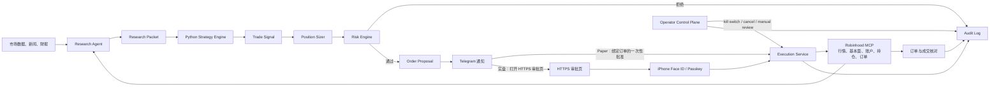
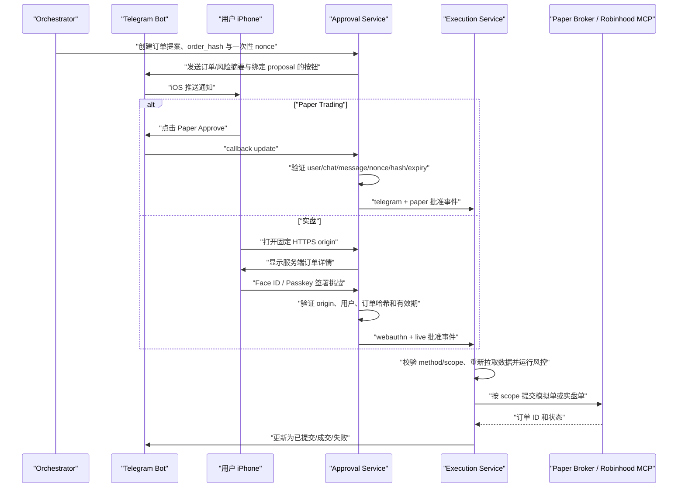
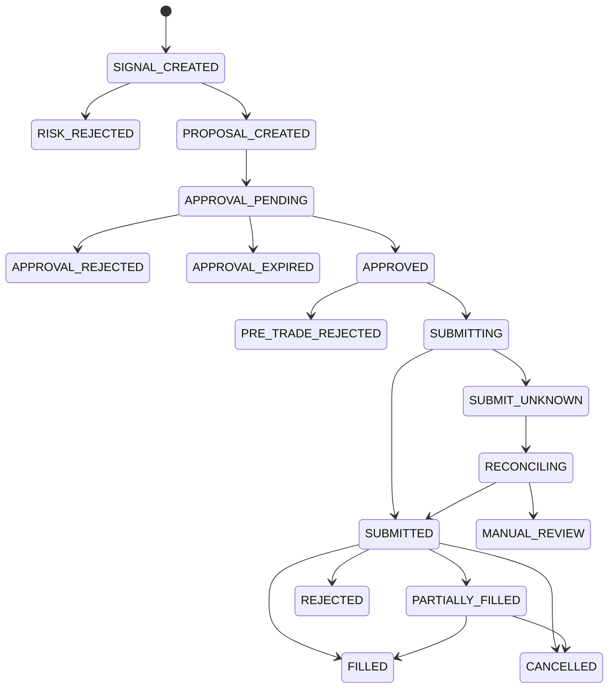
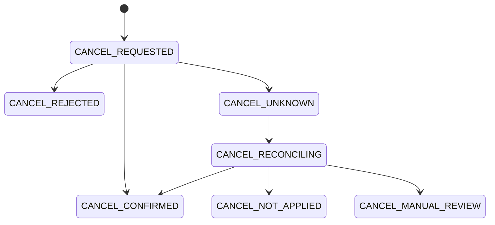

# ainvest 系统设计

> 状态：初始设计
>
> 更新日期：2026-07-24
>
> 首版范围：美股与 ETF、人工逐笔审批、默认模拟交易

## 1. 背景与目标

ainvest 是一个由 AI 辅助研究、由确定性 Python 策略产生交易信号，并在独立风控和人工审批之后通过 Robinhood 执行订单的交易框架。

系统的目标是：

1. 让 Research Agent 汇集市场、公司、技术面和投资组合信息。
2. 将研究结果转换为有类型、有来源、有时间戳的数据，而不是把自然语言直接交给交易程序。
3. 支持用户以 Python 插件形式添加、测试和启停策略。
4. 让风险控制独立于 AI 模型和策略，拥有无条件否决权。
5. 通过 Telegram 将订单提案及时发送到 iPhone。
6. 通过独立 HTTPS 审批页面和 Face ID/Passkey 确认每一笔实盘订单。
7. 通过 Robinhood 官方 Trading MCP 查询账户并在专用 Agentic Account 中执行获批订单。
8. 为研究、信号、审批、下单和成交保留完整、可追溯的审计记录。

本系统不是投资顾问，也不保证任何策略获利。实盘损失由账户持有人承担。

## 2. 非目标

首版明确不包含：

- 高频或低延迟交易
- 无人值守的全自动实盘交易
- 期权、期货、加密货币、保证金和裸卖空
- 让大语言模型自行决定订单数量或绕过策略与风控
- 在 Telegram 消息中直接完成不可撤销的实盘授权
- 用回测结果代表未来收益
- 管理他人资产或提供面向第三方的投资建议

## 3. 核心设计原则

### 3.1 AI 负责研究，规则负责资金

AI 可以阅读、总结、比较并形成多空论点，但所有会改变账户资金或仓位的动作必须经过确定性的策略、风控、审批和执行状态机。

### 3.2 结构化数据优先

模块之间传递版本化的数据对象。自然语言只能作为解释字段，不能作为下单指令。

### 3.3 默认不交易

任何缺失、异常、超时、数据过期、连接失败或状态不一致都必须失败关闭（fail closed），最终结果为不下单。

### 3.4 审批绑定具体订单

审批必须绑定标的、方向、数量、订单类型、限价、有效期和策略版本。任一字段变化都使原审批失效。

### 3.5 最小权限与资金隔离

系统使用 Robinhood Agentic Account 的独立预算。研究组件不得持有交易权限；只有执行组件能够调用下单工具。

### 3.6 可重放与可审计

相同输入和相同策略版本应产生相同信号。每一次决策都要能够还原当时的数据、配置和代码版本。

### 3.7 优先组合成熟组件

ainvest 不自行实现通用基础设施。数据验证、插件发现、技术指标、回测、Telegram、WebAuthn、状态机、数据库、MCP、调度和可观测性优先采用成熟的开源组件。

只有以下与 ainvest 领域和资金安全直接相关的部分由项目自己实现：

- 版本化领域数据协议
- 策略输入输出契约
- 账户专属硬风控政策
- 订单规范化、订单哈希和一次性审批事务
- Robinhood MCP 薄适配与成交核对
- 连接各组件的状态迁移和审计事件

不得为了减少少量适配代码而采用一个同时持有 AI、数据、策略和 Broker 权限的第三方“全自动交易机器人”。

### 3.8 标的身份与订单精度必须明确

Ticker symbol 只能用于显示和查询，不能单独作为 Broker 写单标识。所有可交易对象必须绑定稳定的 Broker instrument ID、symbol、交易所、币种、资产类型、可交易状态、价格 tick 和数量 increment。映射缺失、歧义、冲突或过期时必须拒绝交易。

### 3.9 管理操作也是资金安全边界

Kill switch、人工复核结案、核对任务触发、取消订单、审计查询和实盘启动确认都属于特权操作。它们必须经过独立于 Telegram 的 operator 身份认证和最小权限授权，并记录操作人、理由、幂等键、前后状态和审计事件。健康检查之外不得暴露匿名管理接口。

## 4. 总体架构



系统逻辑上分为七个信任域：

1. **数据域**：获取、清洗并缓存外部数据。
2. **研究域**：运行 AI Agent，生成有证据的研究包。
3. **决策域**：运行用户策略并产生信号。
4. **风险域**：校验仓位、资金、价格、时效和交易限制。
5. **审批域**：通知用户并验证一次性人工授权。
6. **执行域**：通过 Robinhood MCP 下单并核对最终状态。
7. **运营控制域**：认证和授权特权操作，不持有研究或策略权限。

## 5. 主要组件

### 5.1 Data Adapters

统一外部数据源的差异，向上层提供稳定接口：

- 实时或延迟报价
- OHLCV 历史数据
- 公司基本面与财报日历
- 公司新闻、行业新闻和宏观事件
- Robinhood 账户、购买力、仓位和订单历史

每一条数据必须包含：

- `source`
- `observed_at`
- `received_at`
- `timezone`
- `is_delayed`
- `quality_flags`

系统不得静默混合不同时间点、复权方式或币种的数据。

首版采用以下数据源优先级：

1. Robinhood 官方 Trading MCP 是其公开工具能够提供的数据的首选来源，包括实时股票报价、Level 2 price book、历史 OHLCV、标准化基本面、财务数据、技术指标、财报日历、指数，以及账户、购买力、仓位和订单。
2. 实盘报价只使用 Robinhood MCP 的 `get_equity_quotes`，并在需要校验点差与深度时使用 `get_equity_price_book`。执行前必须重新获取；超时、缺字段、时间戳缺失、数据过期、工具 schema 不兼容或结果冲突时一律拒绝交易。
3. 实盘流程不得自动回退到 Alpaca、yfinance 或其他免费行情源。辅助来源只能用于开发、离线研究或差异监控；来源差异超过阈值时应拒绝交易，而不是选择其中一个继续执行。
4. Research Agent 和 Strategy Engine 不得直接持有具备交易能力的 MCP 会话或凭据。它们只能通过 Robinhood Non-Trading Gateway 的只读投影调用经过白名单验证的读取能力，并接收 ainvest 版本化 schema；11 个已批准的非交易 mutation 不向这两个组件暴露。
5. SEC EDGAR + EdgarTools 用于获取可引用的原始申报、XBRL、8-K 和 Form 4，作为基本面和公司事件的权威证据来源；Robinhood MCP 用于标准化基本面和快速查询。
6. 新闻和外部事件使用 GDELT、SEC 8-K/Form 4 和公司 Investor Relations 公告。只有 Robinhood MCP 正式工具清单中存在并通过契约测试的能力，才可以替代对应外部适配器。
7. yfinance 只作为无需 Robinhood 授权时的可选开发、回测或离线研究适配器。Alpaca 不作为首版默认依赖。

Robinhood Non-Trading Gateway 由独立的
[`likefudan/rh-mcp`](https://github.com/likefudan/rh-mcp) 项目实现；它私有持有
MCP SDK v2 传输与 OAuth 生命周期，并固定经过审查的完整 capability manifest
和 schema digest。当前固定的 manifest 精确允许 35 个 `mutates=false` 读取能力和
11 个 `mutates=true` 的 watchlist/saved-scan 非交易 mutation，并永久拒绝 8 个
下单、撤单、行权和订单模拟能力。OAuth credential 本身具备交易能力，因此真正
的安全边界是经过审查和 digest 固定的 **no-trading manifest**，而不是 token scope
或“只读”命名。ainvest 固定经过独立审查的 tagged SemVer release、不可变
artifact 身份及其 provenance/digest，并在部署组合和启动时验证已安装的
artifact；readiness 验证 `manifest_version` 与完整 `manifest_digest`，每个
结果 envelope 还必须验证 `envelope_version`。ainvest 只接收 SDK-neutral
结果/错误协议，不要求 readiness 或结果携带 package version，也不导入
`mcp.*` 类型或接收原始 session/token。
任何新增、删除、不兼容变更或 `mutates`/disposition 变化都需要重新通过独立审查
和契约测试，不能在运行时自动扩大权限。未知能力一律拒绝；11 个非交易 mutation
只能通过明确命名的 ainvest 操作暴露，不得向 Research、Strategy、Paper、Telegram
或模型传递通用 `invoke(capability, arguments)` 接口。

### 5.2 Research Agent

Research Agent 负责：

- 总结近期市场和行业动态
- 研究公司的业务、财务、估值与事件风险
- 计算或调用确定性工具计算技术指标
- 分析现有持仓、集中度和购买力
- 形成 bull case、bear case、关键风险和待验证事项
- 给出引用来源和数据时间

模型不得自行计算重要金额、仓位或技术指标。此类数值应由 Python 工具计算，模型只负责解释。

Research Agent 的输出是 `ResearchPacket`，而不是 `BUY` 或 `SELL` 指令。

Research Agent 访问 Robinhood 数据时只能调用 Non-Trading Gateway 的版本化只读投影，不能看到 MCP OAuth token、原始 MCP session、11 个非交易 mutation 或任何创建/修改订单的工具。

首版 AI 调用固定为：

- 供应商和模型：OpenAI `gpt-5.6-sol`
- 调用接口：OpenAI Responses API，通过 Pydantic AI 适配
- 推理强度：`medium`
- 状态策略：每次研究任务独立调用并设置 `store=false`，不依赖服务端长对话状态
- 输出方式：使用严格 JSON Schema 生成研究叙事，再由 Pydantic 验证并组装 `ResearchPacket`
- 工具策略：只允许调用 ainvest 的只读确定性工具；关闭模型内置网页搜索，不向模型暴露原始 Robinhood MCP、通用 capability 调用或任何非交易 mutation
- 降级策略：不自动切换到其他模型；只对明确的瞬时网络或限流错误最多重试一次

模型超时、拒绝、输出不符合 schema、引用不存在的证据或达到重试上限时，本次研究运行失败，不产生可供策略使用的完整 `ResearchPacket`。每次调用必须记录模型 ID、请求 ID、prompt 版本、工具 schema 版本、token 用量和输入输出摘要；不得向模型发送账户号码、凭据或完成研究所不需要的个人信息。

参考：

- [OpenAI GPT-5.6 model guide](https://developers.openai.com/api/docs/guides/latest-model)
- [OpenAI Responses API migration guide](https://developers.openai.com/api/docs/guides/migrate-to-responses)
- [OpenAI Structured Outputs](https://developers.openai.com/api/docs/guides/structured-outputs)
- [OpenAI API data controls](https://developers.openai.com/api/docs/guides/your-data#v1responses)

### 5.3 Strategy Engine

Strategy Engine 是 Python 策略运行时，负责：

- 发现并加载已启用策略
- 验证策略声明的输入需求
- 给策略传入不可变的研究和组合快照
- 收集标准化交易信号
- 记录策略名称、版本、参数和运行时间
- 以同一个策略实现支持回测、Paper Trading 和实盘
- 隔离单个策略异常，防止影响整个调度周期

#### 5.3.1 用户策略定义

首版采用 **Python 策略类 + Pydantic 参数模型 + YAML 实例配置**。策略代码定义逻辑，YAML 决定启用状态、标的、周期和参数。

策略接收只读 `StrategyContext` 并返回零个或多个 `TradeSignal`：

```python
from datetime import timedelta
from decimal import Decimal
from typing import Protocol

from pydantic import BaseModel, Field


class MovingAverageParams(BaseModel):
    fast_window: int = Field(default=20, ge=2)
    slow_window: int = Field(default=50, ge=3)
    target_weight: Decimal = Field(default=Decimal("0.10"), gt=0, le=1)


class Strategy(Protocol):
    name: str
    version: str
    params_model: type[BaseModel]

    def evaluate(self, context: StrategyContext) -> list[TradeSignal]:
        ...
```

策略返回的是交易意图，不是 Broker 订单。标准信号至少包含：

- `symbol`
- `intent`：`BUY`、`SELL` 或 `HOLD`
- `strength`：`-1` 到 `1` 的策略内部评分，不代表获利概率
- `target_weight`：可选的目标仓位
- `valid_for`：信号有效期
- `reason_codes`：机器可读的触发原因

最终股数、限价和最大名义金额由独立的 Position Sizer 根据当前仓位和购买力计算，再交给 Risk Engine。策略不得直接决定最终订单或提交交易。

策略实例配置示意：

```yaml
strategies:
  - id: aapl_sma_daily
    plugin: moving_average
    enabled: true
    universe:
      symbols: [AAPL, MSFT]
      timeframe: 1d
    parameters:
      fast_window: 20
      slow_window: 50
      target_weight: "0.10"
    schedule:
      run_at: market_close_minus_15m
    constraints:
      research_max_age: 30m
      signal_ttl: 30m
```

YAML 不允许包含 `eval`、lambda 或其他可执行表达式。

#### 5.3.2 策略发现与注册

由于策略可能由多人、多个团队在独立仓库中开发，首版使用 **pluggy + Python `entry_points`** 作为正式插件机制。ainvest 对业务代码暴露稳定的 `StrategyRegistry` 门面，Registry 内部使用 pluggy 发现、校验和注册策略插件。

```python
import pluggy

hookspec = pluggy.HookspecMarker("ainvest")
hookimpl = pluggy.HookimplMarker("ainvest")


class StrategyHooks:
    @hookspec
    def strategy_definitions(self) -> list[StrategyDefinition]:
        """返回当前插件提供的策略定义。"""


class StrategyRegistry:
    def register(self, strategy_type: type[Strategy]) -> None:
        ...

    def get(self, name: str) -> type[Strategy]:
        ...

    def list(self) -> list[StrategyDefinition]:
        ...
```

每个策略包实现 Hook：

```python
class TeamStrategyPlugin:
    @hookimpl
    def strategy_definitions(self) -> list[StrategyDefinition]:
        return [
            StrategyDefinition.from_type(MovingAverageStrategy),
            StrategyDefinition.from_type(RSIReversionStrategy),
        ]


plugin = TeamStrategyPlugin()
```

并通过 `pyproject.toml` 的 entry point 发布：

```toml
[project.entry-points."ainvest.strategies"]
team_alpha = "team_alpha_strategies.plugin:plugin"
```

Strategy Engine 启动时通过 `PluginManager.load_setuptools_entrypoints("ainvest.strategies")` 加载已安装插件，再由 Registry 展平并验证所有 `StrategyDefinition`。安装或升级策略包后无需修改 ainvest 主程序。

pluggy 负责：

- 定义稳定的 Hook 规范
- 发现多个独立团队发布的策略包
- 注册、列举和启停插件
- 拒绝不符合 Hook 规范的实现
- 为未来的指标或数据扩展保留一致机制

pluggy 不负责参数验证、回测、进程隔离、超时或风控，这些仍由 Strategy Engine 和 ainvest 领域层负责。

每个插件必须提供：

- 全局唯一的 `plugin_id`
- 插件语义版本 `plugin_version`
- 支持的 `ainvest_strategy_api` 版本范围
- 策略定义列表及各自的名称、版本和参数模型
- 源代码版本或构建提交哈希
- 维护团队和仓库地址

插件加载规则：

- `plugin_id`、策略名称或 entry point 冲突时启动失败，不允许静默覆盖
- 不兼容当前 Strategy API 的插件不得加载
- 插件升级不得隐式迁移正在使用的策略状态
- 实盘环境只加载配置白名单中的插件及固定版本
- 生产依赖必须使用锁文件并校验包哈希

ainvest 应提供独立的 `strategy-conformance` 测试套件，供每个团队在自己的 CI 中验证：

- Hook 和元数据兼容性
- Pydantic 参数及信号验证
- 相同输入的确定性
- 无未来数据访问
- 超时与异常处理
- Paper Trading 示例运行
- 禁止 Broker、凭据和网络访问

#### 5.3.3 策略状态与运行隔离

策略应优先保持无状态。确实需要状态时，状态必须通过 `StrategyContext` 显式读取，并通过结构化结果返回 `next_state`；不得依赖类变量、全局变量或进程内隐藏状态。状态记录必须绑定策略版本。

用户策略本质上是任意 Python 代码。即使首版只有项目所有者使用，也应在独立工作进程中执行：

- 不向策略进程传入任何凭据
- 默认禁止网络访问
- 文件系统只读
- 设置执行超时以及 CPU、内存限制
- 输入输出只允许通过版本化 Pydantic 模型
- 策略异常只使本次运行失败
- 记录策略版本、参数和代码哈希

策略不得：

- 直接调用 Robinhood
- 读取经纪账户凭据
- 绕过 Risk Engine
- 在运行时修改全局配置
- 使用真实当前时间代替 `context.as_of`
- 将 `strength` 表述为真实获利概率

#### 5.3.4 Position Sizer

Position Sizer 将策略意图转换为候选订单数量，但不决定订单能否执行。它统一处理：

- 目标仓位与当前仓位的差额
- 可用购买力和最低现金保留
- 股票价格、整股取整、价格 tick 和数量 increment
- 最小、最大订单金额
- 多个策略对同一标的的信号合并

Position Sizer 的输出只是候选订单，必须继续经过 Risk Engine。策略、Position Sizer 和 Risk Engine 分离，可以避免每个策略重复实现资金计算，并保证所有策略使用一致的仓位规则。

### 5.4 Risk Engine

Risk Engine 是纯 Python、确定性、可单元测试的规则集合。它在策略之后、审批之前运行，并在真正下单前再次运行。

首版规则至少包括：

- 单笔最大名义金额
- 单标的最大仓位比例
- 单行业最大暴露
- 单日最大成交额
- 单日最大已实现与未实现亏损
- 最低现金保留比例
- 白名单标的
- canonical instrument identity、交易所、币种、资产类型、可交易状态和订单精度一致性
- 禁止期权、保证金、卖空和杠杆 ETF
- 财报窗口限制
- 行情最大允许年龄
- 买卖价差和异常波动限制
- 最大允许滑点
- 市场交易时段限制
- 重复订单检测
- 未完成订单冲突检测
- 全局 kill switch

Risk Engine 返回：

- `APPROVED`
- `REJECTED`
- `NEEDS_REVIEW`

每个结果都必须包含机器可读的规则编号和人类可读的原因。

任何必需的风控额度缺失、为空、格式错误或超出允许范围时，Risk Engine 必须返回 `REJECTED`，不得使用隐式默认额度继续交易。系统可以继续运行研究任务，但不能创建或执行订单提案。

首版所有会创建或执行订单提案的流程仅允许在美股常规交易时段运行。节假日、提前收市后的时段、盘前、盘后和隔夜时段一律不创建新订单；研究、审计和成交核对任务可以在非交易时段运行。

### 5.5 Approval Service

Approval Service 创建订单提案、冻结 `order_hash`，并根据执行范围验证一次性人工批准。审批事件必须显式包含：

- `approval_method`：首版 Paper 使用 `telegram`，实盘只能使用 `webauthn`
- `approval_scope`：`paper` 或 `live`
- `proposal_id`
- `order_hash`
- `approved_at`
- 审批者的稳定标识

首版只运行 Paper Trading，可以暂不部署公网审批域名和 Passkey。Telegram 私聊消息必须显示订单与风险摘要、有效期和明显的 `PAPER` 标识，并提供与具体 proposal 绑定的一次性批准按钮。系统不得接受没有 proposal 标识的普通 `approve` 文本；Telegram callback 只携带不透明 nonce，订单字段仍从服务端读取。

Telegram Paper 批准必须同时验证数值型 `user_id`、数值型私聊 `chat_id`、`chat.type == "private"`、原始 `message_id`、一次性 nonce、proposal 状态、`order_hash` 和有效期，并在同一事务中完成一次性状态迁移。Telegram username 只能显示，不能用作身份或授权依据。

Telegram 批准只能产生 `approval_method=telegram`、`approval_scope=paper` 的审批事件，只能交给 Paper Broker。Execution Service 的实盘路径必须拒绝任何不是 `approval_method=webauthn` 且 `approval_scope=live` 的审批事件。

在启用任何真实下单前，必须部署固定 HTTPS origin 并启用 Passkey。实盘安全审批页面必须：

1. 从服务端读取订单，不能相信 URL 中的订单参数。
2. 显示标的、方向、数量、订单类型、限价和最坏金额。
3. 显示策略、主要理由和风控结果。
4. 要求 iPhone 使用 Face ID/Passkey。
5. 对完整订单摘要的哈希进行授权。
6. 原子地将一次性令牌从 `PENDING` 改为 `APPROVED`。
7. 防止刷新、重放或重复点击产生多次授权。

### 5.6 Execution Service

Execution Service 是唯一拥有交易工具访问权的组件。

执行前必须：

1. 验证审批仍有效且尚未消费。
2. 重新读取最新报价、购买力、仓位和未完成订单。
3. 重新运行全部硬风控。
4. 比较当前订单与获批订单的哈希。
5. 检查价格偏移是否在允许范围内。
6. 使用幂等键创建订单。
7. 记录 Robinhood 返回的订单 ID。
8. 持续查询直至进入终态或交给核对任务处理。

步骤 2 的实盘报价必须来自 Robinhood Non-Trading Gateway 的读取面。`get_equity_quotes` 和 `get_equity_price_book` 的响应只有在包含风控所需的标的、bid、ask、时间和来源信息并通过新鲜度检查后才可使用；否则本次执行进入 `PRE_TRADE_REJECTED`，不得切换到其他行情供应商重试。

提交前还必须用 Robinhood Non-Trading Gateway 的读取面重新验证 canonical instrument ID、symbol、交易所、币种、资产类型、可交易状态、价格 tick 和数量 increment。任何映射歧义、symbol/instrument 不一致或价格/数量精度不合法都在调用交易写工具前拒绝。

首版不提供原地改单。任何 replacement 必须先按独立取消流程处理旧订单，再从新的 Research/Strategy/Risk 状态创建新 proposal、新 `order_hash` 和新审批；旧订单的审批不能授权 replacement。

取消请求只能来自经过认证和授权的 Operator Control Plane，使用独立 cancel idempotency ID 并写审计。取消结果不确定时不得盲目重试，必须先根据 Broker 订单和成交历史核对。Kill switch 默认只阻止新订单并告警；在账户持有人明确批准自动取消策略之前，不自动取消现有订单。

首版只允许在 Robinhood Agentic Account 中交易。Robinhood 官方文档说明，Trading MCP 可以读取授权账户数据，但交易仅能发生在 Agentic Account。

参考：

- [Robinhood Agentic Trading overview](https://robinhood.com/us/en/support/articles/agentic-trading-overview/)
- [Robinhood Agentic Trading](https://robinhood.com/us/en/agentic-trading/)
- MCP endpoint：`https://agent.robinhood.com/mcp/trading`

### 5.7 Operator Control Plane

Operator Control Plane 负责 kill switch、人工复核、核对触发、取消请求、审计查询和实盘启动确认，不负责研究或策略决策。

要求：

- Telegram `user_id`、username、callback nonce 或网络位置不能作为 operator 身份
- 浏览器管理会话必须使用 HTTPS、安全 Cookie、CSRF/origin 校验、短会话和必要的重新认证
- CLI/服务调用使用短期凭据和独立 service identity
- staging 与 production 身份和权限分离
- 每个特权动作携带 actor、role、reason、correlation ID 和 idempotency key
- 未配置 production operator 认证方式时不得暴露远程管理端点或启动实盘

## 6. 核心数据协议

所有协议都应包含 `schema_version`，并使用 UTC ISO 8601 时间。

### 6.1 ResearchPacket

```json
{
  "schema_version": "1.0",
  "research_id": "res_01...",
  "symbol": "AAPL",
  "as_of": "2026-07-24T18:30:00Z",
  "market": {
    "last_price": "215.42",
    "bid": "215.40",
    "ask": "215.44",
    "currency": "USD",
    "observed_at": "2026-07-24T18:29:58Z"
  },
  "technical": {
    "sma_20": "211.30",
    "sma_50": "204.80",
    "rsi_14": "61.20",
    "atr_14": "4.70"
  },
  "portfolio": {
    "quantity": "10",
    "market_value": "2154.20",
    "portfolio_weight": "0.0800",
    "buying_power": "3000.00"
  },
  "thesis": {
    "bull_case": [],
    "bear_case": [],
    "risks": []
  },
  "evidence": [],
  "quality_flags": []
}
```

金额和数量在 JSON 中使用十进制字符串，Python 中使用 `Decimal`，禁止用二进制浮点数处理订单金额。

### 6.2 TradeSignal

```json
{
  "schema_version": "1.0",
  "signal_id": "sig_01...",
  "research_id": "res_01...",
  "strategy": "sma_crossover",
  "strategy_version": "1.2.0",
  "symbol": "AAPL",
  "intent": "BUY",
  "strength": "0.73",
  "target_weight": "0.10",
  "generated_at": "2026-07-24T18:30:10Z",
  "expires_at": "2026-07-24T19:00:10Z",
  "reason_codes": ["SMA20_CROSSED_ABOVE_SMA50"]
}
```

### 6.3 OrderProposal

```json
{
  "schema_version": "1.0",
  "proposal_id": "ordp_01...",
  "signal_id": "sig_01...",
  "account_scope": "agentic",
  "instrument_id": "rh_inst_...",
  "symbol": "AAPL",
  "exchange": "XNAS",
  "currency": "USD",
  "asset_type": "EQUITY",
  "side": "BUY",
  "quantity": "2",
  "quantity_increment": "1",
  "order_type": "LIMIT",
  "limit_price": "214.50",
  "price_increment": "0.01",
  "time_in_force": "DAY",
  "maximum_notional": "429.00",
  "created_at": "2026-07-24T18:30:12Z",
  "expires_at": "2026-07-24T18:32:12Z",
  "risk_decision_id": "risk_01...",
  "order_hash": "sha256:..."
}
```

`order_hash` 使用规范化序列化后的关键订单字段计算，必须覆盖 canonical instrument identity、symbol、交易所、币种、资产类型、方向、数量、订单类型、限价、有效期、账户范围和策略版本，审批和执行都必须校验它。

## 7. Telegram Paper 审批与 iPhone 实盘审批流程



Telegram Bot 安全要求：

- staging 和 production 分别创建独立 Bot、独立 token 和独立允许列表
- 禁止 Bot 加入群组，仅允许配置中的数值型 Telegram `user_id` 和私聊 `chat_id`
- username 不作为身份依据；ID 使用 64 位整数保存
- 首版 Paper 可以使用单实例 `getUpdates` 长轮询，不要求公网域名；offset 必须持久化并按 `update_id` 幂等
- 切换到 webhook 时必须使用 HTTPS 和 Telegram secret token，并限制 `allowed_updates`
- Bot token 仅存放在 secrets manager 或受保护的环境变量中
- 日志中不得记录 Bot token、完整审批令牌或账户号码
- 消息不包含 Robinhood 凭据和不必要的完整账户数据
- Paper 批准按钮只能携带与服务端 proposal 绑定的不透明 nonce；nonce 至少 256 位随机、数据库只保存哈希
- Paper 批准 nonce 和实盘审批链接均在 60–120 秒内失效并只能消费一次
- 普通 `approve` 文本、群聊消息、转发消息、错误 message ID、非白名单 ID 和重复 callback 均不能批准
- Telegram 不可用、消息未送达或用户未响应时，一律不交易

首版不实现 Passkey。实盘前必须确定固定域名和部署环境，通过独立的非 Telegram bootstrap 注册首个 Passkey，并至少登记两个可恢复凭据；Telegram 不得注册或重置 Passkey。

参考：

- [Telegram Bot API：getUpdates](https://core.telegram.org/bots/api#getupdates)
- [Telegram Bot API dialog IDs](https://core.telegram.org/api/bots/ids)
- [Apple Passkeys](https://developer.apple.com/passkeys/)
- [W3C WebAuthn](https://www.w3.org/TR/webauthn-3/)

## 8. 状态机

订单工作流只能按以下状态迁移：



`SUBMIT_UNKNOWN` 发生时绝不能盲目重试下单。系统必须先根据幂等键、客户端订单 ID 和 Robinhood 订单历史进行核对。

取消使用与订单生命周期关联但相互独立的命令状态机，因为取消等待期间订单仍可能继续成交：



`CANCEL_UNKNOWN` 不能直接再次调用 cancel；系统先查询 Broker 最新订单与成交状态，唯一确认后再进入对应取消命令终态，否则进入 `CANCEL_MANUAL_REVIEW`。取消与提交使用不同的幂等键，订单本身继续按 Broker 的成交事实更新。

`APPROVED` 状态本身不代表具备实盘权限。每个批准事件必须保存 `approval_method` 和 `approval_scope`；Paper Broker 只接受 `scope=paper`，Robinhood 写路径只接受 `method=webauthn` 且 `scope=live`。这个检查必须同时存在于 schema、状态交接和 Execution live guard 中。

## 9. 存储与审计

首版可以使用 SQLite，部署后建议使用 PostgreSQL。

主要记录：

- `research_runs`
- `research_packets`
- `strategy_runs`
- `trade_signals`
- `risk_decisions`
- `order_proposals`
- `approval_challenges`
- `approval_events`
- `broker_orders`
- `broker_fills`
- `cancel_commands`
- `operator_actions`
- `portfolio_snapshots`
- `audit_events`

审计事件应采用追加写入，至少记录：

- 事件时间与关联 ID
- 触发者：系统、模型、策略或用户
- 输入摘要和输出摘要
- 模型、提示词、策略、配置和代码版本
- 状态迁移前后值
- 错误类别和重试信息

敏感字段应脱敏或加密，不在审计日志中保存任何私钥、Passkey 私钥、Telegram Bot token 或 Robinhood 授权令牌。

## 10. 开源复用与项目目录

### 10.1 推荐依赖

| 能力 | 首选组件 | 说明 |
|---|---|---|
| Agent 与结构化输出 | [Pydantic AI](https://github.com/pydantic/pydantic-ai) + OpenAI Responses API | 首版固定 `gpt-5.6-sol`、`medium`、`store=false` 和严格结构化输出 |
| 数据协议与配置 | [Pydantic](https://github.com/pydantic/pydantic) | 领域模型、验证与 JSON Schema |
| 默认行情与标准化基本面 | Robinhood 官方 Trading MCP | 实盘唯一报价源；也优先复用官方历史行情、基本面、指标和账户工具 |
| 原始申报与监管事件 | [EdgarTools](https://github.com/dgunning/edgartools) + SEC EDGAR | 10-K、10-Q、8-K、Form 4、XBRL 和可引用证据 |
| 新闻与外部事件 | GDELT + SEC + 公司 Investor Relations | GDELT 负责新闻发现，SEC/公司公告负责高可信事件 |
| 可选开发行情 | [yfinance](https://github.com/ranaroussi/yfinance) | 只用于开发、回测和离线研究，不进入实盘风控 |
| 技术指标 | [TA-Lib Python](https://github.com/TA-Lib/ta-lib-python) | 避免自行实现常见指标 |
| 策略注册 | [pluggy](https://github.com/pytest-dev/pluggy) + Python `entry_points` + StrategyRegistry | 多团队独立开发、发布和发现策略 |
| 回测 | [bt](https://github.com/pmorissette/bt) | MIT 许可，适合股票组合与再平衡 |
| 绩效分析 | [QuantStats](https://github.com/ranaroussi/quantstats) | 收益、波动、回撤和报告 |
| 交易日历 | [pandas-market-calendars](https://github.com/rsheftel/pandas_market_calendars) | 节假日、提前收市和交易时段 |
| HTTPS API | [FastAPI](https://github.com/fastapi/fastapi) | 审批和管理接口 |
| Telegram | [python-telegram-bot](https://github.com/python-telegram-bot/python-telegram-bot) | 首版使用私聊长轮询和绑定 proposal 的 Paper 批准按钮；实盘仅发送 HTTPS 链接 |
| Face ID/Passkey | [py_webauthn](https://github.com/duo-labs/py_webauthn) | 首版暂缓；任何实盘前必须完成 WebAuthn 服务端挑战与验证 |
| 状态机 | [transitions](https://github.com/pytransitions/transitions) | MVP 订单状态迁移 |
| 数据库 | [SQLAlchemy](https://github.com/sqlalchemy/sqlalchemy) + Alembic | 事务、持久化和迁移 |
| 调度 | [APScheduler](https://github.com/agronholm/apscheduler) 3.11.x | 4.x 稳定前固定 3.x |
| 大规模持久工作流 | [Temporal](https://github.com/temporalio/temporal)，可选 | 多进程或长时审批后再引入 |
| Robinhood Non-Trading Gateway | [`likefudan/rh-mcp`](https://github.com/likefudan/rh-mcp) | 独立持有 MCP SDK v2、具备交易能力的 OAuth credential、35 个读取能力 + 11 个非交易 mutation 的 allowlist/manifest 与 SDK-neutral 协议；永久拒绝 8 个交易能力；ainvest 固定 independently reviewed tagged SemVer release artifact、provenance/artifact digest 和完整 manifest digest；ainvest 的公开读取投影仍固定为已有 10 个能力 |
| 日志与监控 | structlog、OpenTelemetry、Prometheus | 结构化日志、trace 和指标 |
| 测试 | pytest、Hypothesis、HTTPX mock | 单元、性质和故障注入测试 |

许可证和数据使用注意事项：

- OpenBB 使用 AGPLv3，只有在明确接受许可证义务后再引入。
- backtesting.py 使用 AGPLv3；首版优先选择 MIT 许可的 `bt`。
- VectorBT 社区版带 Commons Clause，不作为默认核心依赖。
- yfinance 本身开源，但 Yahoo 数据的使用权受 Yahoo 条款约束。
- Alpaca 不作为首版默认依赖；实盘不得在 Robinhood MCP 失败时自动回退到 Alpaca 或 yfinance。
- pluggy 使用 MIT 许可，只承担插件 Hook、发现和注册，不承担隔离与风控。
- 原版 Zipline 和 Pyfolio 不作为新项目基础。
- 不使用要求 Robinhood 用户名、密码并调用非官方接口的 Broker 库或 MCP Server。

以上组件负责通用能力；ainvest 仍拥有领域协议、硬风控、审批绑定、Broker 幂等和成交核对。

### 10.2 项目目录建议

```text
ainvest/
├── src/ainvest/
│   ├── agents/             # Research Agent 与工具编排
│   ├── data/               # 行情、新闻和基本面适配器
│   ├── schemas/            # 版本化数据协议
│   ├── strategies/         # 策略协议、pluggy Hook、Registry、worker
│   ├── risk/               # 硬风控规则
│   ├── approval/           # Telegram、Passkey 和审批状态机
│   ├── execution/          # Paper broker 与 Robinhood MCP
│   ├── portfolio/          # 仓位、暴露和绩效
│   ├── audit/              # 审计事件
│   └── api/                # HTTPS 审批与管理 API
├── config/
│   ├── risk.example.yaml
│   └── strategies.example.yaml
├── tests/
│   ├── unit/
│   ├── integration/
│   ├── backtest/
│   └── safety/
├── migrations/
├── scripts/
├── design.md
├── pyproject.toml
└── README.md
```

## 11. 配置与密钥

非敏感配置使用版本控制下的 YAML：

- 策略参数
- 风控上限
- 允许标的
- 交易时段
- 数据新鲜度阈值
- AI 模型 ID、推理强度、prompt 版本和 `store=false`
- Telegram 允许的数值型 `user_id`/私聊 `chat_id` 与审批 scope
- Operator role、允许动作和短期会话策略（不包含凭据本身）
- Instrument allowlist 使用 canonical instrument ID，并附 symbol、交易所、币种和资产类型

敏感信息不得进入 Git：

- OpenAI API key
- Telegram Bot token
- Telegram webhook secret
- Operator authentication client secret 或 service credential
- Passkey/WebAuthn 服务端密钥
- 数据供应商 API key
- Robinhood/MCP OAuth token
- 数据库密码

生产环境应使用托管 secrets manager。开发环境可以使用未提交的 `.env`，并提供不含真实值的 `.env.example`。

## 12. 调度与运行模式

支持三种运行模式：

1. **Research only**：只研究和生成报告。
2. **Paper trading**：完整运行策略、风控与审批，但使用模拟 Broker。
3. **Live trading**：通过 Robinhood MCP 交易，需要显式配置和启动开关。

生产默认值必须是：

```text
TRADING_MODE=paper
LIVE_TRADING_ENABLED=false
REQUIRE_HUMAN_APPROVAL=true
REGULAR_TRADING_HOURS_ONLY=true
REQUIRE_COMPLETE_RISK_LIMITS=true
```

首版不允许关闭 `REGULAR_TRADING_HOURS_ONLY` 或 `REQUIRE_COMPLETE_RISK_LIMITS`。交易日和提前收市时间必须由交易日历确定，不能使用固定的工作日或本地时钟判断。

切换实盘不能只依赖一个环境变量，至少还需：

- 已完成的 Robinhood Agentic Account 授权
- 配置中的账户范围校验
- 通过 Operator Control Plane 完成的认证、授权和审计式启动确认
- 通过预设安全测试
- 有效 kill switch

## 13. 可观测性与告警

需要监控：

- 外部数据延迟和错误率
- Research Agent 成功率、耗时和 token 使用量
- 策略运行结果及异常
- 风控拒绝原因分布
- Telegram 通知发送状态
- 审批延迟与过期数量
- MCP 调用耗时和错误
- 订单提交、部分成交、拒绝和未知状态
- 当前仓位、日内成交额和损益阈值

必须立即告警：

- 无法确定订单是否已提交
- 实际订单与获批订单不一致
- 重复订单
- 账户、购买力或仓位读取不一致
- kill switch 激活
- 实盘组件在非预期环境启动

## 14. 测试策略

### 14.1 单元测试

- 数据协议校验
- Decimal 金额计算
- 每一条风控规则
- 订单哈希
- 审批令牌过期和单次消费
- 状态机非法迁移
- 幂等处理

### 14.2 回测

- 禁止未来函数和数据泄漏
- 模拟手续费、点差和滑点
- 使用正确的复权价格
- 区分样本内和样本外
- 做 walk-forward 验证
- 报告最大回撤、波动率、换手率和基准对比

### 14.3 集成测试

- 使用假的市场数据供应商
- 使用假的 Telegram API
- 使用 Paper Broker 或 Robinhood MCP mock
- 测试长轮询 offset、网络超时、重复 update/webhook 和乱序事件
- 验证 Telegram Paper 批准包含正确的 method/scope，且不能进入实盘 Execution

### 14.4 实盘前安全测试

- 审批过期后不能下单
- 修改数量或限价后审批失效
- 重复点击只产生一个执行请求
- 任意 `approval_method=telegram` 或 `approval_scope=paper` 的事件都不能进入 Robinhood 写路径
- Passkey origin、RP ID、challenge、订单哈希或用户验证不匹配时不能下单
- MCP 超时不会盲目重复订单
- kill switch 阻止所有新订单
- 非白名单 Telegram 用户不能批准 Paper proposal
- 非 Agentic Account 不能交易
- 任一必需风控额度未配置时不能交易
- 非美股常规交易时段不能创建或执行新订单
- ticker symbol 与 canonical instrument ID、交易所、币种或资产类型不一致时不能下单
- 价格 tick、数量 increment 或 Broker tradability 缺失/无效时不能下单
- 未认证或权限不足的 operator 不能操作 kill switch、人工复核、取消、审计查询或实盘启动
- 原地 replacement 必须被拒绝；新订单必须重新生成 proposal、风控、哈希和审批
- `CANCEL_UNKNOWN` 不得盲目重试 cancel

## 15. 分阶段实施

### Phase 1：领域模型与模拟闭环

- 定义 schemas 和状态机
- 建立策略协议、pluggy Hook、StrategyRegistry 和 entry_points 发现
- 发布 strategy-conformance 测试工具
- 建立策略独立进程执行边界
- 实现硬风控
- 实现 Paper Broker
- 建立 SQLite 审计记录

验收标准：从固定 ResearchPacket 到模拟成交的流程可重复、可测试。

### Phase 2：研究能力

- 建立 Robinhood Non-Trading Gateway 接口和完整 capability manifest；固定 35 个读取能力、11 个非交易 mutation 与 8 个永久拒绝的交易能力；ainvest 仅投影已有 10 个命名读取能力；在尚未授权 MCP 时使用 fake 或可选 yfinance 完成开发
- 接入 GDELT、SEC EDGAR 和公司 Investor Relations 新闻/事件数据
- 接入 SEC 原始申报，并为 Robinhood MCP 标准化基本面预留统一适配器
- 实现技术指标工具
- 接入 AI Research Agent
- 建立来源、时效和质量标记

验收标准：研究输出完全符合 schema，关键数值由确定性工具生成。

### Phase 3：Telegram Paper 审批

- staging/production 独立 Telegram Bot 配置；每个环境固定正整数型 expected
  Bot ID 和绑定的 `(user_id, private_chat_id)` 私聊收件人记录，禁止两个独立列表形成
  cross-product
- 使用单实例长轮询接收私聊 update，无需公网域名
- 显示完整 Paper 订单摘要并提供绑定 proposal/order_hash 的一次性批准按钮
- 将审批固定标记为 `approval_method=telegram`、`approval_scope=paper`
- 重复、过期、错误用户、群聊、普通 `approve` 文本和篡改回调全部失败关闭

验收标准：Telegram 批准只能驱动 Paper Broker；没有任何公网域名或 Passkey 也能完成可审计的 Paper 闭环；重放和篡改测试全部失败关闭。

### Phase 4：Robinhood 非交易接入

- 连接官方 Trading MCP
- 读取实时报价、price book、历史行情、基本面、账户、持仓、购买力和订单历史
- 通过 Robinhood Non-Trading Gateway 暴露固定白名单能力和版本化数据；审查 manifest 的读取面固定为 35 个能力，ainvest 的命名读取投影仍为已有 10 个能力，非交易写入面仅允许 11 个明确命名的 watchlist/saved-scan mutation
- 将真实组合快照用于 Paper Trading

验收标准：审查 manifest 精确允许 35 个读取能力和 11 个非交易 mutation，并永久拒绝 8 个交易能力；ainvest 当前只能调用已有 10 个命名读取能力，不能调用任何非交易 mutation、交易能力或未知能力，除非后续独立任务明确扩展该投影；实时报价契约满足时间戳、bid/ask、新鲜度和 schema 要求，失败时不会回退到其他行情源。

### Phase 5：受控实盘

- 部署固定 HTTPS 审批域名和与研究/执行隔离的 Approval Service
- 通过独立 bootstrap 注册 Passkey，并至少登记两个可恢复凭据
- 专用 Agentic Account
- 极小预算
- 只允许白名单股票/ETF 和限价单
- 每笔 Face ID/Passkey 审批；Telegram 仅通知和打开审批页
- 实盘只接受 `approval_method=webauthn`、`approval_scope=live`
- 使用独立 Operator Control Plane 认证、授权和审计 kill switch、人工复核、取消与实盘启动确认
- 不支持原地改单；取消使用独立幂等键和 unknown-outcome 核对，新订单重新审批
- 下单前二次风控与成交核对

验收标准：Telegram Paper 审批无法进入实盘路径；完成小额端到端演练，审计记录可还原全部输入、Passkey 批准和 Broker 响应。

## 16. 已确定的产品决策

| 决策 | 当前选择 |
|---|---|
| Broker | Robinhood 官方 Trading MCP |
| 交易账户 | 专用 Robinhood Agentic Account |
| 策略语言 | Python |
| 策略定义 | Python 策略类 + Pydantic 参数 + YAML 实例配置 |
| 策略插件机制 | pluggy + Python entry_points |
| 策略访问门面 | StrategyRegistry |
| 多团队兼容 | Strategy API 版本、插件元数据、conformance tests |
| 策略输出 | 交易意图与目标仓位，不直接生成 Broker 订单 |
| 策略隔离 | 独立工作进程、无凭据、默认无网络 |
| 手机通知 | Telegram Bot 私聊 |
| AI 供应商和模型 | OpenAI `gpt-5.6-sol` |
| AI 调用方式 | Pydantic AI + Responses API；`medium`、`store=false`、严格结构化输出、关闭内置网页搜索、不自动切换模型 |
| 首版 Paper 审批 | Telegram 私聊中绑定 proposal/order_hash 的一次性按钮；`approval_method=telegram`、`approval_scope=paper` |
| Telegram 身份 | staging/production 独立 Bot；只信任数值型 `user_id` 和私聊 `chat_id`，不以 username 鉴权 |
| 首版审批部署 | 使用单实例长轮询；不要求公网审批域名或 Passkey |
| 实盘最终授权 | 固定 HTTPS 审批页 + iPhone Face ID/Passkey；只接受 `approval_method=webauthn`、`approval_scope=live` |
| 首版资产 | 美股和 ETF |
| 首版订单 | 优先限价单 |
| 首版执行模式 | 默认 Paper Trading |
| 实盘审批 | 每笔必须人工确认 |
| AI 权限 | 研究和解释，不直接下单 |
| 交易时段 | 仅在美股常规交易时段创建或执行订单 |
| 风控配置缺失行为 | 任一必需风控额度未配置或无效时拒绝交易 |
| 数据源总策略 | Robinhood MCP 正式提供的能力优先使用 MCP，并通过 Non-Trading Gateway 的审查 manifest 隔离交易权限 |
| 实盘行情 | Robinhood MCP `get_equity_quotes`；点差与深度使用 `get_equity_price_book` |
| 实盘行情失败行为 | 拒绝交易，不自动回退到 Alpaca、yfinance 或其他来源 |
| 基本面 | Robinhood MCP 用于标准化查询；SEC EDGAR + EdgarTools 用于原始申报和证据 |
| 新闻与事件 | GDELT + SEC 8-K/Form 4 + 公司 Investor Relations 公告 |
| 开发与离线行情 | yfinance 可选；Alpaca 不作为首版默认依赖 |
| Broker 标的身份 | canonical instrument ID + symbol + 交易所 + 币种 + 资产类型；symbol 不能单独用于写单 |
| 原地改单 | 首版不支持；replacement 必须作为取消旧订单和全新审批订单处理 |
| Kill switch 默认行为 | 阻止新订单并告警；未明确批准自动取消策略前不自动取消现有订单 |
| 特权管理操作 | 必须通过独立 Operator Control Plane 认证、授权并审计，Telegram 身份不能替代 |

## 17. 实现前仍需确定

首版 Paper Trading 开始前仍需由账户持有人提供或确定：

- OpenAI API 项目凭据和月度预算上限
- 创建 staging/production Telegram Bot，并为每个环境提供正整数型 expected Bot ID
  和绑定的数值型 `(user_id, private_chat_id)` 私聊收件人记录；Bot token 只进入
  secret 存储，真实 token/ID 不写入文档或示例
- 首版策略和具体参数
- 单笔、单股、单日和最大回撤限制的具体数值
- 数据和审计记录保留期限
- 备份 RPO/RTO

启用任何实盘写单前另需确定：

- 固定审批页面域名、云部署环境、TLS、数据库和 secret manager
- production Operator Control Plane 的身份认证方式和角色授权
- 首个 Passkey 的独立 bootstrap 与恢复流程
- Robinhood Agentic Account 授权和实盘预算
- 是否允许未来的 kill switch 自动取消现有订单；如允许，需要明确 eligible order、部分成交、顺序和恢复策略

这些值不影响已经确定的总体架构，可以在对应阶段开始前分别提供。没有实盘域名和 Passkey 时系统必须保持 Paper 模式。
