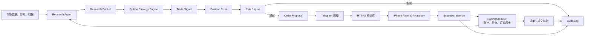
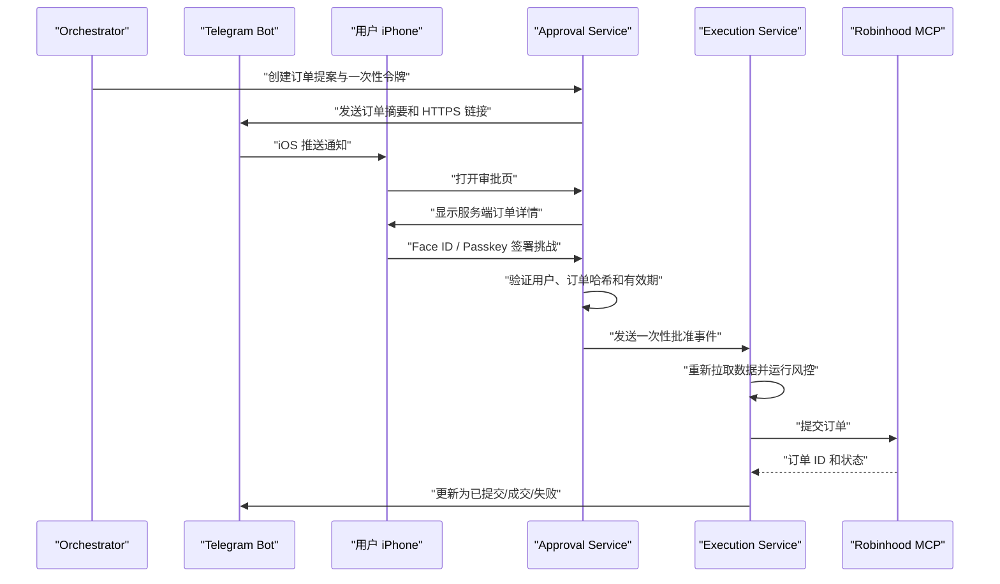
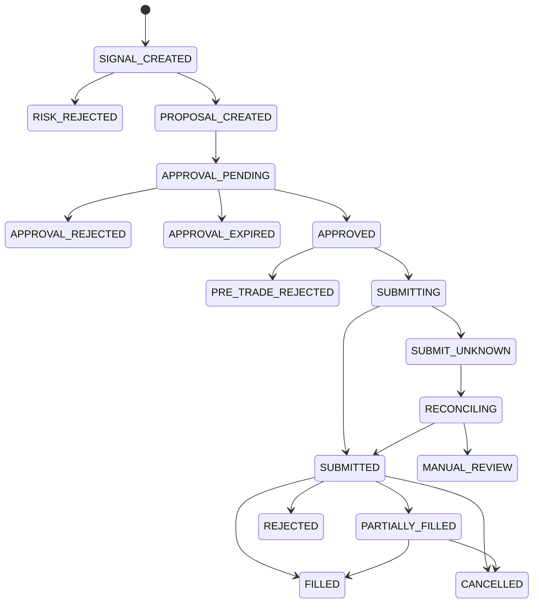

# ainvest 系统设计

> 状态：初始设计
>
> 更新日期：2026-07-24
>
> 首版范围：美股与 ETF、人工逐笔审批、默认模拟交易

## 1. 背景与目标

ainvest 是一个由 AI 辅助研究、由确定性 Python 策略产生交易信号，并在独立风控和人工审批之后通过 Robinhood 执行订单的交易框架。

系统的目标是：

1. 让 Research Agent 汇集市场、公司、技术面和投资组合信息。
2. 将研究结果转换为有类型、有来源、有时间戳的数据，而不是把自然语言直接交给交易程序。
3. 支持用户以 Python 插件形式添加、测试和启停策略。
4. 让风险控制独立于 AI 模型和策略，拥有无条件否决权。
5. 通过 Telegram 将订单提案及时发送到 iPhone。
6. 通过独立 HTTPS 审批页面和 Face ID/Passkey 确认每一笔实盘订单。
7. 通过 Robinhood 官方 Trading MCP 查询账户并在专用 Agentic Account 中执行获批订单。
8. 为研究、信号、审批、下单和成交保留完整、可追溯的审计记录。

本系统不是投资顾问，也不保证任何策略获利。实盘损失由账户持有人承担。

## 2. 非目标

首版明确不包含：

- 高频或低延迟交易
- 无人值守的全自动实盘交易
- 期权、期货、加密货币、保证金和裸卖空
- 让大语言模型自行决定订单数量或绕过策略与风控
- 在 Telegram 消息中直接完成不可撤销的实盘授权
- 用回测结果代表未来收益
- 管理他人资产或提供面向第三方的投资建议

## 3. 核心设计原则

### 3.1 AI 负责研究，规则负责资金

AI 可以阅读、总结、比较并形成多空论点，但所有会改变账户资金或仓位的动作必须经过确定性的策略、风控、审批和执行状态机。

### 3.2 结构化数据优先

模块之间传递版本化的数据对象。自然语言只能作为解释字段，不能作为下单指令。

### 3.3 默认不交易

任何缺失、异常、超时、数据过期、连接失败或状态不一致都必须失败关闭（fail closed），最终结果为不下单。

### 3.4 审批绑定具体订单

审批必须绑定标的、方向、数量、订单类型、限价、有效期和策略版本。任一字段变化都使原审批失效。

### 3.5 最小权限与资金隔离

系统使用 Robinhood Agentic Account 的独立预算。研究组件不得持有交易权限；只有执行组件能够调用下单工具。

### 3.6 可重放与可审计

相同输入和相同策略版本应产生相同信号。每一次决策都要能够还原当时的数据、配置和代码版本。

### 3.7 优先组合成熟组件

ainvest 不自行实现通用基础设施。数据验证、插件发现、技术指标、回测、Telegram、WebAuthn、状态机、数据库、MCP、调度和可观测性优先采用成熟的开源组件。

只有以下与 ainvest 领域和资金安全直接相关的部分由项目自己实现：

- 版本化领域数据协议
- 策略输入输出契约
- 账户专属硬风控政策
- 订单规范化、订单哈希和一次性审批事务
- Robinhood MCP 薄适配与成交核对
- 连接各组件的状态迁移和审计事件

不得为了减少少量适配代码而采用一个同时持有 AI、数据、策略和 Broker 权限的第三方“全自动交易机器人”。

## 4. 总体架构



系统逻辑上分为六个信任域：

1. **数据域**：获取、清洗并缓存外部数据。
2. **研究域**：运行 AI Agent，生成有证据的研究包。
3. **决策域**：运行用户策略并产生信号。
4. **风险域**：校验仓位、资金、价格、时效和交易限制。
5. **审批域**：通知用户并验证一次性人工授权。
6. **执行域**：通过 Robinhood MCP 下单并核对最终状态。

## 5. 主要组件

### 5.1 Data Adapters

统一外部数据源的差异，向上层提供稳定接口：

- 实时或延迟报价
- OHLCV 历史数据
- 公司基本面与财报日历
- 公司新闻、行业新闻和宏观事件
- Robinhood 账户、购买力、仓位和订单历史

每一条数据必须包含：

- `source`
- `observed_at`
- `received_at`
- `timezone`
- `is_delayed`
- `quality_flags`

系统不得静默混合不同时间点、复权方式或币种的数据。

### 5.2 Research Agent

Research Agent 负责：

- 总结近期市场和行业动态
- 研究公司的业务、财务、估值与事件风险
- 计算或调用确定性工具计算技术指标
- 分析现有持仓、集中度和购买力
- 形成 bull case、bear case、关键风险和待验证事项
- 给出引用来源和数据时间

模型不得自行计算重要金额、仓位或技术指标。此类数值应由 Python 工具计算，模型只负责解释。

Research Agent 的输出是 `ResearchPacket`，而不是 `BUY` 或 `SELL` 指令。

### 5.3 Strategy Engine

Strategy Engine 是 Python 策略运行时，负责：

- 发现并加载已启用策略
- 验证策略声明的输入需求
- 给策略传入不可变的研究和组合快照
- 收集标准化交易信号
- 记录策略名称、版本、参数和运行时间
- 以同一个策略实现支持回测、Paper Trading 和实盘
- 隔离单个策略异常，防止影响整个调度周期

#### 5.3.1 用户策略定义

首版采用 **Python 策略类 + Pydantic 参数模型 + YAML 实例配置**。策略代码定义逻辑，YAML 决定启用状态、标的、周期和参数。

策略接收只读 `StrategyContext` 并返回零个或多个 `TradeSignal`：

```python
from datetime import timedelta
from decimal import Decimal
from typing import Protocol

from pydantic import BaseModel, Field


class MovingAverageParams(BaseModel):
    fast_window: int = Field(default=20, ge=2)
    slow_window: int = Field(default=50, ge=3)
    target_weight: Decimal = Field(default=Decimal("0.10"), gt=0, le=1)


class Strategy(Protocol):
    name: str
    version: str
    params_model: type[BaseModel]

    def evaluate(self, context: StrategyContext) -> list[TradeSignal]:
        ...
```

策略返回的是交易意图，不是 Broker 订单。标准信号至少包含：

- `symbol`
- `intent`：`BUY`、`SELL` 或 `HOLD`
- `strength`：`-1` 到 `1` 的策略内部评分，不代表获利概率
- `target_weight`：可选的目标仓位
- `valid_for`：信号有效期
- `reason_codes`：机器可读的触发原因

最终股数、限价和最大名义金额由独立的 Position Sizer 根据当前仓位和购买力计算，再交给 Risk Engine。策略不得直接决定最终订单或提交交易。

策略实例配置示意：

```yaml
strategies:
  - id: aapl_sma_daily
    plugin: moving_average
    enabled: true
    universe:
      symbols: [AAPL, MSFT]
      timeframe: 1d
    parameters:
      fast_window: 20
      slow_window: 50
      target_weight: "0.10"
    schedule:
      run_at: market_close_minus_15m
    constraints:
      research_max_age: 30m
      signal_ttl: 30m
```

YAML 不允许包含 `eval`、lambda 或其他可执行表达式。

#### 5.3.2 策略发现与注册

由于策略可能由多人、多个团队在独立仓库中开发，首版使用 **pluggy + Python `entry_points`** 作为正式插件机制。ainvest 对业务代码暴露稳定的 `StrategyRegistry` 门面，Registry 内部使用 pluggy 发现、校验和注册策略插件。

```python
import pluggy

hookspec = pluggy.HookspecMarker("ainvest")
hookimpl = pluggy.HookimplMarker("ainvest")


class StrategyHooks:
    @hookspec
    def strategy_definitions(self) -> list[StrategyDefinition]:
        """返回当前插件提供的策略定义。"""


class StrategyRegistry:
    def register(self, strategy_type: type[Strategy]) -> None:
        ...

    def get(self, name: str) -> type[Strategy]:
        ...

    def list(self) -> list[StrategyDefinition]:
        ...
```

每个策略包实现 Hook：

```python
class TeamStrategyPlugin:
    @hookimpl
    def strategy_definitions(self) -> list[StrategyDefinition]:
        return [
            StrategyDefinition.from_type(MovingAverageStrategy),
            StrategyDefinition.from_type(RSIReversionStrategy),
        ]


plugin = TeamStrategyPlugin()
```

并通过 `pyproject.toml` 的 entry point 发布：

```toml
[project.entry-points."ainvest.strategies"]
team_alpha = "team_alpha_strategies.plugin:plugin"
```

Strategy Engine 启动时通过 `PluginManager.load_setuptools_entrypoints("ainvest.strategies")` 加载已安装插件，再由 Registry 展平并验证所有 `StrategyDefinition`。安装或升级策略包后无需修改 ainvest 主程序。

pluggy 负责：

- 定义稳定的 Hook 规范
- 发现多个独立团队发布的策略包
- 注册、列举和启停插件
- 拒绝不符合 Hook 规范的实现
- 为未来的指标或数据扩展保留一致机制

pluggy 不负责参数验证、回测、进程隔离、超时或风控，这些仍由 Strategy Engine 和 ainvest 领域层负责。

每个插件必须提供：

- 全局唯一的 `plugin_id`
- 插件语义版本 `plugin_version`
- 支持的 `ainvest_strategy_api` 版本范围
- 策略定义列表及各自的名称、版本和参数模型
- 源代码版本或构建提交哈希
- 维护团队和仓库地址

插件加载规则：

- `plugin_id`、策略名称或 entry point 冲突时启动失败，不允许静默覆盖
- 不兼容当前 Strategy API 的插件不得加载
- 插件升级不得隐式迁移正在使用的策略状态
- 实盘环境只加载配置白名单中的插件及固定版本
- 生产依赖必须使用锁文件并校验包哈希

ainvest 应提供独立的 `strategy-conformance` 测试套件，供每个团队在自己的 CI 中验证：

- Hook 和元数据兼容性
- Pydantic 参数及信号验证
- 相同输入的确定性
- 无未来数据访问
- 超时与异常处理
- Paper Trading 示例运行
- 禁止 Broker、凭据和网络访问

#### 5.3.3 策略状态与运行隔离

策略应优先保持无状态。确实需要状态时，状态必须通过 `StrategyContext` 显式读取，并通过结构化结果返回 `next_state`；不得依赖类变量、全局变量或进程内隐藏状态。状态记录必须绑定策略版本。

用户策略本质上是任意 Python 代码。即使首版只有项目所有者使用，也应在独立工作进程中执行：

- 不向策略进程传入任何凭据
- 默认禁止网络访问
- 文件系统只读
- 设置执行超时以及 CPU、内存限制
- 输入输出只允许通过版本化 Pydantic 模型
- 策略异常只使本次运行失败
- 记录策略版本、参数和代码哈希

策略不得：

- 直接调用 Robinhood
- 读取经纪账户凭据
- 绕过 Risk Engine
- 在运行时修改全局配置
- 使用真实当前时间代替 `context.as_of`
- 将 `strength` 表述为真实获利概率

#### 5.3.4 Position Sizer

Position Sizer 将策略意图转换为候选订单数量，但不决定订单能否执行。它统一处理：

- 目标仓位与当前仓位的差额
- 可用购买力和最低现金保留
- 股票价格和整股取整
- 最小、最大订单金额
- 多个策略对同一标的的信号合并

Position Sizer 的输出只是候选订单，必须继续经过 Risk Engine。策略、Position Sizer 和 Risk Engine 分离，可以避免每个策略重复实现资金计算，并保证所有策略使用一致的仓位规则。

### 5.4 Risk Engine

Risk Engine 是纯 Python、确定性、可单元测试的规则集合。它在策略之后、审批之前运行，并在真正下单前再次运行。

首版规则至少包括：

- 单笔最大名义金额
- 单标的最大仓位比例
- 单行业最大暴露
- 单日最大成交额
- 单日最大已实现与未实现亏损
- 最低现金保留比例
- 白名单标的
- 禁止期权、保证金、卖空和杠杆 ETF
- 财报窗口限制
- 行情最大允许年龄
- 买卖价差和异常波动限制
- 最大允许滑点
- 市场交易时段限制
- 重复订单检测
- 未完成订单冲突检测
- 全局 kill switch

Risk Engine 返回：

- `APPROVED`
- `REJECTED`
- `NEEDS_REVIEW`

每个结果都必须包含机器可读的规则编号和人类可读的原因。

任何必需的风控额度缺失、为空、格式错误或超出允许范围时，Risk Engine 必须返回 `REJECTED`，不得使用隐式默认额度继续交易。系统可以继续运行研究任务，但不能创建或执行订单提案。

首版所有会创建或执行订单提案的流程仅允许在美股常规交易时段运行。节假日、提前收市后的时段、盘前、盘后和隔夜时段一律不创建新订单；研究、审计和成交核对任务可以在非交易时段运行。

### 5.5 Approval Service

Approval Service 创建订单提案、生成一次性令牌并验证 Passkey。

Telegram 只发送：

- 订单摘要
- 风险摘要
- 有效期
- 指向安全审批页面的 HTTPS 链接

Telegram 不是身份验证或最终授权边界。单击聊天按钮不得直接调用 Robinhood。

安全审批页面必须：

1. 从服务端读取订单，不能相信 URL 中的订单参数。
2. 显示标的、方向、数量、订单类型、限价和最坏金额。
3. 显示策略、主要理由和风控结果。
4. 要求 iPhone 使用 Face ID/Passkey。
5. 对完整订单摘要的哈希进行授权。
6. 原子地将一次性令牌从 `PENDING` 改为 `APPROVED`。
7. 防止刷新、重放或重复点击产生多次授权。

### 5.6 Execution Service

Execution Service 是唯一拥有交易工具访问权的组件。

执行前必须：

1. 验证审批仍有效且尚未消费。
2. 重新读取最新报价、购买力、仓位和未完成订单。
3. 重新运行全部硬风控。
4. 比较当前订单与获批订单的哈希。
5. 检查价格偏移是否在允许范围内。
6. 使用幂等键创建订单。
7. 记录 Robinhood 返回的订单 ID。
8. 持续查询直至进入终态或交给核对任务处理。

首版只允许在 Robinhood Agentic Account 中交易。Robinhood 官方文档说明，Trading MCP 可以读取授权账户数据，但交易仅能发生在 Agentic Account。

参考：

- [Robinhood Agentic Trading overview](https://robinhood.com/us/en/support/articles/agentic-trading-overview/)
- [Robinhood Agentic Trading](https://robinhood.com/us/en/agentic-trading/)
- MCP endpoint：`https://agent.robinhood.com/mcp/trading`

## 6. 核心数据协议

所有协议都应包含 `schema_version`，并使用 UTC ISO 8601 时间。

### 6.1 ResearchPacket

```json
{
  "schema_version": "1.0",
  "research_id": "res_01...",
  "symbol": "AAPL",
  "as_of": "2026-07-24T18:30:00Z",
  "market": {
    "last_price": "215.42",
    "bid": "215.40",
    "ask": "215.44",
    "currency": "USD",
    "observed_at": "2026-07-24T18:29:58Z"
  },
  "technical": {
    "sma_20": "211.30",
    "sma_50": "204.80",
    "rsi_14": "61.20",
    "atr_14": "4.70"
  },
  "portfolio": {
    "quantity": "10",
    "market_value": "2154.20",
    "portfolio_weight": "0.0800",
    "buying_power": "3000.00"
  },
  "thesis": {
    "bull_case": [],
    "bear_case": [],
    "risks": []
  },
  "evidence": [],
  "quality_flags": []
}
```

金额和数量在 JSON 中使用十进制字符串，Python 中使用 `Decimal`，禁止用二进制浮点数处理订单金额。

### 6.2 TradeSignal

```json
{
  "schema_version": "1.0",
  "signal_id": "sig_01...",
  "research_id": "res_01...",
  "strategy": "sma_crossover",
  "strategy_version": "1.2.0",
  "symbol": "AAPL",
  "intent": "BUY",
  "strength": "0.73",
  "target_weight": "0.10",
  "generated_at": "2026-07-24T18:30:10Z",
  "expires_at": "2026-07-24T19:00:10Z",
  "reason_codes": ["SMA20_CROSSED_ABOVE_SMA50"]
}
```

### 6.3 OrderProposal

```json
{
  "schema_version": "1.0",
  "proposal_id": "ordp_01...",
  "signal_id": "sig_01...",
  "account_scope": "agentic",
  "symbol": "AAPL",
  "side": "BUY",
  "quantity": "2",
  "order_type": "LIMIT",
  "limit_price": "214.50",
  "time_in_force": "DAY",
  "maximum_notional": "429.00",
  "created_at": "2026-07-24T18:30:12Z",
  "expires_at": "2026-07-24T18:32:12Z",
  "risk_decision_id": "risk_01...",
  "order_hash": "sha256:..."
}
```

`order_hash` 使用规范化序列化后的关键订单字段计算，审批和执行都必须校验它。

## 7. Telegram 与 iPhone 审批流程



Telegram Bot 安全要求：

- 仅允许配置中的 Telegram `user_id` 和私聊 `chat_id`
- Webhook 使用 HTTPS 和 Telegram secret token
- Bot token 仅存放在 secrets manager 或受保护的环境变量中
- 日志中不得记录 Bot token、完整审批令牌或账户号码
- 消息不包含 Robinhood 凭据和不必要的完整账户数据
- 审批链接至少使用 256 位随机令牌，数据库只保存令牌哈希
- 链接 60–120 秒失效并只能消费一次
- Telegram 不可用、消息未送达或用户未响应时，一律不交易

Passkey 参考：[Apple Passkeys](https://developer.apple.com/passkeys/)

## 8. 状态机

订单工作流只能按以下状态迁移：



`SUBMIT_UNKNOWN` 发生时绝不能盲目重试下单。系统必须先根据幂等键、客户端订单 ID 和 Robinhood 订单历史进行核对。

## 9. 存储与审计

首版可以使用 SQLite，部署后建议使用 PostgreSQL。

主要记录：

- `research_runs`
- `research_packets`
- `strategy_runs`
- `trade_signals`
- `risk_decisions`
- `order_proposals`
- `approval_challenges`
- `approval_events`
- `broker_orders`
- `broker_fills`
- `portfolio_snapshots`
- `audit_events`

审计事件应采用追加写入，至少记录：

- 事件时间与关联 ID
- 触发者：系统、模型、策略或用户
- 输入摘要和输出摘要
- 模型、提示词、策略、配置和代码版本
- 状态迁移前后值
- 错误类别和重试信息

敏感字段应脱敏或加密，不在审计日志中保存任何私钥、Passkey 私钥、Telegram Bot token 或 Robinhood 授权令牌。

## 10. 开源复用与项目目录

### 10.1 推荐依赖

| 能力 | 首选组件 | 说明 |
|---|---|---|
| Agent 与结构化输出 | [Pydantic AI](https://github.com/pydantic/pydantic-ai) | 模型无关、工具调用、MCP、结构化输出 |
| 数据协议与配置 | [Pydantic](https://github.com/pydantic/pydantic) | 领域模型、验证与 JSON Schema |
| SEC 文件 | [EdgarTools](https://github.com/dgunning/edgartools) | 10-K、10-Q、8-K、Form 4、XBRL |
| 开发行情 | [yfinance](https://github.com/ranaroussi/yfinance) | 只用于研究和 Paper Trading，不作为实盘唯一报价 |
| 技术指标 | [TA-Lib Python](https://github.com/TA-Lib/ta-lib-python) | 避免自行实现常见指标 |
| 策略注册 | [pluggy](https://github.com/pytest-dev/pluggy) + Python `entry_points` + StrategyRegistry | 多团队独立开发、发布和发现策略 |
| 回测 | [bt](https://github.com/pmorissette/bt) | MIT 许可，适合股票组合与再平衡 |
| 绩效分析 | [QuantStats](https://github.com/ranaroussi/quantstats) | 收益、波动、回撤和报告 |
| 交易日历 | [pandas-market-calendars](https://github.com/rsheftel/pandas_market_calendars) | 节假日、提前收市和交易时段 |
| HTTPS API | [FastAPI](https://github.com/fastapi/fastapi) | 审批和管理接口 |
| Telegram | [python-telegram-bot](https://github.com/python-telegram-bot/python-telegram-bot) | Bot API、Webhook 和消息按钮 |
| Face ID/Passkey | [py_webauthn](https://github.com/duo-labs/py_webauthn) | WebAuthn 服务端挑战与验证 |
| 状态机 | [transitions](https://github.com/pytransitions/transitions) | MVP 订单状态迁移 |
| 数据库 | [SQLAlchemy](https://github.com/sqlalchemy/sqlalchemy) + Alembic | 事务、持久化和迁移 |
| 调度 | [APScheduler](https://github.com/agronholm/apscheduler) 3.11.x | 4.x 稳定前固定 3.x |
| 大规模持久工作流 | [Temporal](https://github.com/temporalio/temporal)，可选 | 多进程或长时审批后再引入 |
| Robinhood MCP 客户端 | [MCP Python SDK](https://github.com/modelcontextprotocol/python-sdk) | 连接官方托管 MCP |
| 日志与监控 | structlog、OpenTelemetry、Prometheus | 结构化日志、trace 和指标 |
| 测试 | pytest、Hypothesis、HTTPX mock | 单元、性质和故障注入测试 |

许可证和数据使用注意事项：

- OpenBB 使用 AGPLv3，只有在明确接受许可证义务后再引入。
- backtesting.py 使用 AGPLv3；首版优先选择 MIT 许可的 `bt`。
- VectorBT 社区版带 Commons Clause，不作为默认核心依赖。
- yfinance 本身开源，但 Yahoo 数据的使用权受 Yahoo 条款约束。
- pluggy 使用 MIT 许可，只承担插件 Hook、发现和注册，不承担隔离与风控。
- 原版 Zipline 和 Pyfolio 不作为新项目基础。
- 不使用要求 Robinhood 用户名、密码并调用非官方接口的 Broker 库或 MCP Server。

以上组件负责通用能力；ainvest 仍拥有领域协议、硬风控、审批绑定、Broker 幂等和成交核对。

### 10.2 项目目录建议

```text
ainvest/
├── src/ainvest/
│   ├── agents/             # Research Agent 与工具编排
│   ├── data/               # 行情、新闻和基本面适配器
│   ├── schemas/            # 版本化数据协议
│   ├── strategies/         # 策略协议、pluggy Hook、Registry、worker
│   ├── risk/               # 硬风控规则
│   ├── approval/           # Telegram、Passkey 和审批状态机
│   ├── execution/          # Paper broker 与 Robinhood MCP
│   ├── portfolio/          # 仓位、暴露和绩效
│   ├── audit/              # 审计事件
│   └── api/                # HTTPS 审批与管理 API
├── config/
│   ├── risk.example.yaml
│   └── strategies.example.yaml
├── tests/
│   ├── unit/
│   ├── integration/
│   ├── backtest/
│   └── safety/
├── migrations/
├── scripts/
├── design.md
├── pyproject.toml
└── README.md
```

## 11. 配置与密钥

非敏感配置使用版本控制下的 YAML：

- 策略参数
- 风控上限
- 允许标的
- 交易时段
- 数据新鲜度阈值

敏感信息不得进入 Git：

- Telegram Bot token
- Telegram webhook secret
- Passkey/WebAuthn 服务端密钥
- 数据供应商 API key
- Robinhood/MCP OAuth token
- 数据库密码

生产环境应使用托管 secrets manager。开发环境可以使用未提交的 `.env`，并提供不含真实值的 `.env.example`。

## 12. 调度与运行模式

支持三种运行模式：

1. **Research only**：只研究和生成报告。
2. **Paper trading**：完整运行策略、风控与审批，但使用模拟 Broker。
3. **Live trading**：通过 Robinhood MCP 交易，需要显式配置和启动开关。

生产默认值必须是：

```text
TRADING_MODE=paper
LIVE_TRADING_ENABLED=false
REQUIRE_HUMAN_APPROVAL=true
REGULAR_TRADING_HOURS_ONLY=true
REQUIRE_COMPLETE_RISK_LIMITS=true
```

首版不允许关闭 `REGULAR_TRADING_HOURS_ONLY` 或 `REQUIRE_COMPLETE_RISK_LIMITS`。交易日和提前收市时间必须由交易日历确定，不能使用固定的工作日或本地时钟判断。

切换实盘不能只依赖一个环境变量，至少还需：

- 已完成的 Robinhood Agentic Account 授权
- 配置中的账户范围校验
- 启动时人工确认
- 通过预设安全测试
- 有效 kill switch

## 13. 可观测性与告警

需要监控：

- 外部数据延迟和错误率
- Research Agent 成功率、耗时和 token 使用量
- 策略运行结果及异常
- 风控拒绝原因分布
- Telegram 通知发送状态
- 审批延迟与过期数量
- MCP 调用耗时和错误
- 订单提交、部分成交、拒绝和未知状态
- 当前仓位、日内成交额和损益阈值

必须立即告警：

- 无法确定订单是否已提交
- 实际订单与获批订单不一致
- 重复订单
- 账户、购买力或仓位读取不一致
- kill switch 激活
- 实盘组件在非预期环境启动

## 14. 测试策略

### 14.1 单元测试

- 数据协议校验
- Decimal 金额计算
- 每一条风控规则
- 订单哈希
- 审批令牌过期和单次消费
- 状态机非法迁移
- 幂等处理

### 14.2 回测

- 禁止未来函数和数据泄漏
- 模拟手续费、点差和滑点
- 使用正确的复权价格
- 区分样本内和样本外
- 做 walk-forward 验证
- 报告最大回撤、波动率、换手率和基准对比

### 14.3 集成测试

- 使用假的市场数据供应商
- 使用假的 Telegram API
- 使用 Paper Broker 或 Robinhood MCP mock
- 测试网络超时、重复 webhook 和乱序事件

### 14.4 实盘前安全测试

- 审批过期后不能下单
- 修改数量或限价后审批失效
- 重复点击只产生一个执行请求
- MCP 超时不会盲目重复订单
- kill switch 阻止所有新订单
- 非白名单 Telegram 用户不能审批
- 非 Agentic Account 不能交易
- 任一必需风控额度未配置时不能交易
- 非美股常规交易时段不能创建或执行新订单

## 15. 分阶段实施

### Phase 1：领域模型与模拟闭环

- 定义 schemas 和状态机
- 建立策略协议、pluggy Hook、StrategyRegistry 和 entry_points 发现
- 发布 strategy-conformance 测试工具
- 建立策略独立进程执行边界
- 实现硬风控
- 实现 Paper Broker
- 建立 SQLite 审计记录

验收标准：从固定 ResearchPacket 到模拟成交的流程可重复、可测试。

### Phase 2：研究能力

- 接入市场、新闻和基本面数据
- 实现技术指标工具
- 接入 AI Research Agent
- 建立来源、时效和质量标记

验收标准：研究输出完全符合 schema，关键数值由确定性工具生成。

### Phase 3：Telegram 与安全审批

- Telegram Bot 私聊通知
- HTTPS 审批页面
- Passkey 注册与 Face ID 验证
- 一次性审批令牌和订单哈希

验收标准：Telegram 单击无法直接交易，重放和篡改测试全部失败关闭。

### Phase 4：Robinhood 只读接入

- 连接官方 Trading MCP
- 读取账户、持仓、购买力和订单历史
- 将真实组合快照用于 Paper Trading

验收标准：系统无法调用任何实盘下单路径。

### Phase 5：受控实盘

- 专用 Agentic Account
- 极小预算
- 只允许白名单股票/ETF 和限价单
- 每笔 Face ID 审批
- 下单前二次风控与成交核对

验收标准：完成小额端到端演练，审计记录可还原全部输入、批准和 Broker 响应。

## 16. 已确定的产品决策

| 决策 | 当前选择 |
|---|---|
| Broker | Robinhood 官方 Trading MCP |
| 交易账户 | 专用 Robinhood Agentic Account |
| 策略语言 | Python |
| 策略定义 | Python 策略类 + Pydantic 参数 + YAML 实例配置 |
| 策略插件机制 | pluggy + Python entry_points |
| 策略访问门面 | StrategyRegistry |
| 多团队兼容 | Strategy API 版本、插件元数据、conformance tests |
| 策略输出 | 交易意图与目标仓位，不直接生成 Broker 订单 |
| 策略隔离 | 独立工作进程、无凭据、默认无网络 |
| 手机通知 | Telegram Bot 私聊 |
| 最终授权 | HTTPS 审批页 + iPhone Face ID/Passkey |
| 首版资产 | 美股和 ETF |
| 首版订单 | 优先限价单 |
| 首版执行模式 | 默认 Paper Trading |
| 实盘审批 | 每笔必须人工确认 |
| AI 权限 | 研究和解释，不直接下单 |
| 交易时段 | 仅在美股常规交易时段创建或执行订单 |
| 风控配置缺失行为 | 任一必需风控额度未配置或无效时拒绝交易 |

## 17. 实现前仍需确定

- 市场、新闻和基本面数据供应商
- AI 模型与调用方式
- 审批页面域名和部署环境
- Telegram Bot 的创建与允许用户 ID
- 首版策略和具体参数
- 单笔、单股、单日和最大回撤限制的具体数值
- 数据和审计记录保留期限

这些选择不影响总体架构，可以在各阶段开始前分别确定。
