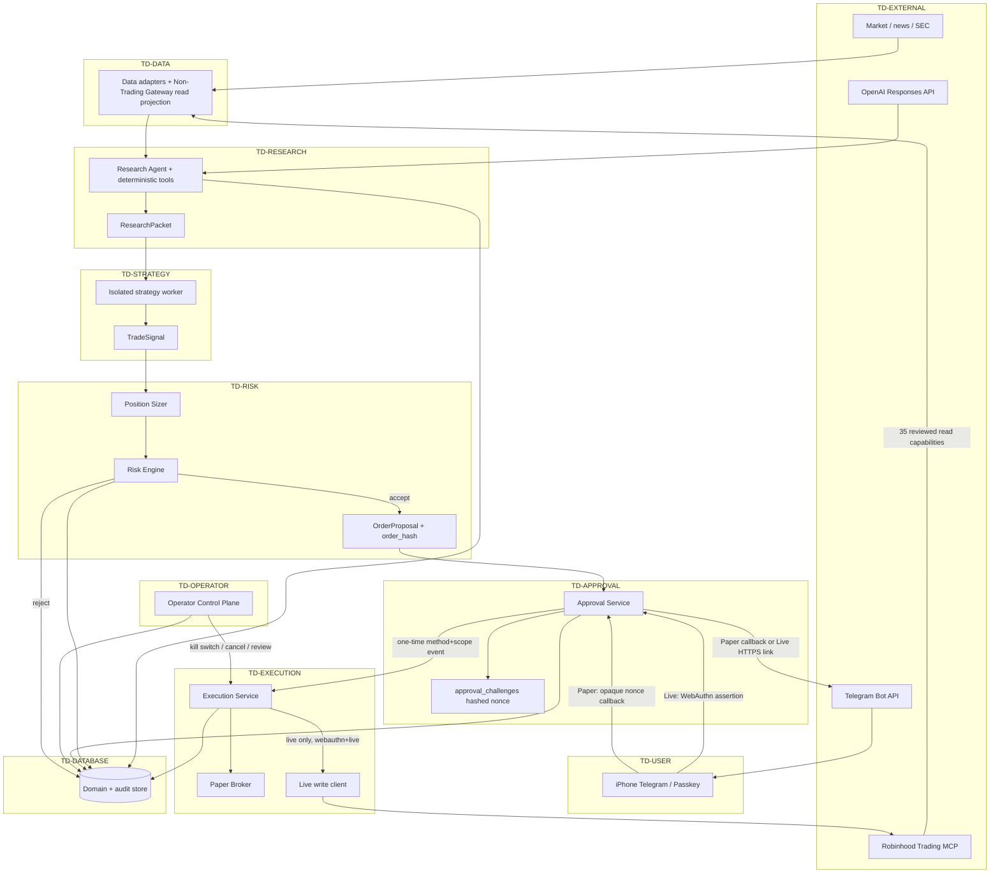
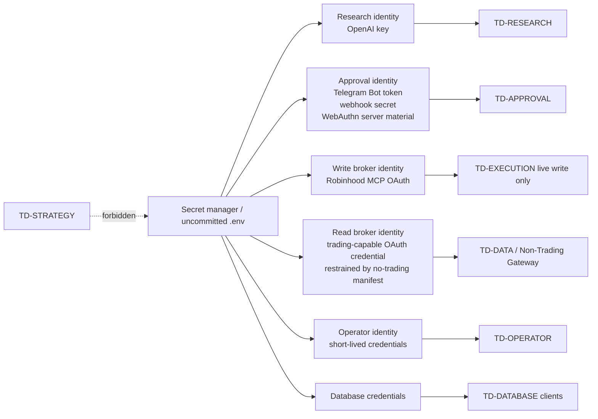
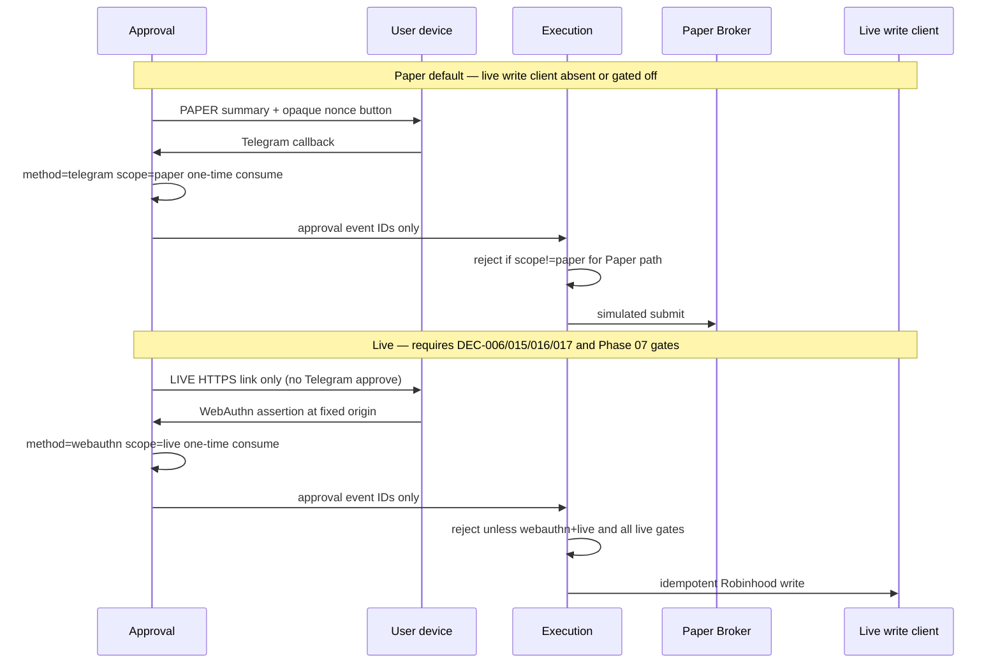

# Data flow and trust boundaries

Status: accepted for Phase 01 documentation (`P01-T1`)  
Last updated: 2026-07-26  
Related: [`threat-model.md`](threat-model.md), `design.md` §4–§5, §7–§9, §11

This document describes how data and credentials move across ainvest trust
domains. It does not authorize live trading. Paper remains the safe default;
live write paths stay disabled until deferred owner decisions and Phase 07
gates are satisfied.

## 1. Trust domains

| Domain ID | Name | May hold | Must not hold | May initiate funds action? |
|---|---|---|---|---|
| `TD-DATA` | Data | Read-normalized market/news/calendar snapshots; optional offline adapters | Broker write credentials; OpenAI key; approval nonces | No |
| `TD-RESEARCH` | Research | OpenAI API key (Research identity only); deterministic tool outputs; `ResearchPacket` | Broker write credentials; Telegram Bot token; WebAuthn private material; raw MCP write session | No |
| `TD-STRATEGY` | Strategy Worker | Immutable research/portfolio snapshot; strategy params; `TradeSignal` | Any secret; network to broker/AI/Telegram; mutable shared process state across strategies | No |
| `TD-RISK` | Risk | Risk limits config; quotes/portfolio for evaluation; `RiskDecision` | Broker write credentials; approval tokens; operator credentials | No (veto only) |
| `TD-APPROVAL` | Approval API | Telegram Bot token (Approval identity); challenge hashes; WebAuthn public credentials and server challenges; Paper/Live approval events | Robinhood write credentials; strategy code execution; OpenAI key | No (authorization only) |
| `TD-EXECUTION` | Execution | Paper broker state; Robinhood write MCP session (live only, isolated); idempotency keys | OpenAI key; Telegram Bot token; strategy packages; raw approval nonces | Yes, after method/scope and pre-trade guards |
| `TD-DATABASE` | Database | Versioned domain rows; append-only audit; hashed tokens; redacted summaries | Raw secrets that belong only in a secret manager (prefer references); Passkey private keys (never) | N/A (persistence) |
| `TD-USER` | User device | iPhone Telegram client; Passkey private key in platform authenticator | Server secrets; broker OAuth tokens | Human authorization only |
| `TD-EXTERNAL` | External provider | Provider-owned accounts (OpenAI, Telegram, Robinhood MCP, SEC/GDELT, etc.) | ainvest private keys and operator credentials | Provider APIs only |
| `TD-OPERATOR` | Operator Control Plane | Operator identity/session; privileged action audit | Research/strategy execution rights; Telegram-as-operator identity | Privileged ops only (kill switch, cancel, review, live-start confirm, audit query) |

`TD-OPERATOR` is the design “运营控制域”. It is listed here because privileged
actions cross the same funds-safety boundary as Execution.

## 2. End-to-end data flow

## 3. Trust-boundary crossings

Every arrow that leaves a domain is a controlled interface. Crossings that can
affect funds are marked **critical**.

| Crossing | From → To | Payload | Controls | Threats |
|---|---|---|---|---|
| X1 | External → Data | Quotes, filings, news, calendar | Source tags, freshness, quality flags; no silent mix of as-of times | `T-016` |
| X2 | Data → Research | Versioned read schemas only | Explicitly named 10-operation projection over the gateway's 35 reviewed `mutates=false` capabilities; no generic capability invocation, no non-trading mutation, no trading capability | `T-007`, `T-016` |
| X3 | Research → Strategy | Immutable `ResearchPacket` | Schema validation; incomplete packet cannot drive trading | `T-001` |
| X4 | Strategy → Risk | `TradeSignal` only | Worker isolation; no broker/network; conformance suite | `T-001` |
| X5 | Risk → Approval | Frozen `OrderProposal` + `order_hash` | Canonical hash; complete risk limits; session rules | `T-004`, `T-015` |
| X6 **critical** | Approval → User (Telegram) | Order/risk summary + opaque Paper nonce or Live HTTPS link | Numeric allowlist; PAPER/LIVE label; no credentials in message | `T-005`, `T-014` |
| X7 **critical** | User → Approval | Callback update or WebAuthn assertion | One-time nonce/assertion; method/scope binding; TTL | `T-003`, `T-005`, `T-008`, `T-009` |
| X8 **critical** | Approval → Execution | Consumable approval event IDs | Outbox once; reload server-side proposal; reject telegram+live | `T-003`, `T-009`, `T-010` |
| X9 **critical** | Execution → Paper/Live broker | Idempotent submit | Pre-trade re-risk; hash match; live gates | `T-010`, `T-016` |
| X10 **critical** | Operator → Execution/DB | Kill switch, cancel, review, audit query | Non-Telegram operator auth; roles; audit | `T-011`, `T-012`, `T-013` |
| X11 | Any service → Database | Domain rows + audit | Redaction; append-only audit; least-privilege DB roles | `T-012`, `T-014` |
| X12 | External Telegram → Approval poller/webhook | Updates | Persisted offset; update_id idempotency; webhook secret when used | `T-006`, `T-008` |

## 4. Credential and secret flow

Secrets never appear in strategy packages, research narratives, Telegram
message text, audit raw payloads, traces, or CI logs.

| Secret | Allowed domains | Forbidden domains | Decision / task refs |
|---|---|---|---|
| OpenAI API key | Research | Strategy, Approval, Execution, Operator UI | `DEC-009`, `P04-T6`, `P08-T7` |
| Telegram Bot token / webhook secret | Approval | Research, Strategy, Execution write path | `DEC-010`, `P05-T4`, `P05-T5`, `P08-T7` |
| WebAuthn RP/server secrets + public credentials | Approval (+ DB for public credential metadata) | Strategy; Telegram bootstrap | `DEC-006`, `DEC-016`, `P05-T2`, `P05-T3` |
| Robinhood MCP read-broker token (trading-capable; restrained by the reviewed no-trading manifest) | Data / Non-Trading Gateway | Strategy, Research direct MCP access, Approval | `DEC-003`, `P06-T0`–`P06-T2`, `P08-T7` |
| Robinhood MCP write token | Execution live write client only | All other domains; Paper mode | `DEC-017`, `P07-T0`, `P07-T1`, `P08-T7` |
| Approval nonce (raw) | In-memory Approval creation + user device briefly | Database (hash only), logs, audit | `P05-T0`, `P05-T1`, `P08-T3` |
| Operator credentials | Operator Control Plane | Telegram identity, Research, Strategy | `DEC-018`, `P08-T14` |
| Database password | Service DB clients per least privilege | Strategy workers; browser pages | `P08-T7` |

## 5. Paper vs Live path split

Invariant: a Telegram-originated approval event can never authorize `W`.
Enforcement points: Approval schema (`P05-T0`), handoff (`P05-T6`), Execution
live guard (`P07-T1`, `P07-T4`), and safety tests (`P05-T8`, `P08-T15`).

## 6. Audit and observability data flow

1. Domain services emit structured events with correlation IDs into the same
   atomic boundary as the state change, or via an explicit transactional outbox
   (`P02-T7`, `P02-T8`, `P02-T10`).
2. `audit_events` are append-only. Updates redact secrets, raw nonces, full
   approval links, Passkey private material, and account numbers (`P02-T8`,
   `P08-T3`).
3. Metrics/traces use the same redaction rules. Health checks expose liveness
   without privileged detail (`P08-T4`, `P08-T14`).
4. Audit query is a privileged Operator action (`T-012`, `P08-T14`).

## 7. Assumptions

- First release is single-operator / single Agentic Account; multi-tenant
  isolation is out of scope.
- First-release Telegram transport is long polling; webhook is a preserved
  future boundary only (`P05-T5`).
- Strategy plugins may be third-party code but run only inside the Strategy
  Worker isolation boundary (`P03-T4`).
- External providers are trusted for availability, not for ainvest
  authorization decisions; all provider inputs are validated and fail closed.
