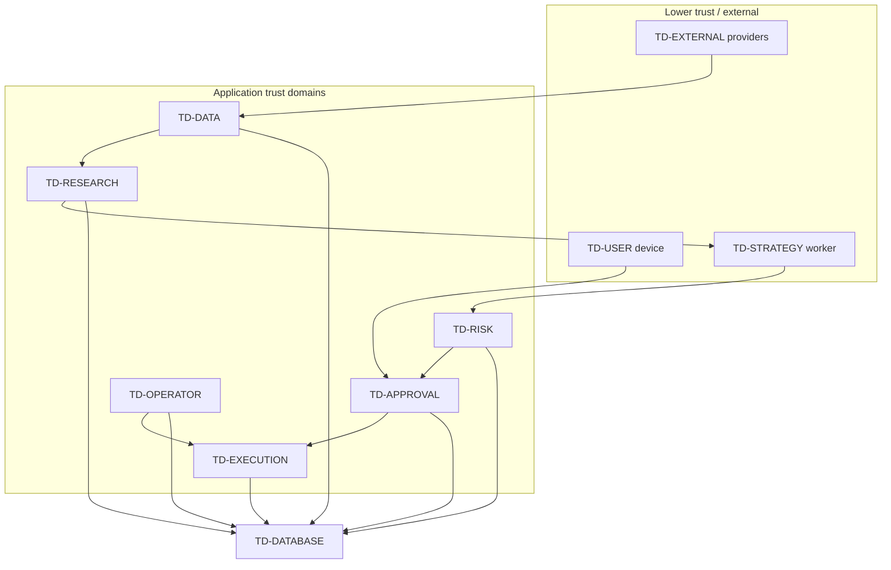

# Threat model and trust boundaries

Status: accepted for Phase 01 documentation (`P01-T1`)  
Last updated: 2026-07-26  
Related: [`data-flow.md`](data-flow.md), `design.md` §3–§5, §7–§9, §11, `docs/decisions/README.md`

This document inventories protected assets, trust domains, threats, mapped
controls, planned security tests, and residual risk. It is documentation only:
it does not implement controls, invent credentials, or enable Live trading.

**Gate rule:** every residual risk rated **High** or **Critical** for Live must
be resolved or explicitly accepted by the product/account owner before Phase 07
live write work proceeds.

## 1. Scope and methodology

### In scope

- US-listed stocks and ETFs; limit-preferred orders; Paper-default; per-order
  human approval for Live (`IMPLEMENTATION_TODO.md` §1).
- Components and trust domains in `design.md` §4–§5 and §7.
- Secrets and configuration boundaries in `design.md` §11.
- Accepted decisions `DEC-001`–`DEC-008`; proposed/deferred owner decisions
  remain fail-closed.

### Out of scope (first release)

- Multi-tenant / third-party asset management.
- Unattended autonomous Live trading.
- Options, futures, crypto, margin, naked short.
- Irreversible Live authorization inside Telegram.

### Method

1. Identify assets an attacker would seek or disrupt.
2. Partition the system into trust domains (`data-flow.md` §1).
3. Enumerate threats that cross domain boundaries or abuse privileged paths.
4. Map each threat to preventive/detective controls, implementing task IDs, and
   planned tests.
5. Record residual risk after planned controls.

Severity uses impact × likelihood for the **Live** posture unless marked Paper.
Paper-only impacts that cannot escalate to Live under method/scope guards are
capped at Medium unless they undermine those guards.

| Severity | Meaning |
|---|---|
| Critical | Direct unauthorized Live funds movement or irreversible Live authorization bypass |
| High | Plausible path to unauthorized funds action, approval forgery, or undetectable audit gap |
| Medium | Integrity/availability damage that fails closed or is Paper-scoped without Live escalation |
| Low | Limited confidentiality or operational nuisance with no funds path |

## 2. Asset inventory

| Asset ID | Asset | Confidentiality | Integrity | Availability | Primary domains |
|---|---|---|---|---|---|
| `A-FUNDS` | Cash and positions in the Robinhood Agentic Account (Live) and Paper ledger | High | Critical | High | Execution, Database, External (Robinhood) |
| `A-BROKER` | Robinhood MCP OAuth credential (trading-capable) and the sessions built from it | Critical | Critical | High | Execution (trading), Data/Non-Trading Gateway (reads) |
| `A-OPENAI` | OpenAI API key and research budget | High | Medium | Medium | Research |
| `A-TELEGRAM` | Telegram Bot token, webhook secret, numeric allowlists | High | High | Medium | Approval |
| `A-WEBAUTHN` | Passkey public credentials, RP/server material; private key on device | Critical | Critical | High | Approval, User device |
| `A-ACCOUNT` | Account identifiers, buying power, positions, order history | High | High | Medium | Database, Execution, Data |
| `A-APPROVAL` | One-time approval nonces/challenges, assertion challenges, approval events | Critical | Critical | High | Approval, Database, User device |
| `A-STRATEGY` | Strategy packages, parameters, versions, plugin code | Medium | High | Medium | Strategy Worker |
| `A-AUDIT` | Append-only audit trail and correlation timelines | High | Critical | High | Database, Operator |
| `A-CONFIG` | Risk limits, mode flags, instrument allowlists, calendars | Medium | Critical | High | Config load (all services) |
| `A-OPERATOR` | Operator identity, sessions, privileged action rights | Critical | Critical | High | Operator Control Plane |

## 3. Trust domains (summary)

See [`data-flow.md`](data-flow.md) for full crossing rules. Logical domains:

Hard rules:

1. Strategy and Research never import or call Execution write APIs (`P01-T3`).
2. Risk has unconditional veto; missing limits reject (`DEC-002`, `P03-T8`–`P03-T12`).
3. Approval method/scope is explicit: telegram+paper or webauthn+live only
   (`DEC-005`, `DEC-006`).
4. Operator identity is never Telegram-derived (`DEC-018`, `P08-T14`).
5. Fail closed on uncertainty (`design.md` §3.3).

## 4. Threat catalog

### T-001 — Strategy escape

| Field | Value |
|---|---|
| Description | Malicious or buggy strategy code escapes the worker to access network, secrets, broker APIs, shared process memory, or to mutate inputs so Risk/Execution see attacker-controlled orders. |
| Assets | `A-FUNDS`, `A-BROKER`, `A-OPENAI`, `A-STRATEGY`, `A-CONFIG` |
| Domains | Strategy Worker → Risk / Execution / secrets |
| Attacker | Compromised plugin author; supply-chain in strategy dependency; local code injection |
| Impact | Critical if escape reaches write credentials; High for integrity even in Paper |
| Controls | Process/resource isolation; no secrets in worker; architecture import bans; conformance suite; immutable context | 
| Tasks | `P01-T3`, `P03-T0`, `P03-T1`, `P03-T4`, `P03-T5`, `P08-T7`, `P08-T9` |
| Planned tests | Architecture tests rejecting `strategies→execution` / `agents→execution`; worker network/secret denials; conformance negatives; `tests/safety` escape attempts (`P08-T12`, `P08-T13`, `P08-T15`) |

### T-002 — Dependency poisoning

| Field | Value |
|---|---|
| Description | Malicious or vulnerable third-party package gains code execution in CI or runtime, especially in research/approval/execution dependency groups. |
| Assets | All secrets and `A-FUNDS` |
| Domains | Build/CI → any runtime domain |
| Attacker | PyPI/GitHub supply chain; compromised maintainer; typosquat |
| Impact | Critical |
| Controls | Hash-locked dependencies; dependency groups; CI audit; secret scanning; CODEOWNERS on security/execution paths; no unofficial Robinhood clients |
| Tasks | `P01-T2`, `P01-T5`, `P08-T6` |
| Planned tests | Lock-file consistency; dependency audit gate; CI fails on known critical CVEs; intentional unofficial client detection (`P01-T5`, `P08-T6`) |

### T-003 — Approval replay

| Field | Value |
|---|---|
| Description | Reuse of a Telegram callback nonce, WebAuthn assertion, outbox delivery, or approval event to create a second execution. |
| Assets | `A-APPROVAL`, `A-FUNDS` |
| Domains | User / External → Approval → Execution |
| Attacker | Network observer; compromised device backup; duplicated webhook/update; crash-retry |
| Impact | Critical (Live); High (Paper if it breaks one-time invariant) |
| Controls | 256-bit nonce, hash-at-rest; 60–120s TTL; single-consume transaction; outbox idempotency keys; assertion counter/UV checks |
| Tasks | `P05-T0`, `P05-T1`, `P05-T3`, `P05-T5`, `P05-T6`, `P02-T7`, `P03-T12` |
| Planned tests | Concurrent double-click; replayed callback/assertion; outbox redelivery; expired nonce (`P05-T8`, `P08-T13`, `P08-T15`) |

### T-004 — Order tampering

| Field | Value |
|---|---|
| Description | Attacker changes symbol, quantity, limit, instrument identity, strategy version, or scope after Risk approval or in URL/callback parameters so Execution submits a different order than the human saw. |
| Assets | `A-FUNDS`, `A-APPROVAL`, `A-ACCOUNT` |
| Domains | Approval UI/callback → Execution |
| Attacker | Man-in-the-middle on notification; malicious client; confused deputy on query params |
| Impact | Critical |
| Controls | Canonical `order_hash` over frozen fields; callback/URL carry opaque token only; server reload of proposal; pre-trade hash compare; instrument identity rules |
| Tasks | `P02-T3`, `P02-T4`, `P03-T10`, `P05-T0`, `P05-T1`, `P05-T3`, `P05-T6`, `P07-T1` |
| Planned tests | Mutate quantity/limit/strategy/instrument in URL or payload; hash mismatch rejects; property tests on canonical serialization (`P08-T12`, `P08-T15`) |

### T-005 — Telegram account or Bot compromise

| Field | Value |
|---|---|
| Description | Theft of Bot token, takeover of the allowlisted Telegram account, or addition of the Bot to a group/channel to forge Paper approvals or phishing Live links. |
| Assets | `A-TELEGRAM`, `A-APPROVAL`, `A-FUNDS` (via scope escalation attempts) |
| Domains | External Telegram → Approval |
| Attacker | Token leaker; SIM/account takeover; malicious group admin |
| Impact | High for Paper trading; Critical if combined with Live escalation (`T-009`) |
| Controls | Separate staging/prod Bots; numeric user/chat allowlist; private chat only; username not auth; Telegram cannot create live scope; Live requires WebAuthn; secrets isolation; no irreversible Live auth in Telegram |
| Tasks | `P01-T4`, `P05-T1`, `P05-T4`, `P05-T5`, `P08-T7`, `DEC-005`, `DEC-010` |
| Planned tests | Wrong user/chat/message; group/channel; username-only; plain `approve` text; telegram+live creation rejected (`P05-T8`, `P08-T15`) |

### T-006 — Long-poll offset loss

| Field | Value |
|---|---|
| Description | Poller crash, dual pollers, or lost offset causes missed, duplicated, or reordered Telegram updates, producing duplicate approvals or skipped expiry handling. |
| Assets | `A-APPROVAL`, integrity of Paper loop |
| Domains | Approval ↔ Telegram |
| Attacker | Fault / misconfiguration (availability abuse) |
| Impact | Medium (Paper); High if duplicates bypass one-time consume |
| Controls | Single active poller; durable offset; dedupe by `update_id` / callback id; approval consume still transactional |
| Tasks | `P05-T5`, `P05-T1`, `P05-T6`, `P08-T13` |
| Planned tests | Restart mid-batch; duplicate/out-of-order updates; two-poller conflict fails closed (`P05-T5`, `P05-T8`, `P08-T13`) |

### T-007 — SSRF

| Field | Value |
|---|---|
| Description | Research tools, data adapters, webhooks, or MCP/HTTP clients are induced to fetch internal URLs, cloud metadata, or arbitrary addresses, exfiltrating secrets or pivoting. |
| Assets | `A-OPENAI`, `A-BROKER`, `A-CONFIG`, cloud credentials |
| Domains | Research / Data / Approval → External or internal network |
| Attacker | Prompt/tool argument injection; malicious evidence URL; forged webhook source |
| Impact | High |
| Controls | Deterministic tool allowlists; no model built-in web search; URL allowlists/blocks for link fetches; Non-Trading Gateway fixed capability manifest and pinned schema digests; Approval/Execution least privilege egress; disable unsafe redirects |
| Tasks | `P04-T5`, `P04-T6`, `P04-T8`, `P06-T0`, `P08-T7`, `DEC-004` |
| Planned tests | Tool attempts to hit link-local/metadata URLs; disallowed MCP tools; research packet with malicious URL (`P04-T8`, `P08-T13`, `P08-T15`) |

### T-008 — Webhook forgery

| Field | Value |
|---|---|
| Description | Forged Telegram webhook (or future HTTP callback) injects fake approval updates without a valid Bot secret or identity checks. |
| Assets | `A-APPROVAL`, `A-TELEGRAM` |
| Domains | External → Approval API |
| Attacker | Internet client when webhook mode is enabled |
| Impact | High (Paper); Critical if paired with Live confusion |
| Controls | First release uses long poll (no public webhook required); future webhook requires HTTPS secret token, body/rate limits, same identity rules; forbid poll+webhook simultaneously |
| Tasks | `P05-T5`, `P05-T7`, `P01-T4` |
| Planned tests | Missing/invalid secret token; replayed body; poll+webhook dual-mode rejected (`P05-T5`, `P08-T13`) |

### T-009 — Paper-to-Live scope escalation

| Field | Value |
|---|---|
| Description | A telegram+paper approval, Paper Broker path, or config flag combination is accepted by the Live write client. |
| Assets | `A-FUNDS`, `A-BROKER`, `A-APPROVAL` |
| Domains | Approval → Execution live |
| Attacker | Logic bug; forged event; mis-set `LIVE_TRADING_ENABLED`; confused handoff |
| Impact | Critical |
| Controls | Schema allows only telegram+paper or webauthn+live; handoff routing; Execution live guard; multi-gate Live startup; Paper defaults; safety attestation |
| Tasks | `P01-T4`, `P05-T0`, `P05-T6`, `P07-T0`, `P07-T1`, `P07-T4`, `P08-T0`, `P08-T15`, `DEC-005`, `DEC-006` |
| Planned tests | Inject telegram+paper into live path; missing live gates; safety suite blocks write deploy (`P05-T8`, `P07-T4`, `P08-T15`) |

### T-010 — Duplicate orders

| Field | Value |
|---|---|
| Description | Scheduler double-fire, retry after timeout, or concurrent approval produces two broker submits for one human intent. |
| Assets | `A-FUNDS`, `A-ACCOUNT` |
| Domains | Execution ↔ Broker |
| Attacker | Fault / race (integrity) |
| Impact | Critical (Live); High (Paper ledger integrity) |
| Controls | Client idempotency keys; approval/proposal consume-once; open-order conflict checks; pre-trade duplicate rules; SUBMIT_UNKNOWN reconciliation without blind retry |
| Tasks | `P03-T12`, `P05-T6`, `P07-T1`, `P07-T2`, `P02-T7`, `P02-T9` |
| Planned tests | Concurrent approval; outbox redelivery; timeout then retry; duplicate scheduler (`P08-T13`, `P08-T15`) |

### T-011 — Operator / control-plane takeover

| Field | Value |
|---|---|
| Description | Unauthenticated or weakly authenticated party activates kill switch incorrectly, releases it, confirms Live start, cancels orders, or resolves manual review. |
| Assets | `A-OPERATOR`, `A-FUNDS`, `A-AUDIT` |
| Domains | Operator Control Plane |
| Attacker | Exposed admin route; CSRF; stolen session; Telegram-as-admin confusion |
| Impact | Critical |
| Controls | Deny-by-default privileged routes; non-Telegram operator identity; HTTPS session hardening or short-lived service creds; roles; audited idempotent actions; no remote prod endpoints until `DEC-018` |
| Tasks | `P08-T14`, `P08-T7`, `P07-T4`, `P07-T5`, `DEC-008`, `DEC-018` |
| Planned tests | Anonymous privileged calls; wrong role; CSRF; Telegram credential used as operator; cross-env identity (`P08-T14`, `P08-T15`) |

### T-012 — Unauthorized audit access

| Field | Value |
|---|---|
| Description | Attacker reads or alters audit/history to hide trading activity or harvest account detail. |
| Assets | `A-AUDIT`, `A-ACCOUNT` |
| Domains | Database / Operator / API |
| Attacker | Stolen DB creds; open audit API; compromised Research identity with over-broad DB grants |
| Impact | High |
| Controls | Append-only audit; least-privilege DB roles; audit query as privileged operator action; redaction; retention policy before deletion (`DEC-013`) |
| Tasks | `P02-T8`, `P08-T2`, `P08-T11`, `P08-T14`, `P08-T7` |
| Planned tests | Mutate audit row rejected; unauthenticated audit query denied; redaction fixtures (`P02-T8`, `P08-T14`) |

### T-013 — Unsafe cancel / replace

| Field | Value |
|---|---|
| Description | In-place replace reuses old approval; blind cancel retry after CANCEL_UNKNOWN; kill switch bulk-cancels without policy; cancel without operator auth. |
| Assets | `A-FUNDS`, `A-APPROVAL` |
| Domains | Operator → Execution → Broker |
| Attacker | Logic bug; rushed operator tooling; replayed cancel command |
| Impact | Critical |
| Controls | No in-place replace (`DEC-007`); cancel command state machine; reconcile before re-cancel; kill switch does not auto-cancel (`DEC-008`); authenticated cancel with separate idempotency |
| Tasks | `P02-T9`, `P07-T3`, `P07-T5`, `P05-T0`, `P08-T14`, `DEC-007`, `DEC-008`, `DEC-019` |
| Planned tests | In-place replace rejected; cancel replay; CANCEL_UNKNOWN no immediate retry; kill switch does not cancel (`P08-T13`, `P08-T15`) |

### T-014 — Log leakage

| Field | Value |
|---|---|
| Description | Logs, traces, metrics, Telegram message snapshots, CI artifacts, or audit summaries emit Bot tokens, OAuth tokens, raw nonces, Passkey material, or account numbers. |
| Assets | All secrets; `A-ACCOUNT` |
| Domains | All → observability sinks |
| Attacker | Log aggregator reader; CI artifact download; support export |
| Impact | High (enables other Critical threats) |
| Controls | `repr=False` on secrets; structured redaction; message snapshots without full links/raw tokens; CI never injects real credentials; startup checks presence not values |
| Tasks | `P01-T4`, `P02-T8`, `P05-T4`, `P08-T3`, `P08-T5`, `P08-T7`, `P01-T5` |
| Planned tests | Secret/nonce/account fixtures never appear in captured logs/CI artifacts (`P08-T3`, `P01-T5`, `P08-T15`) |

### T-015 — Clock skew

| Field | Value |
|---|---|
| Description | Client or wrong timezone clock accepts expired approvals, opens trading outside regular session, or skews freshness checks. |
| Assets | `A-APPROVAL`, `A-FUNDS`, `A-CONFIG` |
| Domains | Approval / Risk / Scheduler |
| Attacker | Faulty host clock; attacker-controlled client timestamp |
| Impact | High |
| Controls | Injected server clock; UTC validation; exchange calendar not local weekday; approval TTL evaluated server-side; quote freshness from trusted timestamps |
| Tasks | `P01-T4`, `P02-T0`, `P03-T10`, `P03-T11`, `P05-T0`, `P08-T1`, `DEC-001` |
| Planned tests | Skewed client time ignored; expired challenge; holiday/early-close session reject; stale quote reject (`P08-T12`, `P08-T15`) |

### T-016 — MCP timeout / schema drift

| Field | Value |
|---|---|
| Description | Robinhood MCP tool timeout, missing fields, incompatible schema, or silent tool set change causes stale quotes, wrong instrument mapping, or unexpected write tools to appear on a read session. |
| Assets | `A-FUNDS`, `A-BROKER`, `A-ACCOUNT` |
| Domains | Data / Execution ↔ External Robinhood |
| Attacker | Provider change; network fault; compromised session scope |
| Impact | Critical if write tools leak to read path or bad quote drives Live; High otherwise |
| Controls | Startup tool schema pin + contract tests; read/write client isolation; no live quote fallback (`DEC-003`); timeout/stale/conflict → reject; pre-trade re-fetch |
| Tasks | `P04-T0`, `P06-T0`–`P06-T2`, `P07-T0`, `P07-T1`, `P03-T11`, `P03-T13`, `DEC-003` |
| Planned tests | Schema drift fails contract suite; timeout/stale/conflict pre-trade reject; read client cannot call write tools; no Alpaca/yfinance fallback after MCP failure (`P06-T3`, `P08-T15`) |

## 5. Threat → control → task → test matrix

| Threat | Primary controls | Implementing tasks | Planned security / safety tests |
|---|---|---|---|
| `T-001` | Worker isolation; import architecture; no secrets in strategy | `P01-T3`, `P03-T4`, `P03-T5`, `P08-T7`, `P08-T9` | Arch tests; sandbox denial; conformance; safety escape |
| `T-002` | Lockfile + audit + dependency groups + CODEOWNERS | `P01-T2`, `P01-T5`, `P08-T6` | CI audit; lock consistency; secret scan |
| `T-003` | One-time hashed nonce/assertion; outbox idempotency | `P05-T0`, `P05-T1`, `P05-T3`, `P05-T6`, `P02-T7` | Replay/concurrency/expiry suites |
| `T-004` | Canonical `order_hash`; opaque tokens; server-owned fields | `P02-T4`, `P05-T0`–`P05-T3`, `P05-T6`, `P07-T1` | Tamper URL/payload; hash property tests |
| `T-005` | Numeric allowlist; private chat; Paper-only Telegram | `P05-T1`, `P05-T4`, `P05-T5`, `P01-T4` | Wrong identity; group; plain text; scope |
| `T-006` | Durable offset; update dedupe; single poller | `P05-T5`, `P08-T13` | Restart/dup/out-of-order/two-poller |
| `T-007` | Tool/URL allowlists; no built-in browse; egress limits | `P04-T5`, `P04-T6`, `P06-T0`, `P08-T7` | SSRF fixtures; disallowed tools |
| `T-008` | Long-poll first; webhook secret + same auth rules | `P05-T5`, `P05-T7` | Forged webhook; dual-mode forbid |
| `T-009` | method/scope schema; live multi-gate; Paper defaults | `P05-T0`, `P05-T6`, `P07-T1`, `P07-T4`, `P08-T0`, `P08-T15` | telegram→live blocked; gate matrix |
| `T-010` | Idempotency; consume-once; no blind SUBMIT retry | `P03-T12`, `P05-T6`, `P07-T1`, `P07-T2` | Dup scheduler; timeout; outbox redo |
| `T-011` | Operator authN/Z; deny-by-default admin | `P08-T14`, `P07-T4`, `P07-T5` | Anon/CSRF/wrong-role/Telegram-as-ops |
| `T-012` | Append-only audit; privileged query; redaction | `P02-T8`, `P08-T11`, `P08-T14` | Audit mutate/query denial |
| `T-013` | Cancel SM; no in-place replace; no auto-cancel KS | `P07-T5`, `P02-T9`, `P08-T14`, `DEC-007`/`008` | Replace/cancel-unknown/KS tests |
| `T-014` | Redaction; secret repr; CI hygiene | `P02-T8`, `P08-T3`, `P01-T4`, `P01-T5` | Log/CI artifact scanners |
| `T-015` | Server clock; calendar session; server TTL | `P05-T0`, `P03-T10`, `P08-T1`, `DEC-001` | Skew/holiday/expiry/freshness |
| `T-016` | MCP schema pin; read/write split; fail closed | `P06-T0`–`P06-T2`, `P07-T0`–`P07-T1` | Contract drift; timeout; no fallback |

`P08-T6` owns the living control-matrix document that will track evidence as
these tasks land. `P08-T12` / `P08-T13` / `P08-T15` are the cross-cutting test
vehicles that must cite threat IDs in test names or metadata.

## 6. Traceability: planned tests → threats

Use these stable test ID prefixes in later phases so CI and `P08-T6` can join
evidence to this model.

| Test ID prefix | Planned coverage | Threats |
|---|---|---|
| `SEC-ARCH-*` | Package boundary / import direction | `T-001` |
| `SEC-DEP-*` | Lockfile, audit, unofficial client ban | `T-002` |
| `SEC-APPR-REPLAY-*` | Nonce/assertion/outbox one-time consume | `T-003`, `T-010` |
| `SEC-ORDER-HASH-*` | Canonical hash and field tamper | `T-004` |
| `SEC-TG-ID-*` | Telegram identity and Paper-only scope | `T-005`, `T-009` |
| `SEC-TG-POLL-*` | Offset, dedupe, single poller | `T-006` |
| `SEC-SSRF-*` | Tool/URL egress denials | `T-007` |
| `SEC-HOOK-*` | Webhook secret and dual-mode forbid | `T-008` |
| `SEC-SCOPE-*` | telegram+paper cannot reach live write | `T-009` |
| `SEC-IDEMP-*` | Submit/approve/cancel idempotency | `T-010`, `T-013` |
| `SEC-OPS-*` | Operator privileged action denials | `T-011`, `T-012` |
| `SEC-AUDIT-*` | Append-only + redaction + access control | `T-012`, `T-014` |
| `SEC-CANCEL-*` | Replace ban; cancel reconcile | `T-013` |
| `SEC-LOG-*` | Secret/token absence in sinks | `T-014` |
| `SEC-TIME-*` | Server clock, session, TTL, freshness | `T-015` |
| `SEC-MCP-*` | Schema pin, timeout, read/write split | `T-016` |
| `SAFE-LIVE-*` | `P08-T15` pre-live gate suite | `T-003`–`T-005`, `T-009`–`T-013`, `T-015`, `T-016` |

## 7. Residual risk register

Risks assume the mapped controls are implemented as specified. Ratings are for
**Live** unless noted. Phase 07 may not proceed while any Live High/Critical
row remains open without owner acceptance.

| Risk ID | Linked threats | Residual risk | Severity (Live) | Treatment before Phase 07 |
|---|---|---|---|---|
| `R-001` | `T-005` | Compromised allowlisted human Telegram account can still approve Paper trades until detected | Medium (Paper); Live blocked by `T-009` controls | Accept for Paper with monitoring; Live still requires WebAuthn. Do not weaken Paper-only binding. |
| `R-002` | `T-002` | Zero-day in a pinned dependency before audit detects it | High | Require `P01-T5`/`P08-T6` gates green; owner accepts residual zero-day risk explicitly before Live |
| `R-003` | `T-001` | Strong isolation reduces but does not formally prove a capability-safe sandbox against every OS escape | High | `P03-T4` isolation + no secrets in worker mandatory; owner accepts remaining OS escape residual or strengthens sandbox before Live |
| `R-004` | `T-016` | Provider-side MCP behavior can change between contract test runs | High | Startup schema pin + fail closed; no Live if contract suite stale; owner accepts provider residual only with monitoring |
| `R-005` | `T-011`, `T-012` | Operator auth method (`DEC-018`) and retention/backup (`DEC-013`, `DEC-014`) are unresolved | Critical if Live with open remote admin | Must accept `DEC-018` (and related deploy decisions) or keep remote operator endpoints and Live disabled |
| `R-006` | `T-009`, `T-004` | Human approves a wrong-but-valid order (social/UI mistake) | Medium | Mitigate with clear PAPER/LIVE labels and full summary; residual human error accepted; not an auth bypass |
| `R-007` | `T-013`, `DEC-019` | Without auto-cancel, kill switch leaves working orders live during an incident | Medium (availability/exposure) | Accepted under `DEC-008` until `DEC-019`; document in runbooks (`P08-T10`) |
| `R-008` | `T-007`, `T-014` | Prompt/tool exfiltration of non-secret portfolio context to OpenAI | Medium | Minimize fields sent; `store=false`; budget (`DEC-009`); accept residual model-provider confidentiality for research fields |
| `R-009` | `T-006` | Telegram outage means no Paper approval → no trade | Low | Fail closed by design; accepted |
| `R-010` | `T-015` | Host NTP failure could halt trading via fail-closed session/freshness checks | Low | Prefer safe halt over trading on bad time; accepted |

Open High/Critical Live items that **block Phase 07** until resolved or
owner-accepted: `R-002`, `R-003`, `R-004`, `R-005`.

## 8. Assumptions

1. Single account owner operates staging and production; no multi-tenant CRM.
2. First release Telegram transport is long polling; webhook is future-only.
3. Passkey/WebAuthn and fixed Live origin are deferred (`DEC-015`, `DEC-016`)
   and remain disabled for Paper.
4. Owner-proposed values (`DEC-009`–`DEC-014`) stay at fail-closed defaults
   until accepted; this document does not invent those values.
5. External providers are not part of ainvest's TCB for authorization
   decisions; their outputs are inputs subject to validation.
6. Control effectiveness evidence is produced later by implementing tasks and
   recorded under `P08-T6`; absence of code today is expected for `P01-T1`.

## 9. Revision

| Version | Date | Change |
|---|---|---|
| 1.0 | 2026-07-26 | Initial `P01-T1` threat model (`T-001`–`T-016`) |
